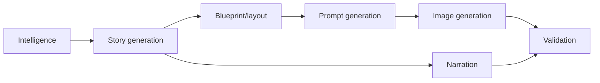

# AI Architecture

## Purpose
Describe AI subsystems for story, blueprint, composition, prompt, narration, validation, and image generation.

## Overview
AI is constrained by deterministic contracts. It proposes story/narration/visual intent and renders image backgrounds, while the pipeline validates and overlays production-safe media.

## Architecture
Story generation appears in hero asset intelligence, question-driven narration, content generation, video assembly intelligence, metadata optimization, and prompt feedback. Blueprint/composition generation transforms event intelligence into hero/thumbnail/gallery/scene contracts. Validation and feedback services score outputs, detect leakage, and feed prompt evolution.

## Components
- Hero asset story generator/intelligence engine.
- Question scene planner/enricher and narration generator.
- Prompt builder and AI image prompt execution.
- AI optimization, analytics feedback, metadata optimization.
- Azure OpenAI content and image providers.

## Responsibilities
Own its media/AI boundary, write diagnostics, obey phase contracts, and avoid silent generic fallback.

## Inputs
Upstream phase JSON, event intelligence, language, region, visual objects, provider configuration, and existing assets when rerunning.

## Outputs
Generated media/JSON artifacts plus validation and diagnostics paths relevant to the subsystem.

## Dependencies
MediaFactory Core contracts, Infrastructure implementations, Rendering/ContentGen projects, Azure providers where configured, and file-system output roots.

## Implementation Notes
This document is reverse engineered from implementation names, tests, phase definitions, and existing Sprint 1 documentation; it avoids aspirational generic architecture.

## Failure Modes
Provider missing, required file missing, invalid JSON/contract, forbidden terms, text overlap, safe-area failure, object not visible, timing drift, or publishing/storage failure as applicable.

## Extension Points
Add new event families, aspect profiles, render contracts, validation checks, language/font mappings, or provider implementations behind existing interfaces.

## Future Improvements
Make contracts more declarative, improve diagnostics browsing, expand automated visual QA, and feed validation outcomes back into prompt generation.

## Related Documents
- [Documentation index](../README.md)
- [Project vision](../ProjectVision.md)
- [Roadmap](../Roadmap.md)
- [Folder structure](../FolderStructure.md)
- [AstronomyV3RC2 release notes](../releases/AstronomyV3RC2.md)
