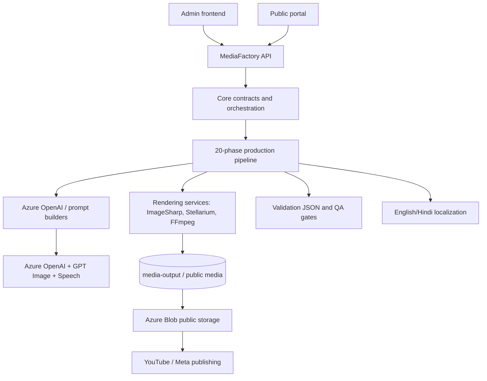

# Architecture Overview

## Purpose
Describe the actual Astronomy V3RC2 product architecture across the TypeScript frontends, ASP.NET Core MediaFactory backend, AI/content generation services, rendering subsystem, production pipeline, validation gates, localization, and Azure-backed providers.

## Overview
Astronomy V3 is a media-production platform, not only a CRUD application. The public/admin frontends call the MediaFactory API, the API composes Core domain services and Infrastructure implementations, and the production pipeline materializes astronomy events into JSON contracts, image assets, audio tracks, subtitles, videos, review artifacts, and publishing packages.

## Architecture
The backend is organized as a layered .NET solution: `Astronomy.MediaFactory.Api` hosts endpoints and health checks; `Core` defines pipeline contracts, DTOs, validation models, and service interfaces; `Infrastructure/Persistence` implements production orchestration and repository-backed workflows; `ContentGen` implements Azure OpenAI prompt/content generation; `Rendering` creates thumbnails, galleries, Stellarium scripts, speech, and FFmpeg output; `Publishing` archives and publishes media; `Astronomy.SscIntelligence` solves sky-scene composition. The TypeScript `frontend` and `mobile` projects consume API contracts and mock data but do not own the production pipeline.

## Components
- **Backend API**: ASP.NET Core host with Swagger, health checks, CORS, diagnostics endpoints, and dependency registration.
- **MediaFactory Core**: production contracts, phase DTOs, pipeline status, localization resolver, prompt feedback, scene/narration/asset models.
- **Pipeline runner**: `ProductionPipelineExecutionService` executes phases 1-20 with requested-output gating; docs here focus on phases 1-18 requested in this sprint.
- **AI subsystem**: prompt builder, Azure content generation, Azure image generation, prompt feedback, AI optimization models.
- **Rendering subsystem**: ImageSharp overlays, Azure image backgrounds, gallery/thumbnail renderers, Stellarium capture, FFmpeg video assembly, Azure Speech.
- **Azure and publishing**: Blob storage, public media storage, YouTube/Meta clients, OAuth/token health services.
- **Frontend/mobile**: admin/public interfaces and API health/load tests.

## Responsibilities
- Preserve event identity and visual-object contracts from planning through rendering.
- Convert astronomy intelligence into educational stories, scene plans, localized narration, visual assets, and final videos.
- Fail early with phase validation JSON when contracts are violated.
- Keep AI-generated content bounded by deterministic schemas, forbidden-term guards, and post-generation validation.
- Maintain operator visibility through diagnostics, queue state, health checks, and recovery commands.

## Inputs
- Content plan production requests with plan/event/region/language/output selections.
- Astronomy event intelligence, required visual objects, local viewing metadata, event family, and strategy.
- Configuration options for localization, rendering, Azure OpenAI/Image/Speech, Blob storage, publishing, scheduling, and validation.
- Existing generated artifacts when rerunning a phase range or retrying failed phases.

## Outputs
- Phase validation files under `validation/phase-XX-validation.json`.
- Planning JSON, question-answer sets, enriched scene plans, narration JSON/text, scene assets, hero assets, thumbnails, gallery images, TTS timelines, subtitles, motion plans, and final videos.
- Publishing packages and public media URLs when archive/publish stages run.

## Dependencies
- .NET backend projects, EF-backed repositories, file-system working directories.
- Azure OpenAI, Azure GPT Image, Azure Speech, Azure Blob Storage.
- FFmpeg/FFprobe, ImageSharp/SixLabors, optional Stellarium/Skyfield sidecars.
- YouTube and Meta publishing APIs for downstream distribution.

## Implementation Notes
Design principles visible in the implementation: contract-first JSON artifacts, deterministic overlays over AI backgrounds, language-scoped artifact paths, phase-range resumability, forbidden-term/event-consistency guards, and explicit validation over silent fallback. Generic render fallbacks are deliberately blocked for hero overlay/font failures and for realistic-object requirements.

## Failure Modes
- Missing required inputs or files fails the current phase.
- AI provider misconfiguration fails image/content phases that require Azure.
- Validation failures are persisted with missing outputs/errors and stop later dependent phases.
- Queue jobs retry with configured backoff; stale running executions can be recovered.
- Publishing errors are separated from generation status in the broader pipeline.

## Extension Points
- Add production phases by adding phase definitions and required-output validation.
- Add new output types by updating requested-output gating.
- Add renderers through service interfaces and JSON contracts.
- Add event families through event intelligence, visual source resolution, prompt enrichment, validation terms, and renderer rules.
- Add languages through `LocalizationOptions`, title/subtitle resolvers, font registration, and TTS voice mapping.

## Future Improvements
- Move more hard-coded phase heuristics into declarative phase contracts.
- Broaden frontend observability around phase diagnostics.
- Add richer artifact lineage indexing for cross-phase debugging.
- Expand object-specific visual validation and AI feedback loops.
- Introduce additional Azure-native media services where FFmpeg/local execution is insufficient.

## Related Documents
- [Documentation index](../README.md)
- [Project vision](../ProjectVision.md)
- [Roadmap](../Roadmap.md)
- [Folder structure](../FolderStructure.md)
- [AstronomyV3RC2 release notes](../releases/AstronomyV3RC2.md)
