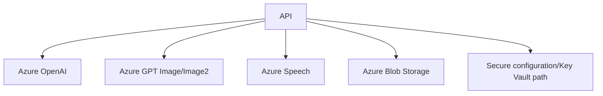

# Azure Architecture

## Purpose
Describe Azure service usage in the implemented solution.

## Overview
Azure is used as a provider layer for language generation, image generation, speech synthesis, and storage/public media.

## Architecture
The API loads secure configuration, registers MediaFactory services, and uses option classes for Azure OpenAI, Image, Speech, Blob, public media storage, and Key Vault/secrets. ContentGen calls Azure OpenAI for JSON content and GPT Image for cinematic images. Rendering uses Azure Speech for TTS. Publishing uses Azure Blob public media storage for generated media before platform publication.

## Components
- `AzureOpenAiContentGenerationService`.
- `AzureOpenAICinematicImageGenerator`.
- `AzureSpeechSynthesisService` / client wrappers.
- `AzureBlobStorageService` and `AzureBlobPublicMediaStorageService`.
- Secure configuration and `Azure.Identity` integration.

## Responsibilities
Own its media/AI boundary, write diagnostics, obey phase contracts, and avoid silent generic fallback.

## Inputs
Upstream phase JSON, event intelligence, language, region, visual objects, provider configuration, and existing assets when rerunning.

## Outputs
Generated media/JSON artifacts plus validation and diagnostics paths relevant to the subsystem.

## Dependencies
MediaFactory Core contracts, Infrastructure implementations, Rendering/ContentGen projects, Azure providers where configured, and file-system output roots.

## Implementation Notes
This document is reverse engineered from implementation names, tests, phase definitions, and existing Sprint 1 documentation; it avoids aspirational generic architecture.

## Failure Modes
Provider missing, required file missing, invalid JSON/contract, forbidden terms, text overlap, safe-area failure, object not visible, timing drift, or publishing/storage failure as applicable.

## Extension Points
Add new event families, aspect profiles, render contracts, validation checks, language/font mappings, or provider implementations behind existing interfaces.

## Future Improvements
Make contracts more declarative, improve diagnostics browsing, expand automated visual QA, and feed validation outcomes back into prompt generation.

## Related Documents
- [Documentation index](../README.md)
- [Project vision](../ProjectVision.md)
- [Roadmap](../Roadmap.md)
- [Folder structure](../FolderStructure.md)
- [AstronomyV3RC2 release notes](../releases/AstronomyV3RC2.md)
