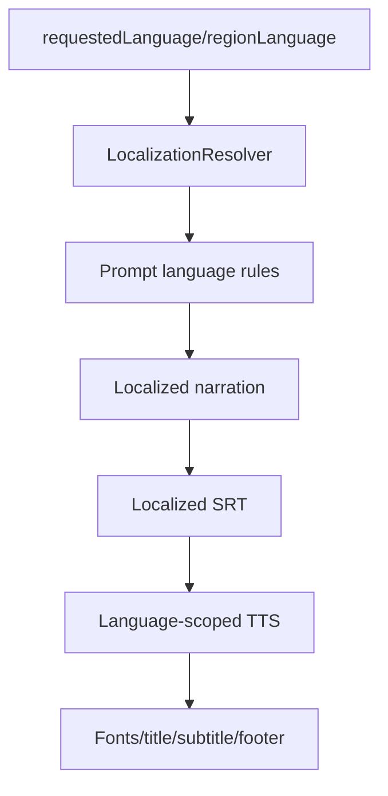

# Localization Architecture

## Purpose
Describe the English/Hindi multilingual implementation.

## Overview
Localization begins at request resolution and continues through prompt requirements, narration generation, subtitles, TTS paths, typography, title/subtitle/footer resolution, and language-scoped output folders.

## Architecture
`LocalizationResolver` supports `en` and `hi`, default/fallback English, and a fallback-used flag. PromptBuilder instructs AI to localize user-facing narration/title/description/tags while preserving JSON keys and scene IDs. Hindi paths are validated to avoid Hinglish fragments, duplicate cues, and event-family leakage. Phase 15 and video assembly prefer canonical language-scoped TTS/SRT/video-assembly paths.

## Components
- `LocalizationOptions` and `LocalizationResolver`.
- Prompt localization requirements.
- Hindi translation/cleanup helpers in Phase 14.
- Typography/font registration and footer compaction.
- Title/subtitle/metadata normalizers for hero and thumbnails.

## Responsibilities
Own its media/AI boundary, write diagnostics, obey phase contracts, and avoid silent generic fallback.

## Inputs
Upstream phase JSON, event intelligence, language, region, visual objects, provider configuration, and existing assets when rerunning.

## Outputs
Generated media/JSON artifacts plus validation and diagnostics paths relevant to the subsystem.

## Dependencies
MediaFactory Core contracts, Infrastructure implementations, Rendering/ContentGen projects, Azure providers where configured, and file-system output roots.

## Implementation Notes
This document is reverse engineered from implementation names, tests, phase definitions, and existing Sprint 1 documentation; it avoids aspirational generic architecture.

## Failure Modes
Provider missing, required file missing, invalid JSON/contract, forbidden terms, text overlap, safe-area failure, object not visible, timing drift, or publishing/storage failure as applicable.

## Extension Points
Add new event families, aspect profiles, render contracts, validation checks, language/font mappings, or provider implementations behind existing interfaces.

## Future Improvements
Make contracts more declarative, improve diagnostics browsing, expand automated visual QA, and feed validation outcomes back into prompt generation.

## Related Documents
- [Documentation index](../README.md)
- [Project vision](../ProjectVision.md)
- [Roadmap](../Roadmap.md)
- [Folder structure](../FolderStructure.md)
- [AstronomyV3RC2 release notes](../releases/AstronomyV3RC2.md)
