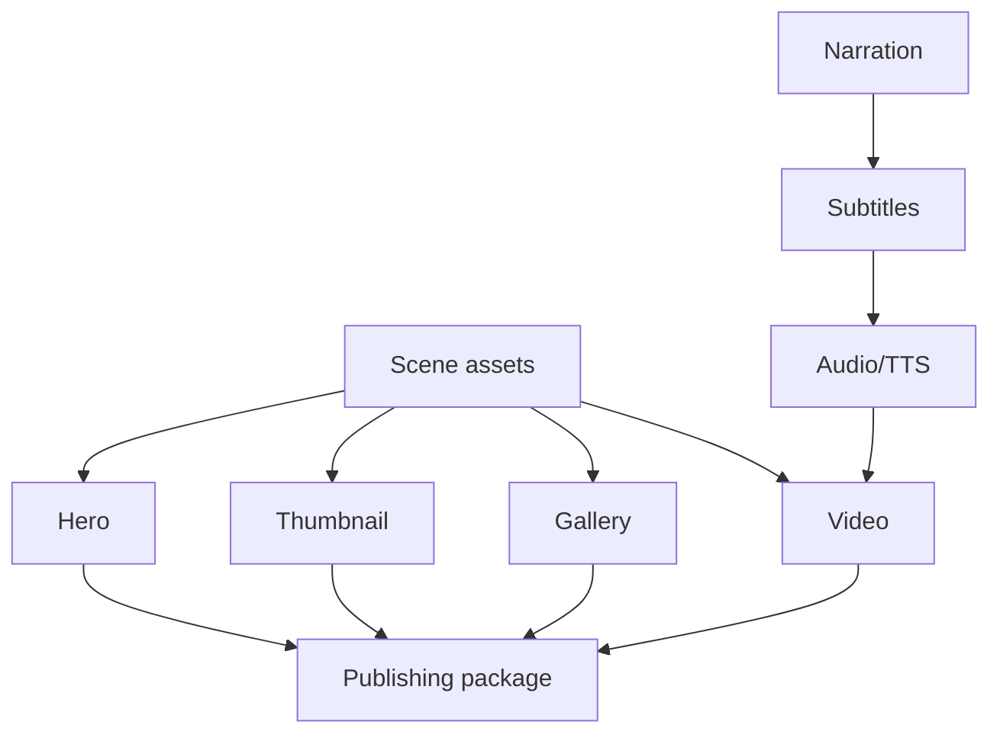

# Media Pipeline

## Purpose
Describe media generation outputs and dependencies from hero/thumbnail/gallery through audio/subtitles/video/publishing.

## Overview
The media pipeline materializes planning JSON into user-visible assets and final videos.

## Architecture
Hero, thumbnail, and gallery are promotional still assets. Narration, subtitles, TTS, duration calibration, motion, and FFmpeg assembly produce videos. Publishing packages can archive to Blob and then publish to YouTube/Meta services. Output folders are rooted in the production execution context and commonly include `plan-input`, `question`, `scene-assets-v3/short`, `scene-assets-v3/long`, `hero`, `thumbnail`, `gallery`, `sync`, `tts/<language>`, `video-assembly/<language>`, `validation`, and final media paths.

## Components
- Scene assets V3 (`final.png` per scene/profile).
- Hero assets and platform variants.
- Thumbnail variants and selection diagnostics.
- Gallery manifest/review/diagnostics.
- SRT/subtitle files, TTS timeline/audio, mixed audio, final short/long MP4s.
- Blob/public media and platform publication records.

## Responsibilities
Own its media/AI boundary, write diagnostics, obey phase contracts, and avoid silent generic fallback.

## Inputs
Upstream phase JSON, event intelligence, language, region, visual objects, provider configuration, and existing assets when rerunning.

## Outputs
Generated media/JSON artifacts plus validation and diagnostics paths relevant to the subsystem.

## Dependencies
MediaFactory Core contracts, Infrastructure implementations, Rendering/ContentGen projects, Azure providers where configured, and file-system output roots.

## Implementation Notes
This document is reverse engineered from implementation names, tests, phase definitions, and existing Sprint 1 documentation; it avoids aspirational generic architecture.

## Failure Modes
Provider missing, required file missing, invalid JSON/contract, forbidden terms, text overlap, safe-area failure, object not visible, timing drift, or publishing/storage failure as applicable.

## Extension Points
Add new event families, aspect profiles, render contracts, validation checks, language/font mappings, or provider implementations behind existing interfaces.

## Future Improvements
Make contracts more declarative, improve diagnostics browsing, expand automated visual QA, and feed validation outcomes back into prompt generation.

## Related Documents
- [Documentation index](../README.md)
- [Project vision](../ProjectVision.md)
- [Roadmap](../Roadmap.md)
- [Folder structure](../FolderStructure.md)
- [AstronomyV3RC2 release notes](../releases/AstronomyV3RC2.md)
