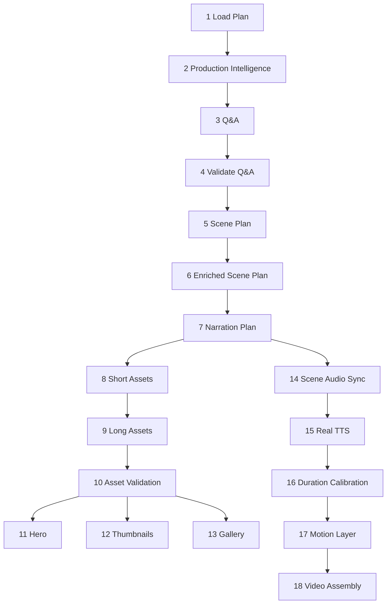

# Pipeline Architecture

## Purpose
Document the actual 18-phase production pipeline requested for Sprint 2, while noting that the implementation currently defines phases 1-20 and uses phases 19-20 for QA/review and publishing package work.

## Overview
The implemented production runner executes ordered phase definitions, writes phase validation JSON, and supports dry-run, overwrite, start/end phase ranges, retry-failed-only, requested-output filtering, and stale execution recovery. Phases 1-10 are foundational. Phases 11-13 create promotional media. Phases 14-18 convert approved scene assets and narration into time-synchronized video.

| Phase | Actual name | Purpose | Primary inputs | Primary outputs / JSON | Validation and recovery |
|---:|---|---|---|---|---|
| 1 | Load Plan | Persist the production request and event intelligence snapshot. | `ContentPlanProductionRequest`, `ProductionEventIntelligence`. | `plan-input/content-plan-production-request.json`, `plan-input/production-event-intelligence.json`. | Missing event lock fields fail input contract; rerun with overwrite or phase range. |
| 2 | Build ProductionEventIntelligence | Normalize/diagnose event family, objects, viewing metadata, and strategy. | Phase 1 snapshot, event strategy. | `production-intelligence.json`, diagnostics. | Planet-conjunction and required-object checks fail invalid intelligence. |
| 3 | Generate QuestionAnswerSet | Create viewer-question framing for one event. | Plan id, region, language, event id. | `question-answer-set.json`. | Generated file list and later Phase 4 file requirement. |
| 4 | Validate Questions | Gate question-answer availability. | Phase 3 output. | Phase validation only. | Requires `question-answer-set.json`; rerun Phase 3/4. |
| 5 | Generate Scene Plan | Build question-driven scene plan. | Event id, region, language, execution context. | `question-driven-scene-plan.json`. | Missing output fails dependent Phase 6. |
| 6 | Enrich Scene Plan | Add narration/visual/overlay/accessibility intent and optional visual variants. | Phase 5 scene plan, event intelligence, required objects. | `question-driven-scene-plan.enriched.json`, diagnostics. | Checks `isValid`, scene count, leakage, required visual objects, optional variant count. |
| 7 | Generate Narration Plan | Produce question-driven narration JSON and review. | Enriched scene plan, plan/event/region/language. | `question-driven-narration.json`, `question-driven-narration-review.json`. | Null response, missing persisted files, failed review checks stop the phase. |
| 8 | Generate Short Scene Assets V3 | Realize short-form scene assets. | Enriched plan, narration, visual source strategy. | `scene-assets-v3/short/**/final.png`, manifests/diagnostics. | Scene asset coverage checked in Phase 10. |
| 9 | Generate Long Scene Assets V3 | Realize long-form scene assets. | Same as Phase 8 for long profile. | `scene-assets-v3/long/**/final.png`, manifests/diagnostics. | Scene asset coverage checked in Phase 10. |
| 10 | Validate Scene Assets V3 | Ensure scene assets contain required realistic objects and final PNGs. | Phase 8/9 assets, visual source resolver diagnostics. | `validation/phase-10-validation.json`. | Rejects missing `final.png`, primitive placeholders, generic sky backgrounds, missing required objects. |
| 11 | Generate Hero | Generate hero story/blueprint/background and deterministic overlay variants. | Event intelligence, approved scenes, localization, Azure Image config. | Hero story, blueprint, composition model, variants, layout validation, diagnostics. | Safe-area, footer, object visibility, title/subtitle clipping/overlap checks; generic fallback blocked. |
| 12 | Generate Thumbnails | Generate thumbnail variants and validation. | Hero/scene assets, metadata, title hooks, output format. | Thumbnail images, `phase-12-validation.json`. | Text readability, asset availability, variant constraints. |
| 13 | Generate Gallery | Create AstroPulse/gallery assets. | Event/media context, Azure Image configuration. | Gallery PNGs, review, manifest, diagnostics, `phase-13-validation.json`. | Fails if required Azure Image2 configuration is absent. |
| 14 | Scene Audio Sync V1 | Pair visual scenes with narration sections and generate SRT/subtitle artifacts. | Phase 7 narration, Phase 8/9 scenes, language. | `sync/scene-audio-sync.json`, narration text, SRT files, diagnostics. | Scene-id lineage, event-consistency, subtitle segmentation, Hindi translation validation. |
| 15 | Real TTS V2 | Generate cue-level TTS audio and timeline. | Phase 14 SRT/sync, Azure Speech, language-scoped paths. | TTS audio files, timeline JSON, `phase-15-validation.json`. | Requires Azure Speech; validates scene-id lineage and audio item coverage. |
| 16 | Duration Calibration V1 | Recalculate scene/cue durations from actual audio. | Phase 15 timeline/audio, SRT. | Duration plan/diagnostics, recalibrated subtitles. | Fails when audio/subtitle timing cannot be resolved. |
| 17 | Motion Layer V1 / V2 preview | Create per-scene motion and filter plans. | Scene assets, duration plan, request motion strength. | Motion plan JSON, `phase-17-validation.json`. | Detects motion-strength mismatches and missing motion data. |
| 18 | Cinematic Video Assembly V2 | Assemble short/long video media with subtitles, audio mix, outro, and fade. | Phase 10 assets, Phase 15 audio, Phase 16 durations, Phase 17 motion, SRT. | Final MP4s, mixed audio, render diagnostics, `phase-18-validation.json`. | Validates cue subtitle drift, scene audio/video sync, final audio/video duration, subtitle safe area. |

## Architecture
`ProductionPipelineExecutionService` owns the phase list and invokes each phase action inside `ExecutePhaseAsync`. Before execution it validates the current event lock for phases up to 15. After each action it checks required outputs, reads special diagnostics for selected phases, and writes `validation/phase-XX-validation.json`. Requested outputs gate optional phases: hero is phase 11, thumbnail phase 12, long/short video phases 15-17, short video phase 18, and long video QA phase 19.

## Components
- `ContentPlanBatchGenerationService`: starts/ranges production executions and records status.
- `ProductionPipelineExecutionService`: phase orchestration, validation writing, output gating, recovery-aware execution.
- `PipelineJobProcessor`/`PipelineJobExecutor`: asynchronous job queue for main videos, shorts, publish, and archive.
- Phase services: question engine, scene planner/enricher, narration generator, scene asset generators, hero/thumbnail/gallery engines, TTS, duration calibration, motion, FFmpeg assembly.
- `ProductionPhaseContext`: carries request, intelligence, strategy, output roots, execution mode, and overwrite metadata.

## Responsibilities
- Preserve phase order and explicit dependency contracts.
- Expand dependencies from a plan/event into generated files rather than transient in-memory state.
- Allow operators to rerun bounded phase ranges without rebuilding everything.
- Separate generated outputs, warnings, missing files, and errors in machine-readable validation.

## Inputs
Pipeline request fields: plan id, astronomy event intelligence id, region, language, requested output types, dry-run/overwrite/retry flags, phase range, execution mode, and media event strategy. Phase-specific inputs are previous phase JSON files and media assets listed in the table above.

## Outputs
Every phase emits a validation JSON document. Product outputs include plan snapshots, intelligence diagnostics, question/scene/narration JSON, short/long scene assets, hero/thumbnail/gallery media, sync/TTS/duration/motion JSON, SRT files, mixed audio, and final MP4s.

## Dependencies
Core service interfaces, Infrastructure implementations, ContentGen, Rendering, Azure Speech/Image/OpenAI, ImageSharp, FFmpeg/FFprobe, file-system working roots, persistence repository, and optional Skyfield/Stellarium intelligence paths.

## Implementation Notes
The code currently clamps production executions to phases 1-20. This document intentionally details phases 1-18 because the sprint request ends at video assembly. Phases 19-20 remain implementation-defined follow-ons for production review and publishing package validation.

## Failure Modes
- Input contract failures before phase execution.
- Missing generated files after a phase.
- Provider configuration failures.
- JSON parse/contract validation failures.
- Event-family leakage or forbidden terms.
- Audio/subtitle/video timing drift.
Recovery is by rerunning with a start/end phase, overwrite, retry-failed-only, or stale-running recovery.

## Extension Points
- Register new phase definitions with action delegates.
- Add new requested output types and map required phases.
- Add validation readers for phase-specific diagnostics.
- Convert implicit path conventions into formal per-phase manifests.

## Future Improvements
- Generate phase documentation directly from phase definitions.
- Add a DAG manifest for dependencies instead of only linear order.
- Surface phase validation diffs in admin UI.
- Promote V2 motion preview into a first-class phase mode.

## Related Documents
- [Documentation index](../README.md)
- [Project vision](../ProjectVision.md)
- [Roadmap](../Roadmap.md)
- [Folder structure](../FolderStructure.md)
- [AstronomyV3RC2 release notes](../releases/AstronomyV3RC2.md)
