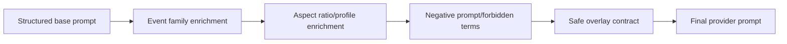

# Prompt Architecture

## Purpose
Describe actual AI prompt generation and validation boundaries.

## Overview
Prompts are built from structured astronomy/event context, then enriched by event family, aspect ratio/profile, negative/forbidden instructions, and overlay-safe contracts.

## Architecture
`PromptBuilder` creates content prompts with structured astronomy JSON and localization requirements. Visual prompts are assembled by event intelligence, visual source resolver, hero/thumbnail/gallery services, and prompt feedback. Diagnostics persist final prompt text, provider, model/deployment, length, request timings, and failure reasons. Prompt validation guards JSON-only content output, required visual terms, forbidden terms, event-family leakage, and non-generic realistic object representation.

## Components
- `PromptBuilder` and `PromptFeedbackComposer`.
- `AzureOpenAiContentGenerationService` for story/script JSON.
- `AzureOpenAICinematicImageGenerator` for GPT Image calls.
- `AstronomyPromptBuilder`, `AiImagePromptExecutionService`, hero/thumbnail/gallery prompt composers.
- `EventContentGuard` and visual source resolver prompt diagnostics.

## Responsibilities
Own its media/AI boundary, write diagnostics, obey phase contracts, and avoid silent generic fallback.

## Inputs
Upstream phase JSON, event intelligence, language, region, visual objects, provider configuration, and existing assets when rerunning.

## Outputs
Generated media/JSON artifacts plus validation and diagnostics paths relevant to the subsystem.

## Dependencies
MediaFactory Core contracts, Infrastructure implementations, Rendering/ContentGen projects, Azure providers where configured, and file-system output roots.

## Implementation Notes
This document is reverse engineered from implementation names, tests, phase definitions, and existing Sprint 1 documentation; it avoids aspirational generic architecture.

## Failure Modes
Provider missing, required file missing, invalid JSON/contract, forbidden terms, text overlap, safe-area failure, object not visible, timing drift, or publishing/storage failure as applicable.

## Extension Points
Add new event families, aspect profiles, render contracts, validation checks, language/font mappings, or provider implementations behind existing interfaces.

## Future Improvements
Make contracts more declarative, improve diagnostics browsing, expand automated visual QA, and feed validation outcomes back into prompt generation.

## Related Documents
- [Documentation index](../README.md)
- [Project vision](../ProjectVision.md)
- [Roadmap](../Roadmap.md)
- [Folder structure](../FolderStructure.md)
- [AstronomyV3RC2 release notes](../releases/AstronomyV3RC2.md)
