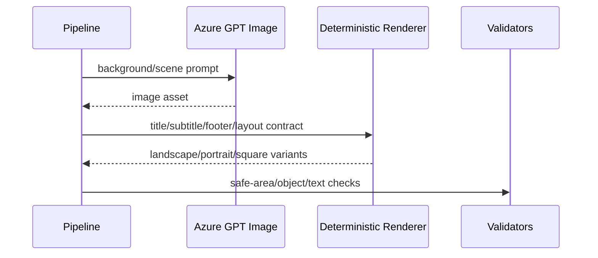

# Rendering Architecture

## Purpose
Describe how actual hero, thumbnail, gallery, observation/sky-guide, and video rendering are composed.

## Overview
Rendering is hybrid: AI creates or supports backgrounds and concepts; deterministic renderers own text, safe areas, footers, typography, ImageSharp overlays, motion plans, and FFmpeg assembly.

## Architecture
Hero rendering uses Azure Image2/GPT Image for the cinematic background and a deterministic overlay contract for title, subtitle, date/time/direction footer, object visibility, and platform variants. Thumbnail rendering uses thumbnail intelligence, scoring, mood grading, local asset collages, and cinematic overlay renderers. Gallery generation is handled by AstroPulse gallery services with Azure Image2 configuration. Observation/Sky Guide rendering flows through scene assets, Stellarium/SSC scene planning, motion profiles, subtitles, and FFmpeg.

## Components
- Hero: `HeroAssetIntelligenceEngine`, composition model, shared footer renderer, Azure renderer diagnostics.
- Thumbnail: `ThumbnailAssetIntelligenceService`, `CinematicThumbnailService`, `ThumbnailGenerationService`, selectors/scorers.
- Gallery: `AstroPulseGalleryService`.
- Sky/observation guide: scene assets V3, Stellarium visual generation, SSC intelligence, FFmpeg video render.
- Typography: `TypographyResolver`, font registration, Hindi-aware title/subtitle/footer choices.

## Responsibilities
Own its media/AI boundary, write diagnostics, obey phase contracts, and avoid silent generic fallback.

## Inputs
Upstream phase JSON, event intelligence, language, region, visual objects, provider configuration, and existing assets when rerunning.

## Outputs
Generated media/JSON artifacts plus validation and diagnostics paths relevant to the subsystem.

## Dependencies
MediaFactory Core contracts, Infrastructure implementations, Rendering/ContentGen projects, Azure providers where configured, and file-system output roots.

## Implementation Notes
This document is reverse engineered from implementation names, tests, phase definitions, and existing Sprint 1 documentation; it avoids aspirational generic architecture.

## Failure Modes
Provider missing, required file missing, invalid JSON/contract, forbidden terms, text overlap, safe-area failure, object not visible, timing drift, or publishing/storage failure as applicable.

## Extension Points
Add new event families, aspect profiles, render contracts, validation checks, language/font mappings, or provider implementations behind existing interfaces.

## Future Improvements
Make contracts more declarative, improve diagnostics browsing, expand automated visual QA, and feed validation outcomes back into prompt generation.

## Related Documents
- [Documentation index](../README.md)
- [Project vision](../ProjectVision.md)
- [Roadmap](../Roadmap.md)
- [Folder structure](../FolderStructure.md)
- [AstronomyV3RC2 release notes](../releases/AstronomyV3RC2.md)
