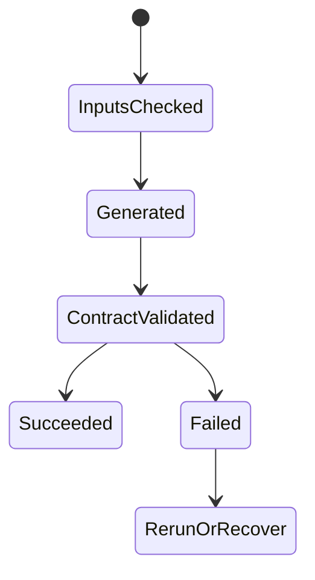

# Validation Architecture

## Purpose
Document validation gates for hero, thumbnail, gallery, scene, prompt, media, safe area, object visibility, text overlap, and diagnostics.

## Overview
Validation is a first-class artifact stream. The pipeline does not rely on provider success alone; it writes validation JSON and blocks dependent phases when contracts fail.

## Architecture
Validation is layered: input contracts before execution, output existence after execution, domain validation inside services, and specialized media validation during Phase 18. Hero validation checks overlay text, safe area, footer slots, object visibility, and no fallback renderer. Scene validation checks V3 final PNG coverage and realistic required objects. Prompt validation uses forbidden-term detection and final prompt previews. Media validation checks audio coverage, subtitle lineage, drift, duration, safe area, and final file paths.

## Components
- `WritePhaseValidationAsync` phase gate.
- Hero layout/overlay diagnostics DTOs.
- Production quality validator and visual source resolver rules.
- TTS package, subtitle, scene-id lineage, and Phase 18 diagnostics.
- Test suite coverage for phase-specific contracts.

## Responsibilities
Own its media/AI boundary, write diagnostics, obey phase contracts, and avoid silent generic fallback.

## Inputs
Upstream phase JSON, event intelligence, language, region, visual objects, provider configuration, and existing assets when rerunning.

## Outputs
Generated media/JSON artifacts plus validation and diagnostics paths relevant to the subsystem.

## Dependencies
MediaFactory Core contracts, Infrastructure implementations, Rendering/ContentGen projects, Azure providers where configured, and file-system output roots.

## Implementation Notes
This document is reverse engineered from implementation names, tests, phase definitions, and existing Sprint 1 documentation; it avoids aspirational generic architecture.

## Failure Modes
Provider missing, required file missing, invalid JSON/contract, forbidden terms, text overlap, safe-area failure, object not visible, timing drift, or publishing/storage failure as applicable.

## Extension Points
Add new event families, aspect profiles, render contracts, validation checks, language/font mappings, or provider implementations behind existing interfaces.

## Future Improvements
Make contracts more declarative, improve diagnostics browsing, expand automated visual QA, and feed validation outcomes back into prompt generation.

## Related Documents
- [Documentation index](../README.md)
- [Project vision](../ProjectVision.md)
- [Roadmap](../Roadmap.md)
- [Folder structure](../FolderStructure.md)
- [AstronomyV3RC2 release notes](../releases/AstronomyV3RC2.md)
