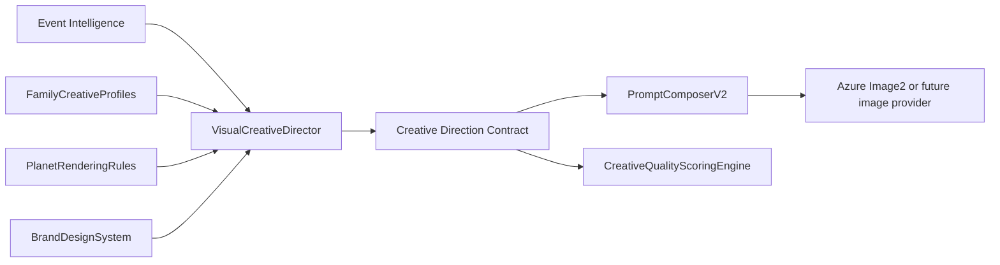

# Visual Creative Director V3.2A Architecture

## Purpose

Visual Creative Director V3.2A defines a premium visual intelligence layer for Drashyam V3.2 that converts astronomy event intelligence into reusable creative direction for Hero, Thumbnail, Gallery, and future visual assets. It is a document-first architecture proposal and does not change any existing V3.1 runtime pipeline behavior.

The layer exists to translate event-family intelligence, observation context, platform needs, and brand standards into a structured creative direction contract before prompt text is composed. It makes visual decisioning explicit without binding Drashyam to a specific renderer, image provider, narration system, or pipeline phase.

## Version and Compatibility Position

- **Version:** V3.2A architecture proposal.
- **Release posture:** additive, behind a future feature flag, and safe to ignore by all V3.1 components.
- **Runtime impact:** none in V3.2A documentation scope.
- **Compatibility goal:** existing V3.1 release-candidate behavior remains unchanged unless a later implementation explicitly opts in.

## Design Principles

### Document-first

V3.2A starts as an architecture and contract definition. It should be reviewed, refined, and accepted before implementation work begins.

### Separation of concerns

Creative direction is separate from event intelligence, prompt wording, rendering, validation, narration, and provider execution. The Visual Creative Director decides *what the visual should feel and communicate like*; downstream systems decide *how to phrase prompts, call providers, render assets, or validate outputs*.

### No Azure dependency

The Visual Creative Director must not require Azure OpenAI, Azure Image2, Azure Storage, Azure Speech, or Azure-specific configuration. Azure Image2 may consume the final prompt later, but the creative direction contract remains provider-neutral.

### No renderer dependency

The Visual Creative Director must not require FFmpeg, ImageSharp, Stellarium, web canvas rendering, template rendering, or any other renderer. Renderer-specific sizing and output mechanics belong downstream.

### No narration dependency

The Visual Creative Director must not read, generate, or require narration text. Narration may inform future asset timing, but V3.2A creative direction is driven by event intelligence, platform, family, and brand context.

### Additive to V3.1

V3.2A introduces a new conceptual layer without replacing V3.1 prompt construction, asset generation, validation, or pipeline orchestration.

### Backward compatible

If the feature is disabled or unavailable, V3.1 Hero, Thumbnail, Gallery, image generation, prompt, and validation behavior must remain exactly as before.

### Family-aware but not event-hardcoded

The system should understand event families such as planet pairings, groupings, meteor showers, moons, and eclipses. It must avoid hardcoded one-off creative rules for individual dated events unless those rules are represented through reusable family profiles or explicit event intelligence metadata.

## Proposed Modules



## Module Responsibilities

### VisualCreativeDirector

**Does:**

- Accept normalized event intelligence, language, platform, aspect ratio, target asset type, and brand context.
- Select the relevant family creative profile.
- Merge family profile, brand design system, platform conventions, and subject-specific rendering rules.
- Emit a provider-neutral `CreativeDirectionContract`.
- Keep creative decisions structured and inspectable before prompt text exists.

**Does not:**

- Generate final prompt text.
- Call Azure, image providers, renderers, validators, storage, or publishing APIs.
- Modify V3.1 phase ordering or pipeline behavior.
- Depend on narration scripts or voice timing.
- Hardcode unique creative choices for a single event occurrence.

### FamilyCreativeProfiles

**Does:**

- Define reusable creative defaults by astronomy event family.
- Provide family-level mood, composition, subject emphasis, observation card suggestions, and negative rules.
- Support first-pass families: `PlanetPairing`, `PlanetGrouping`, `MeteorShower`, `NamedFullMoon`, `SolarEclipse`, and `LunarEclipse`.
- Remain extensible for future families such as comets, occultations, conjunction variants, and deep-sky events.

**Does not:**

- Compose provider prompts.
- Override verified event facts.
- Store provider-specific syntax.
- Require one profile per real-world event date.

### PlanetRenderingRules

**Does:**

- Provide planet-specific visual guidance for apparent scale, color discipline, glow treatment, rings, phase visibility, and relative emphasis.
- Prevent misleading imagery such as impossible planet sizes, arbitrary colors, or misplaced rings.
- Offer reusable rules for planet pairings and groupings.

**Does not:**

- Compute ephemerides or validate orbital geometry.
- Render planets directly.
- Replace astronomy event intelligence.
- Force photorealism where the chosen creative style is illustrative, provided visual truthfulness is preserved.

### BrandDesignSystem

**Does:**

- Define Drashyam visual identity constraints: premium cinematic tone, typography hierarchy, color palette, spacing, safe-area discipline, overlay style, and observation-card treatment.
- Provide platform-aware brand rules for Hero, Thumbnail, Gallery, and future assets.
- Keep visual consistency across languages and aspect ratios.

**Does not:**

- Contain event-family astronomy rules.
- Generate copy or narration.
- Depend on a specific image model, rendering stack, or CSS implementation.

### PromptComposerV2

**Does:**

- Consume `CreativeDirectionContract` and event intelligence to compose final provider prompt text.
- Translate structured creative direction into image-provider-specific prompt language when later implemented.
- Preserve negative rules, brand rules, and quality targets in the provider prompt.

**Does not:**

- Invent creative direction that belongs to VisualCreativeDirector.
- Change V3.1 prompts until explicitly enabled by a later migration step.
- Call providers directly unless a later implementation assigns that responsibility.

### CreativeQualityScoringEngine

**Does:**

- Score generated visual outputs against the `CreativeDirectionContract` after image generation in a future phase.
- Evaluate brand fit, subject clarity, composition, typography safety, observation-card readability, and obvious astronomy mismatches.
- Produce diagnostics useful for retries, human review, or creative tuning.

**Does not:**

- Block or validate V3.1 outputs in V3.2A.
- Replace existing validation gates.
- Require a provider-specific image source.
- Make Azure calls as part of V3.2A.

## Data Flow

V3.2A proposes the following future data flow:

```text
Event Intelligence
→ Visual Creative Director
→ Creative Direction Contract
→ Prompt Composer V2
→ Azure Image2 / future image provider
```

### Flow Notes

1. **Event Intelligence** remains the factual source of event family, celestial objects, timing, region, visibility, and observation context.
2. **Visual Creative Director** maps those facts to premium creative direction while preserving family awareness and brand consistency.
3. **Creative Direction Contract** becomes the stable handoff artifact between creative intelligence and prompt composition.
4. **Prompt Composer V2** converts structured creative decisions into provider-specific prompt text.
5. **Azure Image2 / future image provider** receives the final composed prompt only after a later implementation introduces provider integration.

## CreativeDirectionContract

The proposed contract is JSON-serializable, provider-neutral, and safe to persist for diagnostics. Field names are intentionally descriptive so Phase 11/12 consumers can use partial adoption without ambiguity.

```json
{
  "eventFamily": "PlanetPairing",
  "language": "en",
  "platform": "YouTube",
  "aspectRatio": "16:9",
  "creativeStyle": {
    "tone": "premium cinematic astronomy",
    "visualMood": "awe, clarity, quiet anticipation",
    "realismLevel": "truthful cinematic illustration",
    "colorPalette": ["deep navy", "star white", "warm gold accent"],
    "lighting": "soft celestial rim light with controlled glow"
  },
  "compositionStyle": {
    "layout": "hero subject with negative space for title",
    "focalHierarchy": ["primary celestial subject", "secondary celestial subject", "observation context"],
    "cameraLanguage": "wide sky view with premium editorial framing",
    "safeAreas": {
      "titleSafe": true,
      "platformUiSafe": true,
      "avoidCriticalDetailAtEdges": true
    }
  },
  "subjectTreatment": {
    "primarySubject": "Venus",
    "secondarySubjects": ["Jupiter"],
    "humanContext": "optional small observer silhouette only when helpful for scale",
    "skyContext": "recognizable night-sky field without clutter",
    "truthfulnessNotes": ["do not exaggerate apparent separation beyond event intelligence"]
  },
  "typographyStyle": {
    "titleTreatment": "bold premium editorial, high contrast, minimal words",
    "languageScript": "Latin",
    "fontMood": "modern, cinematic, readable",
    "maxTextDensity": "low",
    "textPlacement": "safe negative space, never over primary subject"
  },
  "observationCardStyle": {
    "enabled": true,
    "placement": "lower third or side panel depending on aspect ratio",
    "contentPriority": ["date", "time window", "direction", "visibility"],
    "visualStyle": "glassmorphism card with subtle border and high readability"
  },
  "planetRenderingRules": {
    "scalePolicy": "symbolic but not misleading",
    "colorAccuracy": "respect known dominant colors",
    "ringsPolicy": "rings only for Saturn unless event intelligence says otherwise",
    "glowPolicy": "controlled glow, no fantasy aura",
    "relativeEmphasis": "primary event objects are visually clear but sky-realistic"
  },
  "brandRules": {
    "brandTone": "premium, calm, intelligent, wonder-led",
    "logoUsage": "optional and unobtrusive",
    "colorDiscipline": "deep-sky base with restrained accent colors",
    "overlayDiscipline": "no clutter, no clickbait chaos, no unreadable text"
  },
  "negativeRules": [
    "no inaccurate planet rings",
    "no cartoon planets unless explicitly requested by asset strategy",
    "no oversized typography covering celestial subject",
    "no fake telescope UI clutter",
    "no unrelated spacecraft or astronauts"
  ],
  "qualityTargets": {
    "subjectClarity": 0.9,
    "brandFit": 0.9,
    "astronomyTruthfulness": 0.85,
    "thumbnailReadability": 0.9,
    "compositionBalance": 0.85,
    "textSafety": 0.95
  }
}
```

## Family Creative Profiles

### PlanetPairing

- **Creative intent:** make two visible bodies feel intentional, rare, and easy to recognize.
- **Composition:** dual-subject balance with clear separation, one primary and one secondary emphasis, optional horizon or observer context.
- **Subject treatment:** respect relative identity through color, brightness, rings, and labels if used; avoid implying physical proximity.
- **Typography:** short hook with a clear date or viewing cue; avoid covering either planet.
- **Observation card:** useful for direction, time window, and visibility.
- **Negative rules:** no collision imagery, no massive planets looming over Earth, no arbitrary planet colors, no rings on non-ringed planets.

### PlanetGrouping

- **Creative intent:** communicate a multi-planet lineup or cluster as organized and observable rather than chaotic.
- **Composition:** panoramic sky arc, diagonal sweep, or constellation-like grouping with clean spacing.
- **Subject treatment:** highlight each participating planet without forcing equal scale; labels may be useful in educational variants.
- **Typography:** restrained, with title in one safe zone and optional small labels near subjects.
- **Observation card:** strongly recommended because viewing direction and timing are key.
- **Negative rules:** no impossible straight-line mechanical alignment unless event intelligence supports it, no crowded fantasy solar-system diagram, no unreadable labels.

### MeteorShower

- **Creative intent:** evoke motion, anticipation, and night-sky wonder while preserving a believable radiant context.
- **Composition:** wide sky, radiant-aware streak direction, foreground silhouette or landscape for scale.
- **Subject treatment:** meteors should feel dynamic but not like missiles, fireworks, or sci-fi lasers.
- **Typography:** energetic but premium; keep clear of meteor paths.
- **Observation card:** recommended for peak date, best time, moonlight condition, and direction.
- **Negative rules:** no fireballs raining onto cities, no apocalyptic sky, no dense artificial streaks that imply impossible rates.

### NamedFullMoon

- **Creative intent:** present the named moon as culturally memorable, luminous, and calm.
- **Composition:** large but tasteful moon emphasis, horizon or landscape context, strong negative space.
- **Subject treatment:** moon detail should be recognizable; color tint must remain subtle unless the name/event context justifies a treatment.
- **Typography:** elegant editorial title, suitable for Hero and Thumbnail.
- **Observation card:** optional; useful for moonrise time, date, and viewing note.
- **Negative rules:** no extreme fantasy colors, no oversized moon crushing perspective, no unrelated zodiac or astrology symbolism unless product scope explicitly permits it.

### SolarEclipse

- **Creative intent:** communicate rarity, shadow, safety, and dramatic celestial geometry.
- **Composition:** eclipse disk as primary subject, corona or partial phase depending on event intelligence, optional landscape silhouette.
- **Subject treatment:** distinguish total, annular, and partial eclipse variants; include safety-aware visual restraint.
- **Typography:** high-contrast, urgent but not alarmist; do not obscure eclipse disk.
- **Observation card:** strongly recommended for date, path/region, timing, and safe viewing reminder where applicable.
- **Negative rules:** no unsafe direct-sun viewing implication, no fictional black-hole visuals, no exaggerated global darkness for local/partial events.

### LunarEclipse

- **Creative intent:** show Earth-shadow drama with a calm, observable night-sky feel.
- **Composition:** moon as primary subject, optional phase progression strip for educational gallery assets, dark sky with subtle red/orange treatment when appropriate.
- **Subject treatment:** distinguish penumbral, partial, and total eclipse; red color should be credible, not neon.
- **Typography:** calm dramatic editorial; allow moon to remain unobstructed.
- **Observation card:** recommended for eclipse phase timing, visibility region, and best viewing period.
- **Negative rules:** no solar corona, no sun/moon collision, no fantasy red planet substitution, no over-saturated blood-red treatment for non-total events.

## Non-goals for V3.2A

- No pipeline phase changes.
- No prompt replacement yet.
- No Azure calls.
- No image generation changes.
- No validation changes.
- No renderer or template changes.
- No narration changes.
- No migration of existing V3.1 contracts.

## Migration Plan

### Step 1: Keep V3.1 as default

V3.1 remains the production path. No existing Hero, Thumbnail, Gallery, prompt, validation, rendering, or provider component consumes V3.2A contracts by default.

### Step 2: Introduce a feature flag in a later implementation

A future implementation can introduce a feature flag such as `VisualCreativeDirector:Enabled`. When disabled, the pipeline bypasses V3.2 creative direction entirely and uses the V3.1 behavior.

### Step 3: Produce contract diagnostics only

The first implementation should optionally generate and persist `CreativeDirectionContract` diagnostics without feeding them into provider prompts. This makes review possible without output changes.

### Step 4: Allow Phase 11/12 read-only consumption

Phase 11/12 can later read the contract for analysis, preview, or side-by-side comparison. Consumption should be additive and non-blocking.

### Step 5: Enable PromptComposerV2 in controlled mode

After contract quality is proven, `PromptComposerV2` may consume the contract behind a separate flag such as `PromptComposerV2:Enabled`. Existing V3.1 prompt composition remains the fallback.

### Step 6: Add quality scoring after provider output

`CreativeQualityScoringEngine` can later score generated images against the contract, initially as diagnostics only. Blocking validation should require a separate acceptance decision.

## Acceptance Criteria

- Existing V3.1 RC behavior remains unchanged.
- Architecture document is complete and reviewable.
- Module responsibilities are clear, including explicit non-responsibilities.
- Data flow from event intelligence to future provider prompt consumption is unambiguous.
- `CreativeDirectionContract` fields are named and structured clearly enough for future implementation.
- Family creative profiles exist for `PlanetPairing`, `PlanetGrouping`, `MeteorShower`, `NamedFullMoon`, `SolarEclipse`, and `LunarEclipse`.
- V3.2A non-goals prevent accidental prompt, provider, renderer, validation, narration, or pipeline changes.
- Migration path supports feature-flagged adoption by later Phase 11/12 work.

## Related Documents

- [Prompt Architecture](./PromptArchitecture.md)
- [AI Architecture](./AIArchitecture.md)
- [Rendering Architecture](./RenderingArchitecture.md)
- [Astronomy V3 RC2 Release Notes](../releases/AstronomyV3RC2.md)
