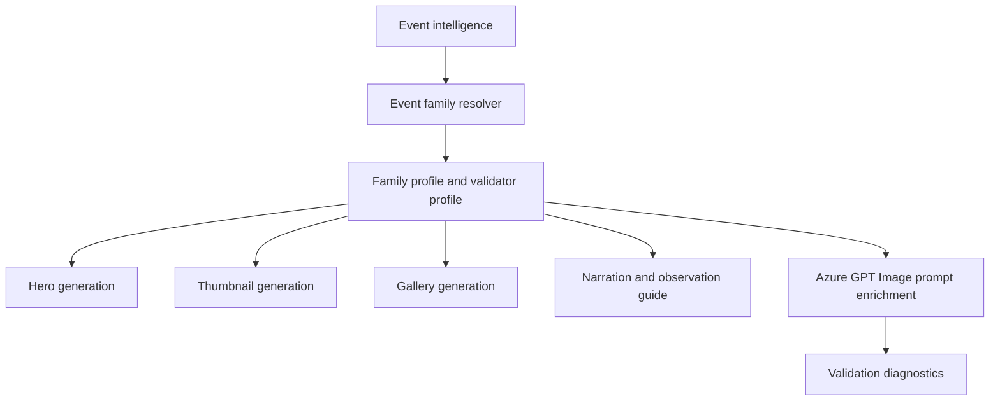

# Comet Event Family

## 1 Overview

**Scientific explanation.** A comet is an icy small body that can develop a coma and tail as it approaches the Sun. Visibility ranges from naked-eye spectacle to binocular/telescope-only object.

**Typical occurrence.** Bright comets are unpredictable and uncommon; many cataloged comets are visible only with optical aid.

**Visibility.** Visibility depends on brightness magnitude, altitude, twilight, Moon, tail orientation, and dark-sky quality.

**Difficulty.** Medium to hard unless the comet is bright; finding requires charts or nearby guide stars/planets.

**Educational significance.** Teaches small bodies, solar heating, tails, orbital returns, magnitude, and binocular observing.

**Examples.** Comet C/2023 A3, Halley-type return content, binocular comet near horizon.

## 2 Business Purpose

Business purpose: comets create strong curiosity and search traffic, but accuracy matters because brightness can change. Audience: casual viewers, photographers, binocular users, educators. Objectives: explain whether naked-eye/binocular/telescope is needed, where and when to look, and why comet appearance changes. Publishing frequency: when a comet becomes observable, brightens, passes a landmark, or reaches perihelion/closest approach.

## 3 Hero Strategy

Hero objective: show comet nucleus/tail plus observing context. Hierarchy: comet first, finder cue second, title third, guide card. Dominant object: comet head and tail. Composition: dark sky with horizon or star-field context; binocular cue may appear in guide panel, not as gimmick. Title: comet name + “Viewing Guide.” Subtitle: brightness/equipment/time. Footer: dark sky/binocular advice. CTA: “Bring binoculars.”

## 4 Thumbnail Strategy

CTR objective: make the tail obvious and promise practical finding help. Style: photorealistic comet with subtle green/blue/white coma if appropriate. Emotion: rare visitor. Curiosity: “Can you see it?” Title rules: use official/common comet name. Subtitle: naked-eye/binocular status only if sourced. Examples: “COMET TONIGHT?”, “COMET VIEWING GUIDE”.

## 5 Gallery Strategy

Gallery: finder chart, equipment, brightness expectation, tail direction, date-by-date movement. Density: medium; avoid overwhelming orbital data. Overlay: comet label, direction, guide stars/planets, binocular icon. Carousel: what it is, visibility, where to look, equipment, why tails point away from Sun.

## 6 Narration Strategy

Hook: “A visitor from the outer Solar System is in our sky.” Fact: tails are pushed by sunlight/solar wind. Guidance: dark sky, binoculars, scan near landmark, manage expectations. CTA: save finder guide. Voice: exploratory and honest.

## 7 Observation Guide Strategy

Direction: constellation/horizon/object landmark. Time: best window and altitude. Equipment: binoculars by default unless naked-eye confirmed; tripod/camera optional. Difficulty: medium/hard. Sky: dark, clear, low Moon. Regional: visibility and altitude can change quickly by latitude/date.

## 8 Prompt Enrichment

Prompt enrichment: comet nucleus, coma, tail, dark sky, binocular viewing context. Keywords: comet tail, coma, star field, finder guide, dark-sky horizon. Atmosphere: rare visitor, quiet wonder. Lighting: faint luminous tail, low light. Composition: tail angled away from text zones; portrait tail vertical/diagonal; landscape broad tail; square comet upper third. Negative: no meteor shower, no fireball impact, no spaceship, no planet-conjunction labels. Forbidden: eclipse safety, meteor radiant/debris stream unless article is comparative and sourced. Safe overlay: leave finder card and title clear.

## 9 Validation Rules

Validation: comet nucleus/tail required; not just a generic star. Cropping must keep head and meaningful tail. Object count: comet plus optional landmark objects only. Labels: comet name and equipment cue. Guide panel: dark-sky/binocular guidance required. Renderer expects SpecialEventComet/CometSkyGuideThumbnail profile. Failures: no tail, meteor-like streaks, unrealistic impact, missing equipment expectation, false naked-eye claim.

## 10 Localization

English copy should use short, concrete astronomy terms and avoid sensational claims that overpromise visibility. Hindi copy should preserve technical names such as Venus, Jupiter, Moon, eclipse, comet, and radiant with readable Devanagari explanations rather than literal word-for-word translation. Future languages must define font coverage, TTS voice, title length budgets, and localized direction/time conventions before enabling production. Astronomical terminology must remain event-specific: do not import meteor vocabulary into planet or moon families, do not import conjunction vocabulary into moon-only families, and always preserve object names supplied by event intelligence.

## 11 Extension Points

Improve the family by adding richer object-specific validation, observed-performance feedback from published assets, more precise sky-geometry contracts, and localized education cards. Future AI enhancements should use family profiles as declarative prompt modules rather than hard-coded strings. Future educational enhancements can add classroom explainer slides, safety panels, and region-specific observing alternatives while keeping hero, thumbnail, gallery, narration, guide, prompt, validation, and localization rules aligned.

## 12 Related Documents

- [Architecture overview](../architecture/ArchitectureOverview.md)
- [Pipeline architecture](../architecture/PipelineArchitecture.md)
- [Prompt architecture](../architecture/PromptArchitecture.md)
- [AI architecture](../architecture/AIArchitecture.md)
- [Rendering architecture](../architecture/RenderingArchitecture.md)
- [Validation architecture](../architecture/ValidationArchitecture.md)
- [Localization architecture](../architecture/LocalizationArchitecture.md)
- [Astronomy V3 RC2 release notes](../releases/AstronomyV3RC2.md)
- [Roadmap](../Roadmap.md)

