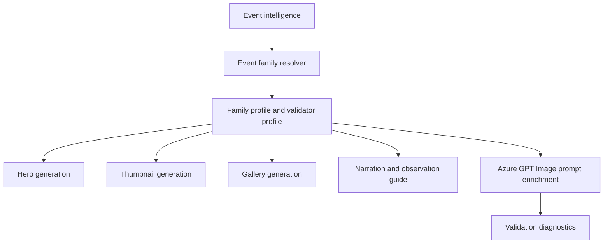

# Generic Astronomy Event Family

## 1 Overview

**Scientific explanation.** Generic astronomy covers events that do not resolve to meteor, planet grouping, moon, eclipse, or special-event subtypes. It may include seasonal sky views, educational explainers, or fallback current-event content.

**Typical occurrence.** Frequency depends on editorial calendar, weekly forecasts, and evergreen education needs.

**Visibility.** Visibility varies by selected object/context; generic content must not imply observability without supporting data.

**Difficulty.** Variable: simple star-guide content is easy; deep-sky or technical explainers can be hard.

**Educational significance.** Useful for evergreen literacy: constellations, sky navigation, object types, observing habits, and platform continuity between major events.

**Examples.** Tonight’s sky, constellation guide, deep-sky explainer, seasonal Milky Way overview.

## 2 Business Purpose

Business purpose: generic content fills schedule gaps, supports evergreen learning, and provides a safe fallback when event classification is unknown. Audience: broad astronomy learners and returning Drashyam viewers. Objectives: teach one clear sky concept, provide honest observation advice, and preserve current-event contracts without inventing family-specific details. Publishing frequency: scheduled editorial cadence, weekly/daily guides, and fallback when no major event is selected.

## 3 Hero Strategy

Hero objective: communicate the selected sky concept without pretending to be a special event. Hierarchy: actual target/context first, title second, guide/info card third. Dominant object: selected object, constellation, Milky Way, or sky landscape. Composition: clean cinematic astronomy poster; labels only when helpful. Title: precise topic. Subtitle: learning/where-to-look cue. Footer: brand/guide tip. CTA: “Learn the sky tonight” or topic-specific action.

## 4 Thumbnail Strategy

CTR objective: clear benefit rather than false rarity. Style: premium night-sky educational visual. Emotion: curiosity and calm exploration. Curiosity: “What can you see tonight?” Title rules: avoid “rare,” “eclipse,” “meteor,” or “alignment” unless resolved. Subtitle: educational promise. Examples: “TONIGHT’S SKY”, “FIND ORION”, “MILKY WAY GUIDE”.

## 5 Gallery Strategy

Gallery is the primary teaching surface: one idea per slide, low jargon, clear labels, and practical observing tips. Density depends on audience but should not exceed one chart/card per slide. Overlay: simple guide panels and captions. Carousel: concept, how to find it, what it means, best conditions, next step.

## 6 Narration Strategy

Hook: ask a sky-question or reveal one practical thing to look for. Fact: chosen from the actual topic, not from a stale event. Guidance: time/direction/equipment only if source data supports it. CTA: follow/save for more sky guides. Voice: welcoming, clear, non-hype.

## 7 Observation Guide Strategy

Direction/time/equipment/difficulty must be derived from the selected object or omitted. Sky: mention darkness, Moon, clouds, horizon as relevant. Regional notes: generic guides may need hemisphere/latitude warnings. If the event cannot be localized, state broad educational framing instead of local visibility claims.

## 8 Prompt Enrichment

Prompt enrichment: event-neutral astronomy visual using supplied target/context. Keywords come from event intelligence, not family assumptions. Atmosphere: educational premium night sky. Lighting: realistic night/twilight. Composition: reserve safe overlay zones in all aspect ratios. Negative: no family-specific icons unless requested; no fake planets/meteors/eclipses; no unreadable text. Forbidden: any stale terms from another family. Safe overlay: title/footer/guide card clear and generic renderer-compatible.

## 9 Validation Rules

Validation: target must match current event/intelligence; no forbidden leakage from previous event. Cropping must keep the dominant object/sky feature legible. Object count follows requested visual objects. Labels only when sourced. Guide panels optional but must not claim unsourced observation details. Renderer expects CurrentEvent/RC1CinematicThumbnail fallback behavior. Failures: stale event family terms, fake rarity, unsupported local directions, generic background with no target, overlay collisions.

## 10 Localization

English copy should use short, concrete astronomy terms and avoid sensational claims that overpromise visibility. Hindi copy should preserve technical names such as Venus, Jupiter, Moon, eclipse, comet, and radiant with readable Devanagari explanations rather than literal word-for-word translation. Future languages must define font coverage, TTS voice, title length budgets, and localized direction/time conventions before enabling production. Astronomical terminology must remain event-specific: do not import meteor vocabulary into planet or moon families, do not import conjunction vocabulary into moon-only families, and always preserve object names supplied by event intelligence.

## 11 Extension Points

Improve the family by adding richer object-specific validation, observed-performance feedback from published assets, more precise sky-geometry contracts, and localized education cards. Future AI enhancements should use family profiles as declarative prompt modules rather than hard-coded strings. Future educational enhancements can add classroom explainer slides, safety panels, and region-specific observing alternatives while keeping hero, thumbnail, gallery, narration, guide, prompt, validation, and localization rules aligned.

## 12 Related Documents

- [Architecture overview](../architecture/ArchitectureOverview.md)
- [Pipeline architecture](../architecture/PipelineArchitecture.md)
- [Prompt architecture](../architecture/PromptArchitecture.md)
- [AI architecture](../architecture/AIArchitecture.md)
- [Rendering architecture](../architecture/RenderingArchitecture.md)
- [Validation architecture](../architecture/ValidationArchitecture.md)
- [Localization architecture](../architecture/LocalizationArchitecture.md)
- [Astronomy V3 RC2 release notes](../releases/AstronomyV3RC2.md)
- [Roadmap](../Roadmap.md)

