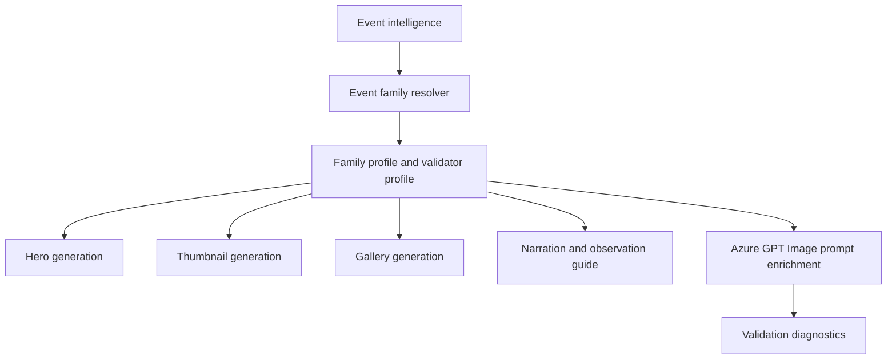

# Lunar Eclipse Event Family

## 1 Overview

**Scientific explanation.** A lunar eclipse occurs when the Moon passes through Earth’s shadow. Total eclipses can turn the Moon copper-red; partial and penumbral eclipses produce less dramatic shadowing.

**Typical occurrence.** Several occur in many years globally; a region may see zero, partial, or full visibility depending on Moon position and timing.

**Visibility.** Visible from the night side of Earth where the Moon is above the horizon during the event.

**Difficulty.** Easy to medium: safe with unaided eyes, but timing and weather still matter.

**Educational significance.** Teaches Earth-Sun-Moon geometry, shadows, orbital inclination, and why “blood moon” color comes from Earth’s atmosphere.

**Examples.** Total lunar eclipse, partial lunar eclipse, penumbral lunar eclipse.

## 2 Business Purpose

Business purpose: lunar eclipses are accessible mass-audience events with no eye-safety barrier. Target audiences include families, students, casual Moon watchers, and photographers. Learning objectives: identify eclipse type, understand Earth’s shadow, know peak time and visible direction, and set expectations for brightness/color. Publishing frequency is event-driven with reminders during the final week and short-form updates near peak.

## 3 Hero Strategy

Hero objective: present the eclipsed Moon as a dramatic but accurate night-sky object. Visual hierarchy: red/dim Moon first, title second, peak-time guide card third. Dominant object: lunar disk with Earth-shadow bite or red totality. Composition: large Moon in upper or side third, dark horizon for context, sufficient safe area. Title strategy: “Lunar Eclipse” plus subtype/date. Subtitle: “Peak at [local time]” or visibility cue. Footer: direction/equipment. CTA: “Look toward the Moon at peak.” Examples: “Blood Moon Eclipse”, “Partial Lunar Eclipse”.

## 4 Thumbnail Strategy

CTR objective: make the Moon color/shape unmistakable. Visual style: cinematic dark sky, copper Moon, minimal guide text. Emotion: wonder and accessibility. Curiosity trigger: “Why the Moon turns red.” Title rules: avoid “blood moon” unless total/reddening is expected. Subtitle rules: local peak and visibility only. Examples: “LUNAR ECLIPSE”, “BLOOD MOON”, “MOON TURNS RED”.

## 5 Gallery Strategy

Gallery slides teach stages, timing, direction, and viewing tips. Information density can be medium because safety is simple. Overlay style: dark panels, red/copper highlights, clear Moon phase diagrams. Captions should distinguish penumbral/partial/total rather than showing every lunar eclipse as red. Carousel: what it is, peak time, where to look, photo tips, why it turns red.

## 6 Narration Strategy

Opening hook: “Tonight the Moon passes through Earth’s shadow.” Interesting fact: red color is refracted sunlight through Earth’s atmosphere. Observation guidance: find the Moon, watch around peak, binoculars optional. Closing CTA: save/share timing. Voice: warm, accessible, explanatory.

## 7 Observation Guide Strategy

Direction: Moon azimuth/elevation at peak. Time: start/peak/end if available; otherwise peak window. Equipment: eyes, binoculars, camera/tripod optional. Difficulty: easy unless Moon is low or weather poor. Sky: clear sky and unobstructed horizon. Regional notes: visible, partial, or not visible from viewer region.

## 8 Prompt Enrichment

Prompt enrichment: photorealistic lunar disk, Earth-shadow gradient, copper/red totality only when subtype supports it, night sky, optional skyline. Keywords: red Moon, shadow bite, lunar disk, craters, horizon. Atmosphere: calm nocturnal event. Lighting: moonlit dark blues/coppers. Composition: keep Moon large but not cropped; portrait Moon upper third; landscape Moon side third with guide card; square centered. Negative: no solar corona, no eclipse glasses, no meteor radiant, no planet conjunction labels. Forbidden: Sun-blocking imagery, unsafe solar guidance, unrelated planets. Safe overlay: clear title/footer/guide panel zones.

## 9 Validation Rules

Validation: Moon must be visible and subtype-consistent. Cropping cannot hide the shadow boundary. Object count is one Moon plus optional context; labels must not imply solar eclipse. Guide panels should show peak time/direction. Renderer expects Eclipse/Moon-compatible diagnostics, guide card, and direction cue. Failures: missing Moon, wrong red color for penumbral event, solar safety confusion, forbidden meteor/conjunction terms, text overlapping Moon.

## 10 Localization

English copy should use short, concrete astronomy terms and avoid sensational claims that overpromise visibility. Hindi copy should preserve technical names such as Venus, Jupiter, Moon, eclipse, comet, and radiant with readable Devanagari explanations rather than literal word-for-word translation. Future languages must define font coverage, TTS voice, title length budgets, and localized direction/time conventions before enabling production. Astronomical terminology must remain event-specific: do not import meteor vocabulary into planet or moon families, do not import conjunction vocabulary into moon-only families, and always preserve object names supplied by event intelligence.

## 11 Extension Points

Improve the family by adding richer object-specific validation, observed-performance feedback from published assets, more precise sky-geometry contracts, and localized education cards. Future AI enhancements should use family profiles as declarative prompt modules rather than hard-coded strings. Future educational enhancements can add classroom explainer slides, safety panels, and region-specific observing alternatives while keeping hero, thumbnail, gallery, narration, guide, prompt, validation, and localization rules aligned.

## 12 Related Documents

- [Architecture overview](../architecture/ArchitectureOverview.md)
- [Pipeline architecture](../architecture/PipelineArchitecture.md)
- [Prompt architecture](../architecture/PromptArchitecture.md)
- [AI architecture](../architecture/AIArchitecture.md)
- [Rendering architecture](../architecture/RenderingArchitecture.md)
- [Validation architecture](../architecture/ValidationArchitecture.md)
- [Localization architecture](../architecture/LocalizationArchitecture.md)
- [Astronomy V3 RC2 release notes](../releases/AstronomyV3RC2.md)
- [Roadmap](../Roadmap.md)

