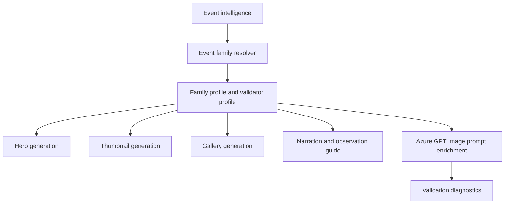

# Meteor Shower Event Family

## 1 Overview

**Scientific explanation.** A meteor shower occurs when Earth crosses a debris stream and many meteoroids burn in the atmosphere, appearing to radiate from a common sky region.

**Typical occurrence.** Major showers recur annually; intensity varies with peak time, moonlight, and stream activity.

**Visibility.** Visibility depends on radiant altitude, darkness, Moon phase, weather, and local peak timing.

**Difficulty.** Easy to medium: no telescope needed, but dark skies and patience are essential.

**Educational significance.** Teaches comet/asteroid debris streams, radiant perspective, sky darkness, rates, and why meteor showers recur.

**Examples.** Perseids, Geminids, Quadrantids, Leonids.

## 2 Business Purpose

Drashyam creates meteor-shower content because these events are recurring, searchable, and perfect for observation guides. Audience: casual viewers, families, photographers, and beginner astronomers. Objectives: explain peak night, best viewing window, radiant direction, moonlight impact, and no-telescope viewing. Publishing frequency: annual preview, peak-week guide, and final-night reminder for major showers.

## 3 Hero Strategy

Hero objective: communicate movement and radiant without clutter. Visual hierarchy: meteor streaks/radiant first, title second, viewing window guide third. Dominant object: dark sky with multiple streaks from one radiant region. Composition: wide night landscape with streaks crossing safe areas but not text; radiant cue optional and subtle. Title: shower name + “Peaks Tonight/This Week.” Subtitle: best time, moonlight note. Footer: dark-sky/no telescope tip. CTA: “Go outside after [time].” Examples: “Geminids Peak”, “Perseids Tonight”.

## 4 Thumbnail Strategy

CTR objective: visible streaks and peak urgency. Style: high-contrast dark sky, diagonal bright meteors, mountain/open horizon. Emotion: excitement and wonder. Curiosity trigger: “How many could you see?” Title rules: use shower name if known; do not promise impossible rates. Subtitle: “Best after midnight” only when sourced. Examples: “METEOR SHOWER PEAKS”, “LOOK UP TONIGHT”.

## 5 Gallery Strategy

Gallery teaches radiant, peak time, moonlight, dark-sky setup, and patience. Information density: low-to-medium; avoid star-map overload. Overlay style: simple arrows/radiant circle only when accurate; captions use “look generally toward darker sky” if direction uncertain. Carousel: peak, radiant, moonlight, gear/no gear, viewing checklist.

## 6 Narration Strategy

Hook: “Earth is moving through a stream of space dust.” Fact: grains can be sand-sized yet bright. Guidance: dark location, lie back, give eyes 20–30 minutes, avoid phone light. CTA: share/save peak time. Voice: energetic, friendly, practical.

## 7 Observation Guide Strategy

Direction: radiant/darkest-sky direction; if unsure, advise broad sky view. Time: peak night and best local window, often late night/pre-dawn. Equipment: none; reclining chair/blanket. Difficulty: easy but requires darkness and patience. Sky: low cloud, low Moon, low light pollution. Regional: local peak may shift; southern/northern visibility can differ.

## 8 Prompt Enrichment

Azure GPT Image prompts: photorealistic meteor shower, multiple believable streaks, one subtle radiant, dark sky, landscape horizon. Keywords: meteor streaks, radiant area, dark sky, Milky Way only if appropriate, open landscape. Atmosphere: energetic but realistic. Lighting: cool night, streak glows, subtle horizon. Composition: streaks frame title zones; portrait vertical streaks; landscape diagonals; square central burst. Negative: no spaceships, no fireballs hitting ground, no comet tail as dominant, no planet conjunction labels, no fake dates. Forbidden: Phaethon/debris-stream specifics unless event intelligence supplies them. Safe overlay: leave title/footer legible and avoid streaks behind small text.

## 9 Validation Rules

Validation: at least several streaks or radiant cue must be visible; do not crop all streak origins. Object count is many meteors but no unrelated large planets. Safe area must preserve title/guide. Labels: shower name, peak, best time, moonlight. Guide panels: required for peak/window. Renderer expects MeteorShower profile/RadiantBurstThumbnail. Failures: generic starry sky without meteors, meteor words in non-meteor event, unrealistic impact imagery, unreadable overlays, stale event/date terms.

## 10 Localization

English copy should use short, concrete astronomy terms and avoid sensational claims that overpromise visibility. Hindi copy should preserve technical names such as Venus, Jupiter, Moon, eclipse, comet, and radiant with readable Devanagari explanations rather than literal word-for-word translation. Future languages must define font coverage, TTS voice, title length budgets, and localized direction/time conventions before enabling production. Astronomical terminology must remain event-specific: do not import meteor vocabulary into planet or moon families, do not import conjunction vocabulary into moon-only families, and always preserve object names supplied by event intelligence.

## 11 Extension Points

Improve the family by adding richer object-specific validation, observed-performance feedback from published assets, more precise sky-geometry contracts, and localized education cards. Future AI enhancements should use family profiles as declarative prompt modules rather than hard-coded strings. Future educational enhancements can add classroom explainer slides, safety panels, and region-specific observing alternatives while keeping hero, thumbnail, gallery, narration, guide, prompt, validation, and localization rules aligned.

## 12 Related Documents

- [Architecture overview](../architecture/ArchitectureOverview.md)
- [Pipeline architecture](../architecture/PipelineArchitecture.md)
- [Prompt architecture](../architecture/PromptArchitecture.md)
- [AI architecture](../architecture/AIArchitecture.md)
- [Rendering architecture](../architecture/RenderingArchitecture.md)
- [Validation architecture](../architecture/ValidationArchitecture.md)
- [Localization architecture](../architecture/LocalizationArchitecture.md)
- [Astronomy V3 RC2 release notes](../releases/AstronomyV3RC2.md)
- [Roadmap](../Roadmap.md)

