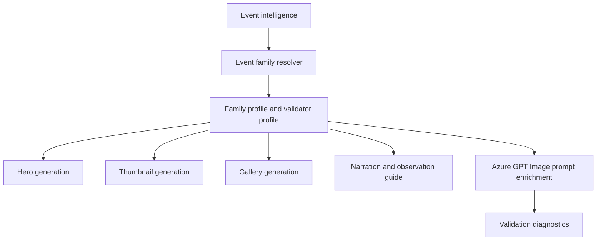

# Occultation Event Family

## 1 Overview

**Scientific explanation.** An occultation occurs when a nearer object passes in front of a farther object, temporarily hiding it. Common examples include the Moon covering a planet or star.

**Typical occurrence.** Lunar occultations occur frequently somewhere on Earth, but visibility is very region- and timing-specific.

**Visibility.** Visibility is path-based and time-sensitive; ingress/egress can last seconds to minutes.

**Difficulty.** Medium to hard: exact location, time synchronization, horizon, and sometimes optical aid are important.

**Educational significance.** Teaches line-of-sight geometry, lunar motion, timing observations, and why events are local.

**Examples.** Moon occults Saturn, Moon occults Venus, asteroid occultation of a star.

## 2 Business Purpose

Business purpose: occultations are specialized but high-value educational events that reward precise guides. Audience: engaged sky watchers, telescope/binocular users, teachers, and local astronomy clubs. Objectives: explain foreground/background object, exact timing, visibility path, and required equipment. Publishing frequency: for bright lunar occultations or notable regional events.

## 3 Hero Strategy

Hero objective: make the covering geometry obvious. Hierarchy: foreground object crossing background object first, timing window second, title third. Dominant object: Moon or foreground body. Composition: close-up geometry with labels for foreground/background; optional timeline strip. Title: “Moon Covers Saturn” beats generic “Occultation.” Subtitle: local ingress/egress window. Footer: equipment/direction. CTA: “Be ready before ingress.”

## 4 Thumbnail Strategy

CTR objective: convey “object disappears” drama. Style: close-up Moon limb and small planet/star near edge. Emotion: anticipation/precision. Curiosity: “Watch it vanish.” Title rules: use common-language verb; include object names. Subtitle: short local time. Examples: “SATURN DISAPPEARS”, “MOON COVERS VENUS”.

## 5 Gallery Strategy

Gallery: ingress, hidden interval, egress, timing map, equipment. Density: medium-high because timing matters. Overlay: timeline, labels, region/path note. Carousel: what happens, exact local times, where to look, equipment, what can go wrong.

## 6 Narration Strategy

Hook: “For a few minutes, the Moon will hide another world.” Fact: the Moon moves its own diameter in about an hour against the stars. Guidance: set up early, use binoculars/telescope if needed, verify local path. CTA: save exact times. Voice: precise, anticipatory, instructional.

## 7 Observation Guide Strategy

Direction: Moon/object position. Time: ingress/egress local times with seconds/minutes when available. Equipment: eyes if bright and separated; binoculars/telescope often recommended. Difficulty: medium/hard. Sky: clear around Moon, steady horizon. Regional: emphasize path; nearby cities can differ.

## 8 Prompt Enrichment

Prompt enrichment: foreground object crossing/covering background object, time-sensitive geometry, clear labels. Keywords: Moon limb, planet near edge, ingress, egress, timing strip. Atmosphere: precise celestial alignment. Lighting: lunar glow with visible background object. Composition: close-up in square/portrait; landscape can include guide timeline. Negative: no meteor radiant, no eclipse glasses, no fake collision/explosion, no multiple planets unless sourced. Forbidden: generic conjunction/separation language as substitute for occultation. Safe overlay: timing strip and labels must have clean dark backing.

## 9 Validation Rules

Validation: must show foreground/background relationship; labels required. Cropping must preserve the contact/edge geometry. Object count: foreground and occulted object only unless event says otherwise. Guide panel: timing/path required. Renderer expects SpecialEventOccultation/OccultationTimingThumbnail and allows separation cue. Failures: simple conjunction instead of covering, missing timing, wrong foreground object, invented visibility path, cluttered labels.

## 10 Localization

English copy should use short, concrete astronomy terms and avoid sensational claims that overpromise visibility. Hindi copy should preserve technical names such as Venus, Jupiter, Moon, eclipse, comet, and radiant with readable Devanagari explanations rather than literal word-for-word translation. Future languages must define font coverage, TTS voice, title length budgets, and localized direction/time conventions before enabling production. Astronomical terminology must remain event-specific: do not import meteor vocabulary into planet or moon families, do not import conjunction vocabulary into moon-only families, and always preserve object names supplied by event intelligence.

## 11 Extension Points

Improve the family by adding richer object-specific validation, observed-performance feedback from published assets, more precise sky-geometry contracts, and localized education cards. Future AI enhancements should use family profiles as declarative prompt modules rather than hard-coded strings. Future educational enhancements can add classroom explainer slides, safety panels, and region-specific observing alternatives while keeping hero, thumbnail, gallery, narration, guide, prompt, validation, and localization rules aligned.

## 12 Related Documents

- [Architecture overview](../architecture/ArchitectureOverview.md)
- [Pipeline architecture](../architecture/PipelineArchitecture.md)
- [Prompt architecture](../architecture/PromptArchitecture.md)
- [AI architecture](../architecture/AIArchitecture.md)
- [Rendering architecture](../architecture/RenderingArchitecture.md)
- [Validation architecture](../architecture/ValidationArchitecture.md)
- [Localization architecture](../architecture/LocalizationArchitecture.md)
- [Astronomy V3 RC2 release notes](../releases/AstronomyV3RC2.md)
- [Roadmap](../Roadmap.md)

