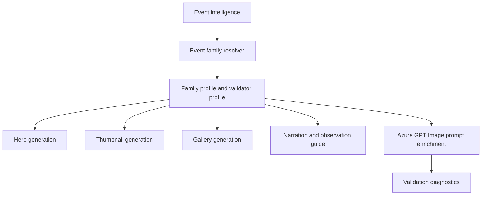

# Planet Conjunction Event Family

## 1 Overview

**Scientific explanation.** A planet conjunction is an apparent close approach of two solar-system objects on the sky, usually planets or the Moon and a planet. The objects are not physically close; they share similar line-of-sight direction from Earth.

**Typical occurrence.** Several visible conjunctions occur each year; especially bright pairings are less frequent.

**Visibility.** Visibility depends on object altitude, Sun separation/twilight, local horizon, angular separation, and weather.

**Difficulty.** Easy to medium: bright planets are easy, but low twilight pairings require timing and clear horizons.

**Educational significance.** Teaches apparent sky geometry, angular separation, ecliptic motion, and why planets can look close while far apart.

**Examples.** Venus-Jupiter conjunction, Moon near Saturn, Mars near the Moon.

## 2 Business Purpose

Drashyam uses conjunctions for high-CTR “two bright objects together” stories. Audience: casual viewers who ask “what are those bright lights?”, beginner astronomers, and mobile photographers. Learning objectives: name both objects, identify direction/time, explain apparent separation, and avoid meteor/moon-only leakage. Publishing frequency: whenever separation and visibility create a strong viewing opportunity, with reminders around closest approach.

## 3 Hero Strategy

Hero objective: show the two-object relationship clearly. Visual hierarchy: two bright objects first, angular/guide cue second, title third, footer last. Dominant object: brighter planet or Moon if present; secondary object remains visible but smaller. Composition: compact pair in a realistic twilight/night sky; use horizon context and optional label lines. Title: “Venus Near Jupiter” or “Moon Near Saturn.” Subtitle: separation/time/direction. Footer: “Look West after sunset” only when sourced. CTA: “Find the bright pair.”

## 4 Thumbnail Strategy

CTR objective: answer what viewers will see. Style: crisp, premium sky guide with two bright objects and bold simple text. Emotion: discovery and immediacy. Curiosity: “Two bright lights together.” Title rules: object names beat generic “conjunction”; max 2 lines. Subtitle: direction/time. Examples: “MOON NEAR JUPITER”, “VENUS + SATURN”.

## 5 Gallery Strategy

Gallery explains object identities, closest approach, where to look, apparent vs real distance, and photo tip. Use moderate density with labels and a small guide card. Carousel should start with the view, then the geometry, then practical timing. Overlays can include object labels and separation cue because the PlanetGrouping profile allows guide cards, labels, direction cues, and separation cues.

## 6 Narration Strategy

Hook: identify the bright pair in the sky. Fact: they only appear close from Earth. Guidance: direction, time, horizon clearance, binocular/camera optional. CTA: share with someone who notices bright evening/morning lights. Voice: clear, practical, lightly cinematic.

## 7 Observation Guide Strategy

Direction: local azimuth/horizon phrase. Time: closest local viewing window with twilight constraints. Equipment: eyes; binoculars optional if dim. Difficulty: easy unless low altitude/twilight. Sky: clear horizon and low haze. Regional: conjunction can be visible at different clock times and altitudes by latitude.

## 8 Prompt Enrichment

Prompt enrichment: two realistic celestial objects with correct size hierarchy, compact angular spacing, twilight/night horizon, guide-card-safe space. Keywords: bright planet pair, angular separation, western/eastern horizon, labels. Atmosphere: elegant sky guide. Lighting: twilight gradient or dark sky as sourced. Composition: objects occupy 25–35% max in hero/thumbnail; portrait stacks vertically; landscape places pair opposite text; square centers pair above guide card. Negative: no meteor shower, no radiant, no debris stream, no random extra planets, no oversized Moon unless event includes Moon. Forbidden: stale Golden Pilot meteor terms for conjunctions. Safe overlay: leave object labels and guide panel readable.

## 9 Validation Rules

Validation: exactly the required primary/secondary objects must appear; no stale meteor terms. Cropping must preserve both objects and separation. Labels must match object names. Guide panels may show direction/time/separation. Renderer expects PlanetConjunction/PlanetarySkyGuideThumbnail validation, object labels, direction cue, and separation cue when available. Failures: missing one object, extra dominant object, wrong labels, meteor vocabulary, title overlap, pair too small or hidden.

## 10 Localization

English copy should use short, concrete astronomy terms and avoid sensational claims that overpromise visibility. Hindi copy should preserve technical names such as Venus, Jupiter, Moon, eclipse, comet, and radiant with readable Devanagari explanations rather than literal word-for-word translation. Future languages must define font coverage, TTS voice, title length budgets, and localized direction/time conventions before enabling production. Astronomical terminology must remain event-specific: do not import meteor vocabulary into planet or moon families, do not import conjunction vocabulary into moon-only families, and always preserve object names supplied by event intelligence.

## 11 Extension Points

Improve the family by adding richer object-specific validation, observed-performance feedback from published assets, more precise sky-geometry contracts, and localized education cards. Future AI enhancements should use family profiles as declarative prompt modules rather than hard-coded strings. Future educational enhancements can add classroom explainer slides, safety panels, and region-specific observing alternatives while keeping hero, thumbnail, gallery, narration, guide, prompt, validation, and localization rules aligned.

## 12 Related Documents

- [Architecture overview](../architecture/ArchitectureOverview.md)
- [Pipeline architecture](../architecture/PipelineArchitecture.md)
- [Prompt architecture](../architecture/PromptArchitecture.md)
- [AI architecture](../architecture/AIArchitecture.md)
- [Rendering architecture](../architecture/RenderingArchitecture.md)
- [Validation architecture](../architecture/ValidationArchitecture.md)
- [Localization architecture](../architecture/LocalizationArchitecture.md)
- [Astronomy V3 RC2 release notes](../releases/AstronomyV3RC2.md)
- [Roadmap](../Roadmap.md)

