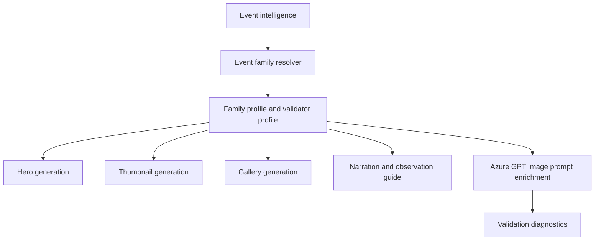

# Planet Grouping Event Family

## 1 Overview

**Scientific explanation.** A planet grouping is an apparent cluster of three or more solar-system objects within a viewer-friendly sky region. It may include the Moon and multiple planets.

**Typical occurrence.** Occurs several times per year in varying quality; compact bright groupings are more noteworthy than wide low-altitude spreads.

**Visibility.** Visibility depends on maximum angular spread, object altitude, twilight, local horizon, and whether all objects fit in one field/composition.

**Difficulty.** Medium: multiple objects require more precise timing and may not all fit comfortably in a single frame.

**Educational significance.** Teaches ecliptic layout, planet motion, relative brightness, and field-of-view tradeoffs.

**Examples.** Moon-Venus-Saturn grouping, three-planet morning lineup.

## 2 Business Purpose

Business purpose: groupings create richer educational stories than simple pairs and can anchor weekly sky forecast content. Audience: sky watchers, teachers, families, and astronomy social viewers. Objectives: identify all visible objects, explain whether it is tight/wide, show best time/direction, and avoid claiming an impossible one-frame view. Publishing frequency follows significant groupings or weekly-sky editorial plans.

## 3 Hero Strategy

Hero objective: show a believable multi-object arrangement. Hierarchy: full group first if compact; dominant cluster first if wide; title and guide follow. Dominant object: Moon or brightest planet. Composition: use compact sky-guide layout for tight/medium spread; for impossible spread, split into cluster scenes rather than force a fake single frame. Title: “Moon, Venus & Saturn” or “Planet Grouping.” Subtitle: direction/time. Footer: all-object checklist. CTA: “Use the Moon as your guide.”

## 4 Thumbnail Strategy

CTR objective: communicate “several objects visible together.” Style: labeled premium sky guide, not an overcrowded infographic. Emotion: “rare lineup” only when justified. Curiosity: “Can you spot all three?” Title rules: name 2–3 key objects; avoid listing too many. Subtitle: direction/time or “after sunset/before sunrise.”

## 5 Gallery Strategy

Gallery teaches each object, layout, best viewing order, and what may be too dim/low. Density can be medium-high but must remain legible. Overlay style: labels, arrows, horizon markers, checklist. Carousel: 1) full grouping, 2) object IDs, 3) timing/direction, 4) why they line up, 5) viewing checklist.

## 6 Narration Strategy

Hook: “Several worlds are sharing one part of the sky.” Fact: the ecliptic creates the lineup. Guidance: start with the brightest/Moon, then scan along the ecliptic. CTA: save the checklist. Voice: guided-tour style.

## 7 Observation Guide Strategy

Direction: local horizon/ecliptic path. Time: best window when all required objects meet altitude/twilight constraints. Equipment: eyes for bright objects; binoculars for dim members. Difficulty: medium. Sky: clear horizon, low haze, light-pollution-aware. Regional: may require split scenes if spread exceeds one-frame limits.

## 8 Prompt Enrichment

Prompt enrichment: realistic multi-object sky with scale hierarchy, ecliptic line implied, no fake crowding. Keywords: planetary grouping, labeled planets, Moon anchor, horizon guide, wide sky. Atmosphere: navigational and cinematic. Lighting: twilight/dark consistent with event. Composition: tight grouping for <15°, medium 15–40°, wide 40–90°, split/ultra-wide for larger. Negative: no meteor streaks, no deep-sky art as main object, no impossible close clustering. Forbidden: conjunction-specific two-object simplification when more objects are required. Safe overlay: reserve label lanes and checklist panel.

## 9 Validation Rules

Validation: required object count must be satisfied or split-scene coverage documented. Cropping cannot remove any required visible object. Object count must not invent unsourced planets. Safe area includes label lanes and guide card. Renderer expects PlanetGrouping profile; SSC composition may classify tight, medium, wide panorama, or impossible grouping. Failures: forced fake single-frame alignment, missing required objects, labels crossing objects, meteor leakage, unsupported ultra-wide claim.

## 10 Localization

English copy should use short, concrete astronomy terms and avoid sensational claims that overpromise visibility. Hindi copy should preserve technical names such as Venus, Jupiter, Moon, eclipse, comet, and radiant with readable Devanagari explanations rather than literal word-for-word translation. Future languages must define font coverage, TTS voice, title length budgets, and localized direction/time conventions before enabling production. Astronomical terminology must remain event-specific: do not import meteor vocabulary into planet or moon families, do not import conjunction vocabulary into moon-only families, and always preserve object names supplied by event intelligence.

## 11 Extension Points

Improve the family by adding richer object-specific validation, observed-performance feedback from published assets, more precise sky-geometry contracts, and localized education cards. Future AI enhancements should use family profiles as declarative prompt modules rather than hard-coded strings. Future educational enhancements can add classroom explainer slides, safety panels, and region-specific observing alternatives while keeping hero, thumbnail, gallery, narration, guide, prompt, validation, and localization rules aligned.

## 12 Related Documents

- [Architecture overview](../architecture/ArchitectureOverview.md)
- [Pipeline architecture](../architecture/PipelineArchitecture.md)
- [Prompt architecture](../architecture/PromptArchitecture.md)
- [AI architecture](../architecture/AIArchitecture.md)
- [Rendering architecture](../architecture/RenderingArchitecture.md)
- [Validation architecture](../architecture/ValidationArchitecture.md)
- [Localization architecture](../architecture/LocalizationArchitecture.md)
- [Astronomy V3 RC2 release notes](../releases/AstronomyV3RC2.md)
- [Roadmap](../Roadmap.md)

