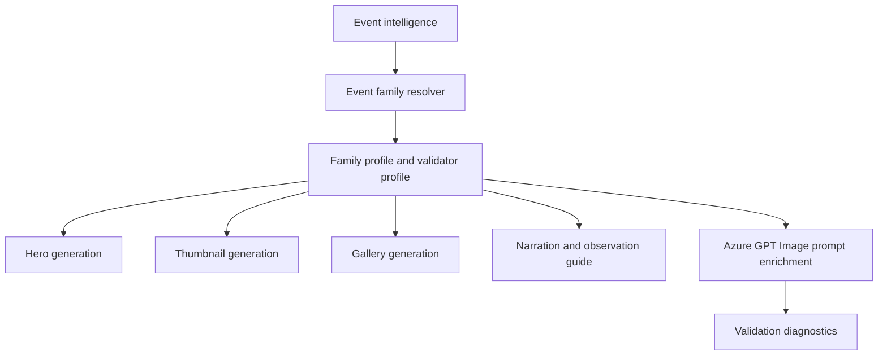

# Planetary Alignment Event Family

## 1 Overview

**Scientific explanation.** A planetary alignment is a broad apparent lineup of multiple planets along the ecliptic. Most public “alignments” are visual lineups, not perfect three-dimensional alignments.

**Typical occurrence.** Minor alignments occur often; large multi-planet visibility events are less frequent and highly dependent on twilight and horizon constraints.

**Visibility.** Visibility requires several planets above the horizon in the same viewing window; some may be too dim or too close to the Sun.

**Difficulty.** Medium to hard: wide sky coverage, dim planets, and horizon limits make it harder than a two-object conjunction.

**Educational significance.** Teaches ecliptic geometry, public-science precision, and the difference between apparent alignment and physical alignment.

**Examples.** Planet parade, five-planet morning lineup, evening ecliptic arc.

## 2 Business Purpose

Business purpose: alignment stories attract broad interest but require careful debunking and practical guidance. Audience: casual audiences, educators, and viewers confused by viral claims. Objectives: set realistic expectations, identify visible planets, explain wide-sky scanning, and avoid exaggeration. Publishing frequency: only when several planets are meaningfully observable; use myth-correction content when public claims spike.

## 3 Hero Strategy

Hero objective: show the ecliptic arc and visible lineup without fake crowding. Hierarchy: ecliptic/horizon arc first, most visible planets next, title and guide. Dominant object: brightest planet or Moon if present; otherwise the arc itself. Composition: ultra-wide horizon or split panels; never compress all planets into a tight cluster unless sky geometry supports it. Title: “Planet Alignment” or “Planet Parade.” Subtitle: “Look along the ecliptic.” Footer: visible/not visible checklist. CTA: “Start with the brightest planet.”

## 4 Thumbnail Strategy

CTR objective: communicate rare/wide lineup while avoiding misinformation. Style: wide cinematic horizon, labeled dots, clean arc. Emotion: curiosity with skepticism. Title: “PLANET PARADE” only when multiple planets are observable; avoid “all planets” unless true. Subtitle: how many visible and when. Examples: “5 PLANETS BEFORE DAWN”, “PLANET LINEUP”.

## 5 Gallery Strategy

Gallery should carry the education load: one slide for realistic view, one for why they line up, one for which planets are visible, one for timing, one for limitations. Density: medium-high with checklist. Overlay: ecliptic line, labels, horizon, visibility status. Carousel strategy must explicitly separate visible naked-eye planets from binocular/telescope-only planets.

## 6 Narration Strategy

Hook: address the viral claim and what viewers can actually see. Fact: planets stay near the ecliptic. Guidance: scan a wide horizon, know which planets are bright, do not expect a tight line. CTA: save the visibility checklist. Voice: trustworthy, myth-busting, practical.

## 7 Observation Guide Strategy

Direction: wide horizon arc from first to last object. Time: narrow best window when most planets are above horizon and sky is dark enough. Equipment: eyes for bright planets; binoculars for Uranus/Neptune if included. Difficulty: medium/hard. Sky: low haze, open horizon. Regional: planet count changes by latitude and local twilight.

## 8 Prompt Enrichment

Prompt enrichment: ultra-wide ecliptic arc, multiple labeled planets, realistic spacing, horizon context. Keywords: planet parade, ecliptic arc, wide horizon, visibility checklist. Atmosphere: educational spectacle. Lighting: pre-dawn/evening gradient. Composition: landscape preferred; portrait may use stacked guide panels; square should show partial arc with checklist. Negative: no tight fake cluster, no meteor streaks, no comet tail, no apocalyptic imagery. Forbidden: “perfect alignment” unless scientifically qualified. Safe overlay: labels must not collide across the arc.

## 9 Validation Rules

Validation: object count and visibility status must match event intelligence; wide spread may require split scenes. Cropping must preserve the arc or checklist. Labels are required for multiple planets. Guide panels should show visible vs binocular-only. Renderer expects PlanetGrouping/RareAlignment style behavior. Failures: invented planets, impossible tight cluster, “all planets” false claim, missing visibility caveats, unreadable labels.

## 10 Localization

English copy should use short, concrete astronomy terms and avoid sensational claims that overpromise visibility. Hindi copy should preserve technical names such as Venus, Jupiter, Moon, eclipse, comet, and radiant with readable Devanagari explanations rather than literal word-for-word translation. Future languages must define font coverage, TTS voice, title length budgets, and localized direction/time conventions before enabling production. Astronomical terminology must remain event-specific: do not import meteor vocabulary into planet or moon families, do not import conjunction vocabulary into moon-only families, and always preserve object names supplied by event intelligence.

## 11 Extension Points

Improve the family by adding richer object-specific validation, observed-performance feedback from published assets, more precise sky-geometry contracts, and localized education cards. Future AI enhancements should use family profiles as declarative prompt modules rather than hard-coded strings. Future educational enhancements can add classroom explainer slides, safety panels, and region-specific observing alternatives while keeping hero, thumbnail, gallery, narration, guide, prompt, validation, and localization rules aligned.

## 12 Related Documents

- [Architecture overview](../architecture/ArchitectureOverview.md)
- [Pipeline architecture](../architecture/PipelineArchitecture.md)
- [Prompt architecture](../architecture/PromptArchitecture.md)
- [AI architecture](../architecture/AIArchitecture.md)
- [Rendering architecture](../architecture/RenderingArchitecture.md)
- [Validation architecture](../architecture/ValidationArchitecture.md)
- [Localization architecture](../architecture/LocalizationArchitecture.md)
- [Astronomy V3 RC2 release notes](../releases/AstronomyV3RC2.md)
- [Roadmap](../Roadmap.md)

