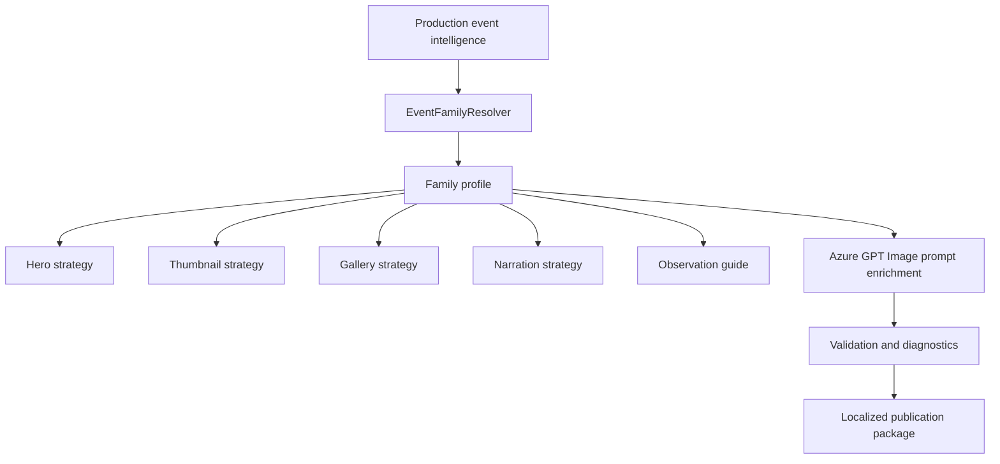
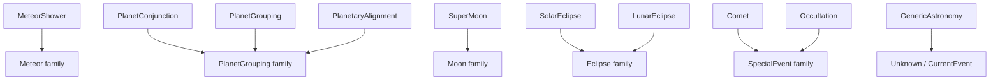

# Astronomy Event Family Specifications

These documents are the product specifications for Astronomy V3 event families. They are the source of truth for hero generation, thumbnail generation, gallery generation, narration, observation guides, AI prompt enrichment, validation, and localization. The implementation currently resolves broad RC2 families (`Meteor`, `PlanetGrouping`, `Moon`, `Eclipse`, `SpecialEvent`, `Unknown`) and these product specs split that architecture into operational content families used by Drashyam.

## Event Family Index

| Event | Frequency | Hero | Thumbnail | Gallery | Narration | Observation Guide | Difficulty | Localization | Prompt Enrichment | Validation |
|---|---:|---|---|---|---|---|---|---|---|---|
| [Solar Eclipse](SolarEclipse.md) | Event-driven; rare per region | Eclipsed solar disk, safety card | High-contrast disk/ring | Stages, path, safety | Safety-first cinematic guide | Exact local contact times, certified filters | Medium-Hard | Safety terms must be exact | Eclipse subtype, corona/ring, no unsafe viewing | Eclipse object, safety, subtype, no false planets/meteors |
| [Lunar Eclipse](LunarEclipse.md) | Event-driven; region-dependent | Red/shadowed Moon | Copper Moon / shadow bite | Stages and peak time | Accessible Moon-shadow story | Moon direction/peak, no special safety | Easy-Medium | Preserve eclipse subtype | Lunar disk, Earth shadow, no solar imagery | Moon visible, shadow subtype correct |
| [Meteor Shower](MeteorShower.md) | Annual peaks plus outbursts | Radiant/streak sky | Peak urgency and bright streaks | Radiant, moonlight, checklist | Energetic practical observing | Dark sky, peak window, no telescope | Easy-Medium | Shower names preserved | Meteor streaks/radiant, no impacts | Streaks visible, peak/window present |
| [Planet Conjunction](PlanetConjunction.md) | Several yearly | Two-object compact pair | Object-name hook | Identity, separation, direction | “What are those bright lights?” | Direction/time/separation | Easy-Medium | Object names transliterated carefully | Two-object hierarchy, no meteor leakage | Both objects present and labeled |
| [Planet Grouping](PlanetGrouping.md) | Several yearly; quality varies | Multi-object group or split clusters | “Spot all objects” guide | Object checklist and ecliptic | Guided tour across group | Best window for all objects | Medium | Keep object list intact | Tight/medium/wide grouping rules | Required object coverage or split report |
| [Planetary Alignment](PlanetaryAlignment.md) | Less frequent for strong public events | Wide ecliptic arc | Planet parade/lineup | Visible vs not visible checklist | Myth-busting, realistic expectations | Wide horizon scan and timing | Medium-Hard | Avoid exaggerated terms | Ultra-wide ecliptic arc | No fake tight cluster; labels/checklist |
| [Comet](Comet.md) | Unpredictable; bright comets uncommon | Comet nucleus/tail | Tail + visibility question | Finder/equipment slides | Rare visitor, honest brightness | Dark sky/binocular guidance | Medium-Hard | Comet names preserved | Tail/coma/dark-sky context | Tail required; no meteor/impact confusion |
| [Occultation](Occultation.md) | Frequent globally; local and precise | Foreground covers background object | “Object disappears” timing | Ingress/egress/path | Precise timing story | Local ingress/egress and equipment | Medium-Hard | Timing wording exact | Covering geometry, timing strip | Must show occulting relationship |
| [Super Moon](SuperMoon.md) | Several/year depending definition | Large detailed Moon | Moonrise visual hook | Perigee, moonrise, myth/fact | Warm Moon guide | Moonrise/eastern horizon | Easy | Moon terms only; no conjunction leakage | Moonrise, craters, no exaggeration | Moon rendered; moon-only forbidden terms |
| [Generic Astronomy](GenericAstronomy.md) | Editorial/evergreen/fallback | Target-specific sky concept | Clear benefit, no false rarity | One concept per slide | Welcoming educational guide | Only sourced time/direction/equipment | Variable | Language configured per target | Event-neutral, current-context keywords | No stale family leakage |

## Architectural Mapping

The product families map onto the RC2 implementation as follows:

- **Meteor Shower** uses the `Meteor` event family and `MeteorShower` validator profile.
- **Planet Conjunction**, **Planet Grouping**, and **Planetary Alignment** use the `PlanetGrouping` family with conjunction/grouping/alignment composition modes.
- **Super Moon** and other full/new/special Moon content use the `Moon` family and moon-specific guide-card validation.
- **Solar Eclipse** and **Lunar Eclipse** use the `Eclipse` family with subtype-specific prompt and safety behavior.
- **Comet** and **Occultation** use `SpecialEvent` subtypes.
- **Generic Astronomy** uses the `Unknown`/`CurrentEvent` fallback when no stronger family resolves.

## How to Add a New Event Family

Use the existing pattern before changing implementation:

1. Define the scientific and product scope.
2. Decide the closest current RC2 family/profile mapping.
3. Specify hero, thumbnail, gallery, narration, and observation-guide behavior.
4. Add prompt enrichment rules for landscape, portrait, and square.
5. Define validation failure conditions before adding renderer code.
6. Define English/Hindi terminology and future multilingual constraints.
7. Link the new document from this README and related architecture docs.

## Related Documents

- [Architecture overview](../architecture/ArchitectureOverview.md)
- [Pipeline architecture](../architecture/PipelineArchitecture.md)
- [Prompt architecture](../architecture/PromptArchitecture.md)
- [Rendering architecture](../architecture/RenderingArchitecture.md)
- [Validation architecture](../architecture/ValidationArchitecture.md)
- [Localization architecture](../architecture/LocalizationArchitecture.md)
- [Astronomy V3 RC2 release notes](../releases/AstronomyV3RC2.md)
- [Roadmap](../Roadmap.md)
