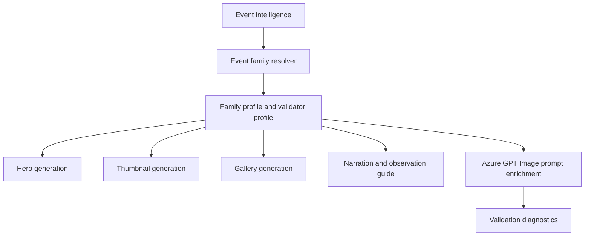

# Solar Eclipse Event Family

## 1 Overview

**Scientific explanation.** A solar eclipse occurs when the Moon passes between Earth and the Sun and blocks all or part of the solar disk. Total, annular, partial, and hybrid forms differ by apparent Moon/Sun size and observer position in the shadow path.

**Typical occurrence.** Several solar eclipses occur globally most years, but any one location sees them rarely; totality at a specific place is uncommon.

**Visibility.** Visibility is path-dependent. The product must distinguish path of totality/annularity from broad partial-eclipse regions and must include eye-safety messaging.

**Difficulty.** Medium to hard: timing and location matter, weather can block the view, and safe solar filters are mandatory for direct viewing outside totality.

**Educational significance.** Excellent for teaching orbital alignment, angular size, shadows, eclipse seasons, and safe observing practice.

**Examples.** Total solar eclipse, annular ring eclipse, partial solar eclipse at sunrise.

## 2 Business Purpose

Drashyam creates solar-eclipse content because eclipses are high-intent, high-share astronomy moments with strong educational and safety needs. Target audiences include casual sky watchers, families, students, teachers, and regional viewers near the visibility path. Learning objectives: explain why eclipses happen, when and where to look, what safety equipment is required, and what visual stages to expect. Publishing frequency is event-driven: publish planning content weeks/months ahead, final guide content in the final week, and short reminders near the event.

## 3 Hero Strategy

Hero objective: make the eclipse geometry instantly recognizable while keeping safety and timing visible. Visual hierarchy: eclipsed Sun/Moon silhouette first, title second, observation/safety card third, footer last. Dominant object: eclipsed solar disk; corona/ring is allowed when scientifically matching the subtype. Composition: large centered or upper-third disk with dark sky/landscape context; avoid clutter. Title strategy: subtype + date/region, e.g., “Solar Eclipse Guide”. Subtitle strategy: path/time/safety phrase. Footer strategy: safety + location + time. CTA strategy: “Check your location” or “Use certified eclipse glasses.” Examples: “Total Solar Eclipse”, “Ring of Fire Eclipse”, “Partial Eclipse Tonight”.

## 4 Thumbnail Strategy

CTR objective: clear rarity and safety value in one glance. Visual style: dramatic high-contrast black disk, corona/ring glow, minimal text. Emotion: awe plus urgency. Curiosity trigger: “Will you see it?” Title rules: 2–5 words, no ambiguous “eclipse” without solar subtype when possible. Subtitle rules: use region/time only if sourced. Examples: “SOLAR ECLIPSE”, “RING OF FIRE”, “WATCH SAFELY”.

## 5 Gallery Strategy

Educational purpose: show event stages, visibility path, safety gear, and timing. Information density should be moderate: one concept per slide. Overlay style: dark translucent panels with yellow/white safety highlights. Caption strategy: stage names, local contact times, filter guidance. Carousel strategy: 1) what happens, 2) who can see it, 3) when to watch, 4) how to watch safely, 5) what to expect.

## 6 Narration Strategy

Opening hook: lead with rarity and viewer relevance. Interesting fact: explain the Moon’s shadow or angular-size coincidence. Observation guidance: emphasize exact location, cloud check, and certified solar filters. Closing CTA: save/share the guide and verify local timings. Voice style: authoritative, calm, safety-first, cinematic without hype.

## 7 Observation Guide Strategy

Direction: based on local Sun position; never use generic east/west unless sourced. Time: contact times and maximum eclipse in local time. Equipment: ISO-certified eclipse glasses or solar-filtered optics; no unfiltered cameras/binoculars/telescopes. Difficulty: medium/hard because safety and path precision matter. Sky conditions: clear horizon/cloud forecast. Regional notes: path, obscuration percentage, and total/annular/partial classification.

## 8 Prompt Enrichment

Azure GPT Image prompts must specify photorealistic eclipsed Sun geometry, safe dark sky/landscape context, and overlay-safe negative space. Visual keywords: solar disk, Moon silhouette, corona or annular ring, horizon, safety card. Atmosphere: rare celestial event, respectful, premium astronomy poster. Lighting: high contrast rim glow; no false daylight if maximum eclipse is nighttime-impossible. Composition: disk separated from text zones; landscape for long hero, portrait with disk upper third, square with centered disk and lower safe area. Negative additions: no fake planets, no meteor streaks, no aurora unless sourced, no unreadable text, no unsafe viewing depiction. Forbidden elements: people looking through unfiltered optics, wrong eclipse subtype, random star fields over daylight Sun. Safe overlay requirements: leave title/subtitle/footer and guide-card zones clean.

## 9 Validation Rules

Object visibility: eclipsed Sun/Moon silhouette must be the primary object. Cropping: corona/ring may not be cut unless intentionally close-up and title zone remains clear. Object count: normally one eclipse disk plus optional landscape; do not add unrelated planets. Safe area: text must not overlap disk or safety panel. Labels: subtype, time, direction, and safety only when sourced. Guide panels: safety card is required. Renderer expectations: Eclipse validator profile, guide card, direction cue, and observation warning. Failure conditions: missing eclipse object, unsafe viewing depiction, wrong subtype, forbidden meteor/planet concepts, no safety guidance, unreadable overlays.

## 10 Localization

English copy should use short, concrete astronomy terms and avoid sensational claims that overpromise visibility. Hindi copy should preserve technical names such as Venus, Jupiter, Moon, eclipse, comet, and radiant with readable Devanagari explanations rather than literal word-for-word translation. Future languages must define font coverage, TTS voice, title length budgets, and localized direction/time conventions before enabling production. Astronomical terminology must remain event-specific: do not import meteor vocabulary into planet or moon families, do not import conjunction vocabulary into moon-only families, and always preserve object names supplied by event intelligence.

## 11 Extension Points

Improve the family by adding richer object-specific validation, observed-performance feedback from published assets, more precise sky-geometry contracts, and localized education cards. Future AI enhancements should use family profiles as declarative prompt modules rather than hard-coded strings. Future educational enhancements can add classroom explainer slides, safety panels, and region-specific observing alternatives while keeping hero, thumbnail, gallery, narration, guide, prompt, validation, and localization rules aligned.

## 12 Related Documents

- [Architecture overview](../architecture/ArchitectureOverview.md)
- [Pipeline architecture](../architecture/PipelineArchitecture.md)
- [Prompt architecture](../architecture/PromptArchitecture.md)
- [AI architecture](../architecture/AIArchitecture.md)
- [Rendering architecture](../architecture/RenderingArchitecture.md)
- [Validation architecture](../architecture/ValidationArchitecture.md)
- [Localization architecture](../architecture/LocalizationArchitecture.md)
- [Astronomy V3 RC2 release notes](../releases/AstronomyV3RC2.md)
- [Roadmap](../Roadmap.md)

