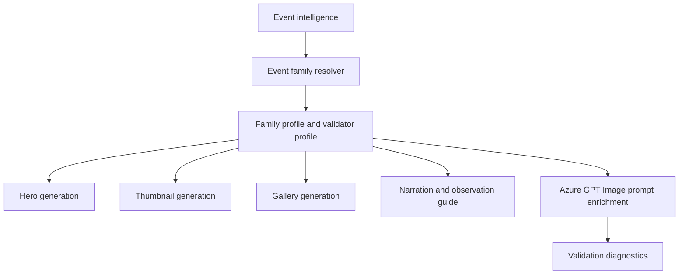

# SuperMoon Event Family

## 1 Overview

**Scientific explanation.** A supermoon is a full or new Moon near perigee, making the lunar disk appear slightly larger and brighter than average. Public content usually focuses on perigee full Moons.

**Typical occurrence.** Several can occur in a year depending on definition; named full moons may overlap with supermoon status.

**Visibility.** Visible wherever the Moon is above the horizon near full phase, weather permitting.

**Difficulty.** Easy: no equipment required, best with clear horizon near moonrise/moonset for scale context.

**Educational significance.** Teaches lunar orbit eccentricity, perigee/apogee, angular size, moonrise timing, and why horizon illusions amplify perception.

**Examples.** Super Buck Moon, Super Harvest Moon, perigee full Moon.

## 2 Business Purpose

Business purpose: supermoons are reliable, accessible, and audience-friendly Moon stories. Target audience: families, casual viewers, photographers, social audiences. Objectives: explain what “super” means, when moonrise occurs, where to look, and avoid unrelated planet/meteor vocabulary. Publishing frequency: every qualifying named/super full Moon, with local moonrise guides and photography tips.

## 3 Hero Strategy

Hero objective: celebrate the Moon while staying scientifically grounded. Hierarchy: large Moon first, moonrise/time guide second, title third. Dominant object: detailed lunar disk. Composition: Moon above horizon/landmark, large but not absurd; preserve craters and round shape. Title: “Supermoon Tonight” or named Moon. Subtitle: moonrise time/direction. Footer: “Look East at moonrise.” CTA: “Watch at moonrise for best effect.”

## 4 Thumbnail Strategy

CTR objective: beautiful Moon plus immediate viewing cue. Style: large warm Moon, skyline/horizon, minimal text. Emotion: calm awe. Curiosity: “Why it looks bigger.” Title rules: use “Supermoon” only when event qualifies. Subtitle: moonrise/direction. Examples: “SUPERMOON TONIGHT”, “BIGGEST FULL MOON?”.

## 5 Gallery Strategy

Gallery teaches perigee, moonrise direction, photo tips, size myth, and named Moon meaning. Density: medium. Overlay: Moon card, phase/illumination, moonrise/moonset, direction. Carousel: tonight’s Moon, why supermoon, when to look, photo tip, myth vs fact.

## 6 Narration Strategy

Hook: “Tonight’s full Moon is near its closest point to Earth.” Fact: size change is real but subtle; horizon makes it feel dramatic. Guidance: watch near moonrise with open eastern horizon. CTA: share/save moonrise time. Voice: warm, family-friendly, factual.

## 7 Observation Guide Strategy

Direction: Moonrise/eastern horizon or local Moon position. Time: moonrise and best viewing window. Equipment: eyes; camera/tripod optional. Difficulty: easy. Sky: clear low horizon; haze can add color but clouds block. Regional: moonrise time changes by location.

## 8 Prompt Enrichment

Prompt enrichment: large detailed full Moon, horizon/landmark, warm moonrise color, guide-card-safe layout. Keywords: full Moon, supermoon, moonrise, craters, eastern horizon. Atmosphere: serene and accessible. Lighting: warm low Moon or cool high Moon. Composition: portrait Moon upper half, landscape Moon side third, square Moon centered with lower guide card. Negative: no planet conjunction, no meteor streaks, no eclipse shadow unless lunar eclipse event, no exaggerated impossible Moon size. Forbidden: Jupiter/Venus/Mars/conjunction/alignment/radiant meteor terms for Moon-only content. Safe overlay: moonrise card must not cover lunar disk.

## 9 Validation Rules

Validation: Moon must be rendered, circular, detailed, and phase-consistent. Cropping cannot flatten/cut the disk unless intentional close-up still preserves identity. Object count: Moon only plus landscape; no unsourced planets. Labels: phase/name, moonrise, direction. Guide panels: Moon guide card expected. Renderer expects Moon validator/MoonPhaseGuideThumbnail with moon-specific forbidden-term diagnostics. Failures: missing Moon, unrelated planets, eclipse coloration, meteor/conjunction leakage, unreadable moonrise card.

## 10 Localization

English copy should use short, concrete astronomy terms and avoid sensational claims that overpromise visibility. Hindi copy should preserve technical names such as Venus, Jupiter, Moon, eclipse, comet, and radiant with readable Devanagari explanations rather than literal word-for-word translation. Future languages must define font coverage, TTS voice, title length budgets, and localized direction/time conventions before enabling production. Astronomical terminology must remain event-specific: do not import meteor vocabulary into planet or moon families, do not import conjunction vocabulary into moon-only families, and always preserve object names supplied by event intelligence.

## 11 Extension Points

Improve the family by adding richer object-specific validation, observed-performance feedback from published assets, more precise sky-geometry contracts, and localized education cards. Future AI enhancements should use family profiles as declarative prompt modules rather than hard-coded strings. Future educational enhancements can add classroom explainer slides, safety panels, and region-specific observing alternatives while keeping hero, thumbnail, gallery, narration, guide, prompt, validation, and localization rules aligned.

## 12 Related Documents

- [Architecture overview](../architecture/ArchitectureOverview.md)
- [Pipeline architecture](../architecture/PipelineArchitecture.md)
- [Prompt architecture](../architecture/PromptArchitecture.md)
- [AI architecture](../architecture/AIArchitecture.md)
- [Rendering architecture](../architecture/RenderingArchitecture.md)
- [Validation architecture](../architecture/ValidationArchitecture.md)
- [Localization architecture](../architecture/LocalizationArchitecture.md)
- [Astronomy V3 RC2 release notes](../releases/AstronomyV3RC2.md)
- [Roadmap](../Roadmap.md)

