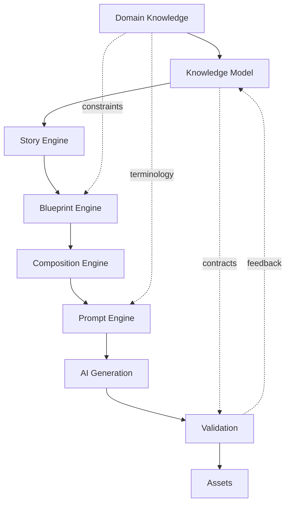
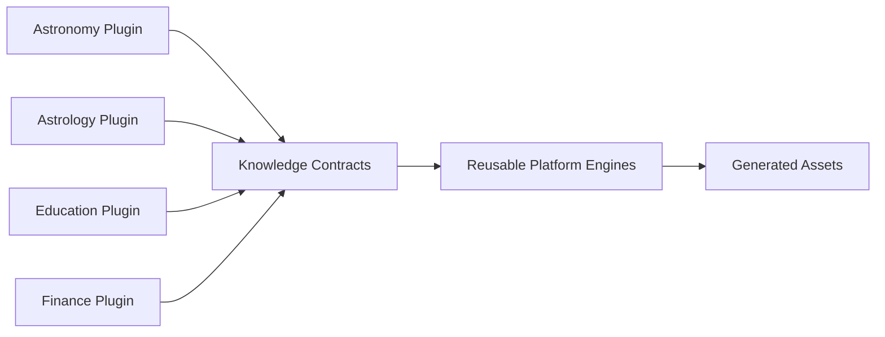

# Knowledge Architecture

## Purpose

Knowledge Architecture describes how the platform turns structured domain understanding into generated media. It defines the reusable layer beneath story planning, visual planning, prompt assembly, validation, and publishing.

Astronomy V3 RC2 proves the pattern with astronomy events. The same architecture supports astrology, numerology, education, history, travel, health, finance, and other domains when each domain provides compatible knowledge contracts.

## Definition of knowledge

In this platform, knowledge is structured, validated, reusable context that describes what the content is about, what must be true, how it should be represented, and how output should be checked.

Knowledge is not a prompt. A prompt is only a provider-specific projection of knowledge into an AI generation request.

Knowledge includes:

- Facts: verifiable claims and source-derived values.
- Entities: objects, people, places, events, concepts, instruments, or market symbols.
- Relationships: how entities interact or depend on one another.
- Timing: dates, windows, recurrence, phases, sequence, duration, and deadlines.
- Region: geography, audience location, visibility, jurisdiction, or market.
- Language: locale, terminology, tone, units, calendars, and cultural rules.
- Visual intent: what must appear, what must not appear, and how visual assets communicate meaning.
- Validation rules: checks that keep generated assets faithful to the knowledge model.

## Knowledge-first pipeline

The important architectural rule is that every downstream engine consumes a structured representation. The Story Engine receives facts and narrative affordances, not raw prose. The Blueprint Engine receives asset requirements and constraints, not vague creative direction. The Prompt Engine receives validated contracts and converts them into provider-specific prompt text.

## Knowledge categories

| Category | Description | Examples |
| --- | --- | --- |
| Platform knowledge | Shared rules owned by the platform and reused across domains. | Asset schemas, validation patterns, publishing states, prompt safety rules. |
| Domain knowledge | Subject-matter model for a product domain. | Astronomy objects, zodiac signs, lesson topics, historical periods, travel destinations. |
| Event knowledge | Time-bound or occurrence-specific knowledge. | Meteor shower peak, eclipse path, market earnings date, festival date, itinerary day. |
| Asset knowledge | Knowledge required to generate consistent media assets. | Hero image visual intent, thumbnail hierarchy, narration tone, safe-area rules. |
| Localization knowledge | Language, locale, cultural, and regional adaptation rules. | Hindi terminology, metric/imperial units, local sky visibility, market jurisdiction. |

## Astronomy today

Astronomy already uses a knowledge-first pattern through event families, event intelligence, visual requirements, localization, and validation gates. Event families such as eclipses, conjunctions, comets, meteor showers, supermoons, occultations, and generic astronomy topics provide domain-specific rules that influence story structure, visual depiction, observability, timing, and user guidance.

Current astronomy knowledge appears as:

- Event family definitions and constraints.
- Structured event metadata such as date, peak time, region, visibility, objects involved, and observing guidance.
- Visual source requirements for realistic celestial representation.
- Prompt enrichment rules that prevent generic or incorrect imagery.
- Localization requirements for language-specific narration and overlays.
- Validation checks for prompt safety, asset completeness, and event-family correctness.

## Reuse by future domains

Future domains reuse the same architecture by replacing astronomy-specific ontology and rules with domain-specific knowledge plugins.

The shared platform does not need to know every domain in advance. It needs stable contracts for facts, entities, events, localization, visual intent, and validation. Each domain plugin supplies the domain-specific vocabulary, rules, sources, and interpretation logic.

## Example domains

| Domain | Knowledge focus | Generated asset implications |
| --- | --- | --- |
| Astronomy | Celestial entities, events, observability, timing, location. | Accurate sky visuals, observing guides, event explainers. |
| Astrology | Zodiac systems, houses, transits, interpretations, audience personalization. | Symbolic visuals, daily readings, compatibility narratives. |
| Numerology | Numbers, birth dates, name mappings, interpretive systems. | Personalized reports, symbolic artwork, explanation videos. |
| Education | Curriculum, learning objectives, prerequisites, assessments. | Lessons, diagrams, quizzes, explainer videos. |
| History | People, places, periods, chronology, causality, sources. | Timelines, documentary scripts, maps, reenactment prompts. |
| Travel | Destinations, seasons, itineraries, attractions, budgets, restrictions. | Guides, itineraries, destination visuals, localized recommendations. |
| Health | Conditions, wellness goals, evidence levels, safety disclaimers. | Educational content, habit plans, visuals with strict validation. |
| Finance | Instruments, markets, dates, metrics, risk, regulations. | Market explainers, dashboards, scenario narratives, compliance checks. |

## Architectural responsibilities

The knowledge layer is responsible for:

- Keeping facts separate from generated expression.
- Normalizing domain inputs into platform-readable contracts.
- Providing stable identifiers for entities, events, regions, languages, and assets.
- Supplying validation rules before and after generation.
- Enabling localization without corrupting meaning.
- Supporting future knowledge graph, RAG, and AI content director capabilities.

## Non-goals

The knowledge layer does not directly render videos, call AI providers, publish assets, or replace domain expertise. It provides the structured source of truth those systems consume.

## Knowledge foundation registry map

The CG-A2 knowledge foundation separates stable platform taxonomies from domain-specific payload implementations so future astronomy families can register new typed knowledge without changing statement envelopes or downstream engines.

| Registry area | Architectural role | Astronomy examples |
| --- | --- | --- |
| Knowledge domains | Coarse subject buckets that describe the kind of knowledge represented by a typed payload. They route validation, indexing, and downstream consumers without replacing family-specific science models. | Classification, physical, orbital, positional, observational, event, temporal, catalog, and derived knowledge. |
| Payload families | Stable groups for related payload shapes within a knowledge domain. They help validators and registries reason about compatible records without inspecting every field. | Entity classification, physical property, orbital parameter, spatial position, observation condition, visibility window, astronomical event, temporal cycle, catalog reference, and derived property. |
| Knowledge type IDs | Versioned, lowercase, dot-separated identifiers for concrete typed payload contracts. They are external contract names, not CLR type names, database IDs, or localized labels. | `typed.classification.entity.v1`, `typed.physical.properties.v1`, `typed.orbital.parameters.v1`. |
| Payload descriptors | Registration metadata binding a knowledge type ID to a concrete payload contract, its knowledge domain, and its payload family. Descriptors are explicit so serialization and validation do not depend on reflection scanning. | A classification descriptor maps `typed.classification.entity.v1` to the entity-classification payload with the classification domain and entity-classification family. |
| Statement kinds | The semantic intent of a knowledge statement independent of its payload body. They let the platform distinguish scientific assertions, editorial guidance, validation rules, observations, and derived assertions while keeping the envelope stable. | A physical-property payload can be carried by a scientific statement, while a remediation payload could be carried by a validation-oriented statement. |
| Validation capabilities | Structural and semantic checks available to the knowledge foundation before content generation consumes a statement. These checks confirm identity, payload completeness, domain/family consistency, issue severity, remediation hints, and deterministic issue codes. | Missing subjects, malformed paths, invalid enum values, family mismatches, duplicate records, and non-blocking warnings. |
| Graph-validation capabilities | Cross-statement checks that treat entities, statements, relationships, references, provenance, versions, repository roots, and graph connectivity as one validation set. They catch issues that single-statement validation cannot see. | Duplicate node identities, missing relationship targets, conflicting duplicate knowledge, broken provenance references, forbidden cycles, orphan statements, disconnected components, and repository mismatches. |
| Registration metadata | The explicit catalog of descriptors, rules, DI registrations, rule ordering, and schema-versioned names needed to assemble the knowledge foundation consistently in tests and production services. | Built-in typed payload descriptors, validation rule descriptors, graph-validation rule ordering, and service-collection extension registrations. |

These registry areas are intentionally narrow. They define how typed knowledge is identified, registered, serialized, and validated, but they do not add astronomy facts, persistence migrations, prompt text, rendering logic, publishing behavior, or certification decisions.
