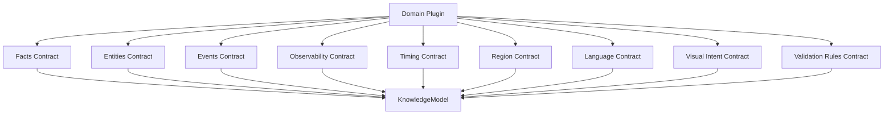

# Knowledge Contracts

## Purpose

Knowledge Contracts define the required fields and behavioral guarantees between domain plugins and reusable platform engines. They prevent each domain from inventing a separate integration shape.

## Contract map

## Facts contract

Defines verifiable assertions used by generated content.

Required concerns:

- Fact identifier.
- Claim text or structured value.
- Source and provenance.
- Confidence level.
- Freshness or effective date.
- Domain and locale applicability.
- Validation status.

## Entities contract

Defines stable identity for domain objects.

Required concerns:

- Entity identifier.
- Canonical name.
- Aliases and localized names.
- Entity type.
- Attributes.
- Relationships to other entities.
- Visual representation hints where applicable.

## Events contract

Defines content opportunities and time-bound occurrences.

Required concerns:

- Event identifier.
- Event family or type.
- Participating entities.
- Timing references.
- Region references.
- Narrative importance.
- Audience relevance.
- Asset package recommendations.

## Observability contract

Defines how, where, or under what conditions something can be observed, experienced, measured, or verified.

Astronomy uses literal sky observability. Other domains reinterpret the same contract:

- Travel: attraction availability or seasonal accessibility.
- Finance: market availability or reporting window.
- Education: measurable learning outcome.
- Health: symptom or habit tracking context.

Required concerns:

- Condition.
- Region or audience segment.
- Time window.
- Confidence.
- Limitation or disclaimer.

## Timing contract

Defines temporal structure.

Required concerns:

- Start and end time.
- Peak or key moment.
- Time zone handling.
- Precision level.
- Recurrence.
- Localized date and time formatting.

## Region contract

Defines geographic, market, cultural, jurisdictional, or audience boundaries.

Required concerns:

- Region identifier.
- Region type.
- Parent and child regions.
- Time zone or currency where relevant.
- Language defaults.
- Domain-specific constraints.

## Language contract

Defines locale-specific terminology and expression rules.

Required concerns:

- Language code and locale.
- Domain glossary.
- Forbidden mistranslations.
- Units and calendars.
- Tone and reading level.
- Script and font requirements for visual assets.

## Visual intent contract

Defines what generated visual assets must communicate.

Required concerns:

- Primary subject.
- Required objects.
- Forbidden objects or styles.
- Composition intent.
- Accuracy requirements.
- Safe areas and overlay constraints.
- Aspect ratio and asset family.

## Validation rules contract

Defines how generated and normalized outputs are checked.

Required concerns:

- Rule identifier.
- Rule scope.
- Severity.
- Automated or human review mode.
- Failure message.
- Remediation action.
- Blocking or non-blocking behavior.

## Contract ownership

| Contract | Owned by | Consumed by |
| --- | --- | --- |
| Facts | Domain plugin and source adapters. | Story, prompt, validation. |
| Entities | Domain ontology. | Story, blueprint, visual assets, localization. |
| Events | Domain plugin. | Story, blueprint, composition. |
| Observability | Domain plugin. | Story, guide, validation. |
| Timing | Domain plugin and localization. | Story, narration, metadata, publishing. |
| Region | Domain plugin and localization. | Localization, publishing, validation. |
| Language | Localization layer. | Prompt, rendering, narration, validation. |
| Visual intent | Domain plugin and product modules. | Blueprint, composition, prompt, asset validation. |
| Validation rules | Platform plus domain plugin. | Validation engine and review workflow. |
