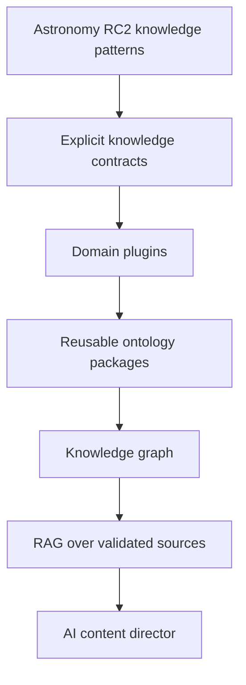
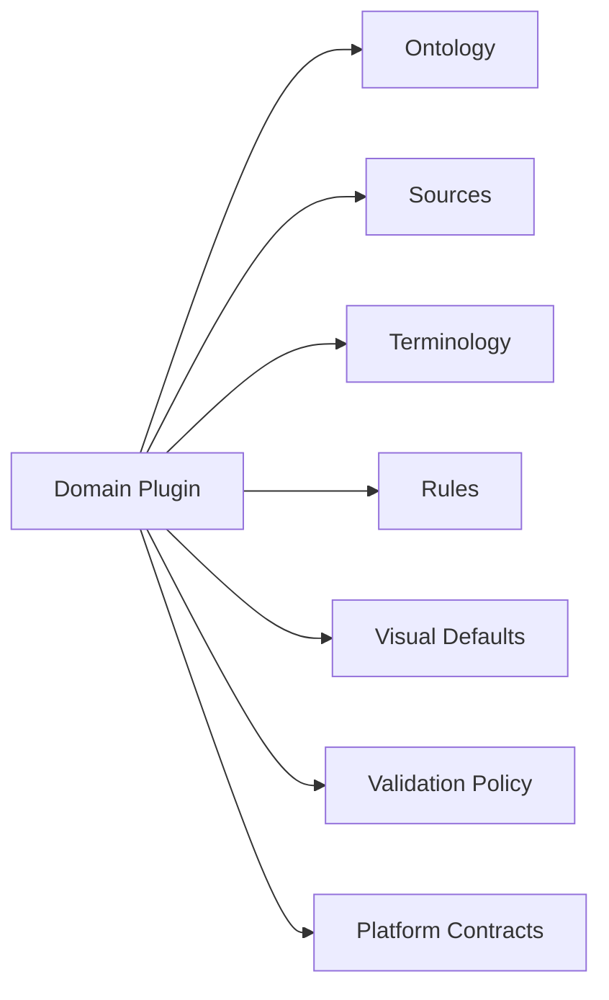
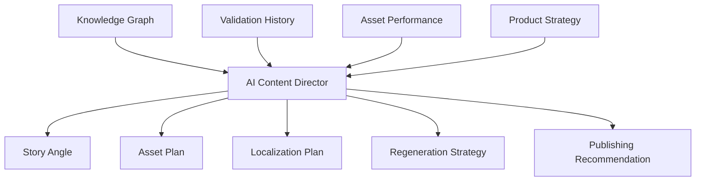

# Knowledge Evolution

## Purpose

Knowledge Evolution describes how the knowledge layer grows from astronomy-specific structures into a multi-domain, graph-backed, plugin-driven AI Content Generation Platform.

## Evolution path

## Phase 1: Astronomy knowledge patterns

Astronomy V3 RC2 already demonstrates domain-aware content generation through event families, structured event data, visual intent, localization, and validation. The first evolution step is to document and stabilize these implicit patterns as explicit contracts.

## Phase 2: Explicit knowledge contracts

The platform should formalize contracts for facts, entities, events, observability, timing, region, language, visual intent, and validation rules. Once explicit, these contracts become the integration boundary for every future domain.

## Phase 3: Domain plugins

Domain plugins package ontology, terminology, source adapters, validation rules, enrichment logic, and asset defaults.

A plugin should be replaceable without changing platform engines. Astronomy becomes one plugin, not the hardcoded shape of the platform.

## Phase 4: Reusable ontology

Some ontology concepts recur across domains:

- Time and recurrence.
- Region and audience.
- Source and confidence.
- Person, place, organization, event, and artifact.
- Visual subject and composition.
- Language, locale, and glossary.
- Risk, safety, and compliance.

Reusable ontology packages prevent each domain from redefining the same primitives.

## Phase 5: Knowledge graph

A graph connects facts, entities, events, sources, regions, languages, generated assets, and validation outcomes. This enables relationship-aware generation, source traceability, impact analysis, and richer personalization.

## Phase 6: RAG over validated sources

Retrieval-augmented generation should retrieve from validated knowledge, not arbitrary raw text. RAG becomes safer when the retrieval corpus is normalized, sourced, versioned, and connected to validation rules.

RAG responsibilities:

- Retrieve relevant facts and context.
- Preserve provenance.
- Respect domain and locale boundaries.
- Avoid mixing stale and current facts.
- Feed prompt contracts rather than bypassing them.

## Phase 7: AI content director

The AI content director is a future orchestration layer that chooses story angles, asset packages, audience framing, regeneration strategies, and publication recommendations based on knowledge graph state, validation history, and performance feedback.

## Governance

Knowledge evolution requires governance:

- Version domain profiles and contracts.
- Track source freshness and confidence.
- Deprecate stale facts and old terminology.
- Review high-risk domains with stricter validation.
- Keep generated assets traceable to knowledge versions.
- Measure validation failures and feed them into contract improvement.

## Strategic outcome

The platform becomes more valuable as domains are added because shared contracts, ontology, validation history, localization patterns, and asset generation strategies compound across products. The goal is not many prompt templates; the goal is a reusable knowledge architecture that can direct many forms of AI content generation.
