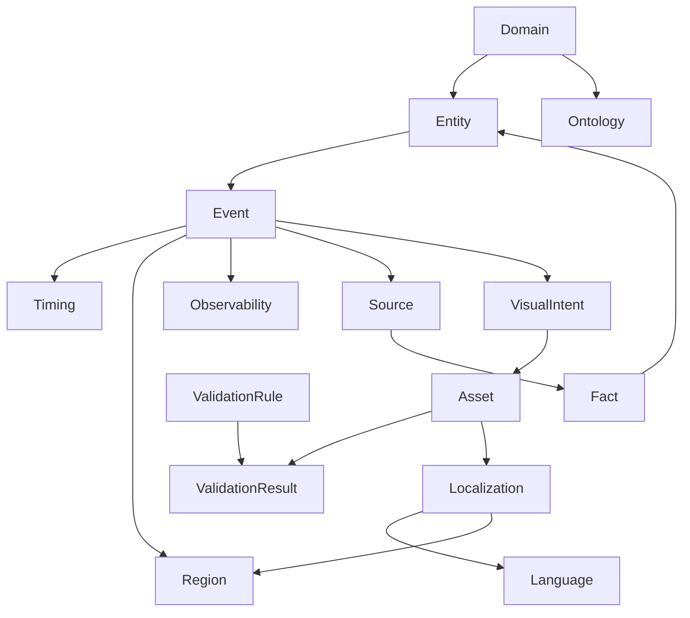
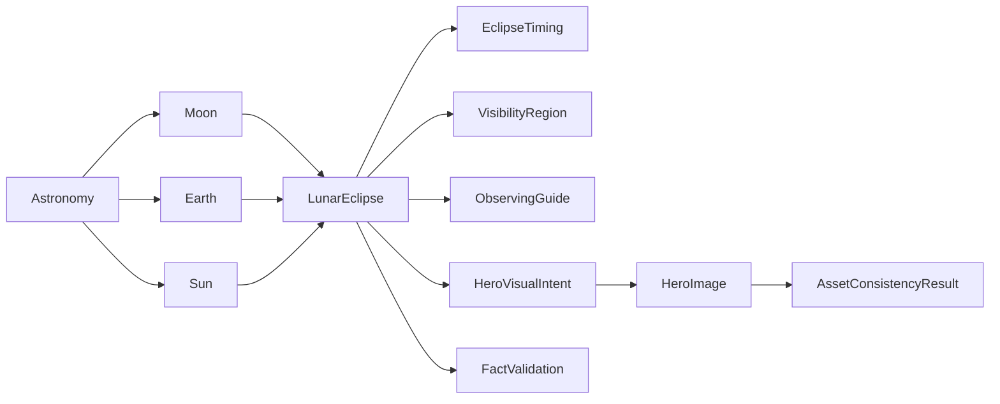

# Knowledge Graph

## Purpose

The Knowledge Graph is the future representation of relationships across domains, entities, events, assets, sources, regions, languages, and validation outcomes. It turns isolated generation inputs into a reusable semantic network.

## Conceptual graph

## Nodes

| Node type | Description |
| --- | --- |
| Domain | Product knowledge boundary such as astronomy, travel, education, or finance. |
| Entity | A named object, concept, place, person, instrument, market, or symbolic item. |
| Event | A time-bound occurrence or content opportunity. |
| Fact | A verifiable assertion with provenance and confidence. |
| Source | Origin of a fact or rule. |
| Timing | Date, duration, phase, recurrence, sequence, or deadline. |
| Region | Geographic, jurisdictional, audience, or visibility boundary. |
| Observability | Conditions under which an event can be observed, experienced, or measured. |
| Visual intent | Required visual meaning and constraints. |
| Asset | Generated or curated output artifact. |
| Localization | Locale-specific adaptation of terminology, units, format, tone, and cultural framing. |
| Validation rule | Machine-checkable or reviewer-checkable rule. |
| Validation result | Outcome of checks against a generated or normalized artifact. |

## Edges

| Edge | Meaning |
| --- | --- |
| domain contains entity | Entity belongs to a domain ontology. |
| entity participates in event | Entity is relevant to an occurrence. |
| event occurs during timing | Event has a temporal boundary. |
| event visible from region | Event has region-specific observability. |
| fact derived from source | Fact has provenance. |
| asset represents visual intent | Asset must satisfy a declared representation. |
| localization adapts asset | Asset is transformed for language and region. |
| validation rule checks contract | Rule enforces a knowledge requirement. |

## Astronomy example

## Cross-domain reuse

The graph model is reusable because domains differ mostly in ontology and validation semantics, not in the need to connect facts, entities, events, timing, regions, assets, and validation results.

Examples:

- Travel connects destinations, seasons, itinerary events, visas, attractions, languages, and assets.
- History connects people, places, dates, primary sources, maps, timelines, and documentary scenes.
- Finance connects instruments, markets, earnings events, metrics, regions, risk notices, and charts.
- Education connects concepts, prerequisites, learning objectives, assessments, examples, and diagrams.

## Future graph services

The platform can evolve toward:

- Entity resolution across sources and domains.
- Relationship-aware story planning.
- Source-aware RAG retrieval.
- Reusable ontology packages.
- Knowledge impact analysis when facts change.
- AI content director decisions based on graph state and validation history.
