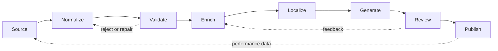
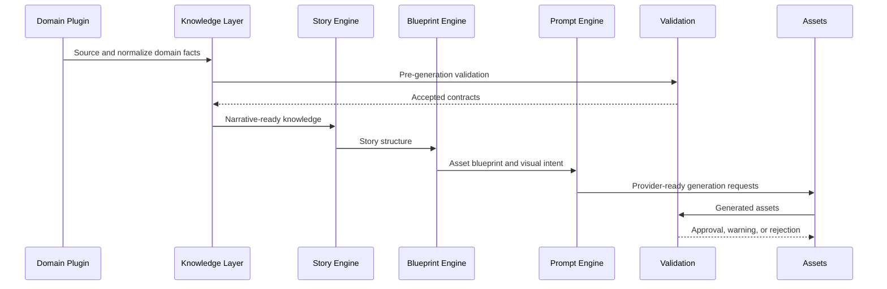

# Knowledge Lifecycle

## Purpose

The Knowledge Lifecycle defines how raw domain information becomes validated, localized, generation-ready knowledge and then published assets.

## Lifecycle flow

## Stages

### 1. Source

Collect domain inputs from approved sources, product configuration, user requests, curated data files, APIs, editorial rules, or previously generated knowledge.

Outputs:

- Raw facts.
- Candidate entities and events.
- Source provenance.
- Confidence and freshness metadata.

### 2. Normalize

Convert raw inputs into platform knowledge records with stable identifiers, canonical terminology, typed fields, and domain profile mappings.

Outputs:

- Normalized entities.
- Normalized events.
- Timing and region records.
- Initial validation scope.

### 3. Validate

Check normalized records before generation. Validation protects the platform from factual errors, missing required fields, unsafe prompt inputs, and invalid localization assumptions.

Outputs:

- Accepted records.
- Rejected records.
- Warnings requiring review.
- Repair suggestions.

### 4. Enrich

Add derived structure that helps story, blueprint, composition, and prompt systems. Enrichment may add narrative significance, visual intent, audience relevance, related entities, observing guidance, or asset recommendations.

Outputs:

- Story affordances.
- Visual intent.
- Asset requirements.
- Recommended composition patterns.

### 5. Localize

Adapt knowledge for target language, region, culture, units, calendars, and audience expectations while preserving source facts and entity identity.

Outputs:

- Localized terminology.
- Region-specific timing.
- Locale-specific formatting.
- Cultural and compliance notes.

### 6. Generate

Generate stories, blueprints, prompts, images, narration, thumbnails, galleries, metadata, or guides from structured knowledge.

Outputs:

- Generated text assets.
- Generated visual assets.
- Generated audio or video assets.
- Prompt diagnostics.

### 7. Review

Run automated and human review against the original knowledge contracts.

Outputs:

- Fact validation results.
- Terminology validation results.
- Prompt safety results.
- Localization accuracy results.
- Asset consistency results.

### 8. Publish

Publish approved assets and retain lineage from asset to knowledge source, validation outcome, locale, and generation configuration.

Outputs:

- Published assets.
- Asset lineage.
- Performance feedback.
- Future enrichment signals.

## Lifecycle responsibilities by engine

## Lifecycle states

| State | Meaning |
| --- | --- |
| Draft | Ingested but not trusted for generation. |
| Normalized | Converted to platform schema. |
| Validated | Passed required checks. |
| Enriched | Has story, visual, or asset metadata. |
| Localized | Adapted for target locale. |
| GenerationReady | Approved for engines. |
| Generated | Used to create assets. |
| Reviewed | Assets checked against contracts. |
| Published | Approved output released. |
| Deprecated | Replaced or no longer valid. |

## Feedback loops

Validation outcomes and asset performance should improve future knowledge. Failed terminology checks update localization rules. Visual misses update visual intent rules. Factual corrections update source confidence and domain validation policy.
