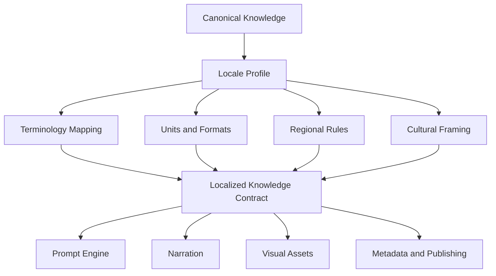
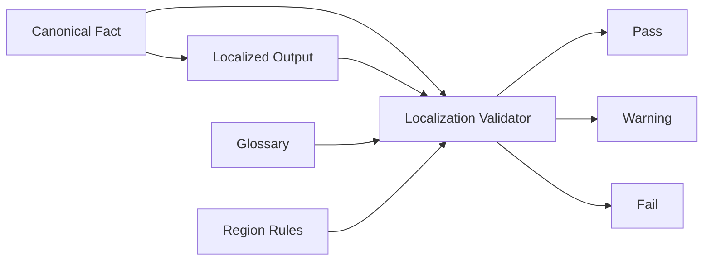

# Knowledge Localization

## Purpose

Knowledge Localization adapts structured knowledge to a target language, region, culture, and channel without corrupting the underlying facts or entity identity.

Localization is not only translation. It includes timing, units, terminology, naming, cultural framing, compliance boundaries, visual text, script support, and regional relevance.

## Localization flow

## Localization responsibilities

- Preserve canonical entity identifiers.
- Translate or transliterate names according to domain policy.
- Convert dates, times, units, currencies, and calendars where appropriate.
- Apply locale-specific terminology and forbidden translations.
- Adapt examples and framing to the region.
- Ensure visual overlays use supported scripts, fonts, and safe areas.
- Validate localized output against the original knowledge contract.

## Localization knowledge types

| Type | Description |
| --- | --- |
| Language profile | Language, script, reading direction, tone, and reading level. |
| Locale profile | Region-specific date, time, units, currency, and naming conventions. |
| Domain glossary | Approved translations and terms for domain entities and concepts. |
| Cultural rules | Phrasing, sensitivity, examples, and assumptions for the target audience. |
| Visual text rules | Font, safe area, text length, script rendering, and overlay constraints. |
| Compliance rules | Regional restrictions, disclaimers, or regulated phrasing. |

## Astronomy localization examples

- Convert event timing from UTC to local time where required.
- Explain visibility by region rather than implying global visibility.
- Preserve names such as Mars, Venus, Perseids, or lunar eclipse using approved localized terminology.
- Avoid translating constellation or event-family names into misleading terms.
- Ensure thumbnail and hero overlays fit the target script.

## Cross-domain examples

| Domain | Localization concern |
| --- | --- |
| Astrology | Zodiac terminology, calendar conventions, cultural interpretation style. |
| Numerology | Name scripts, number symbolism, birth date formats. |
| Education | Grade level, curriculum terms, local examples. |
| History | Place names, period names, political sensitivity, map labels. |
| Travel | Local names, currencies, seasons, transport conventions, safety advisories. |
| Health | Regulatory language, disclaimers, measurement units, culturally appropriate examples. |
| Finance | Currency, market hours, tax or regulatory boundaries, risk language. |

## Localization validation

Localization validation checks:

- Fact preservation.
- Entity identity preservation.
- Approved terminology.
- Correct dates, units, currencies, and time zones.
- Script and font compatibility.
- Tone and audience fit.
- Regional compliance requirements.

## Design rule

The canonical knowledge record remains the source of truth. Localized knowledge is a projection with traceability back to canonical records, not a separate untracked fact base.
