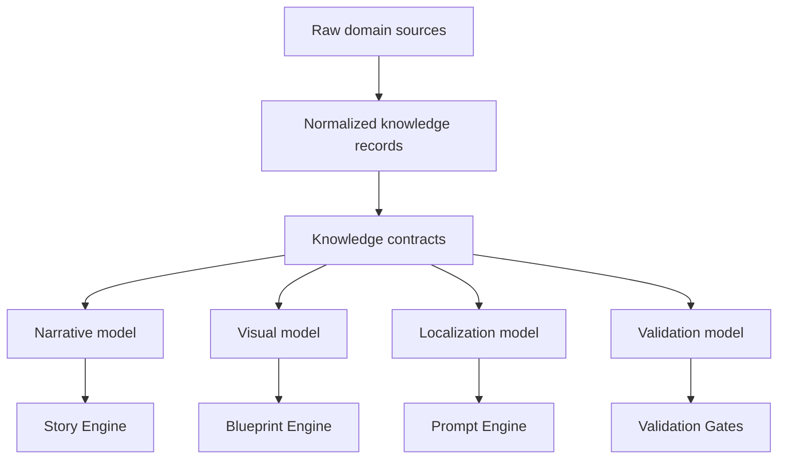
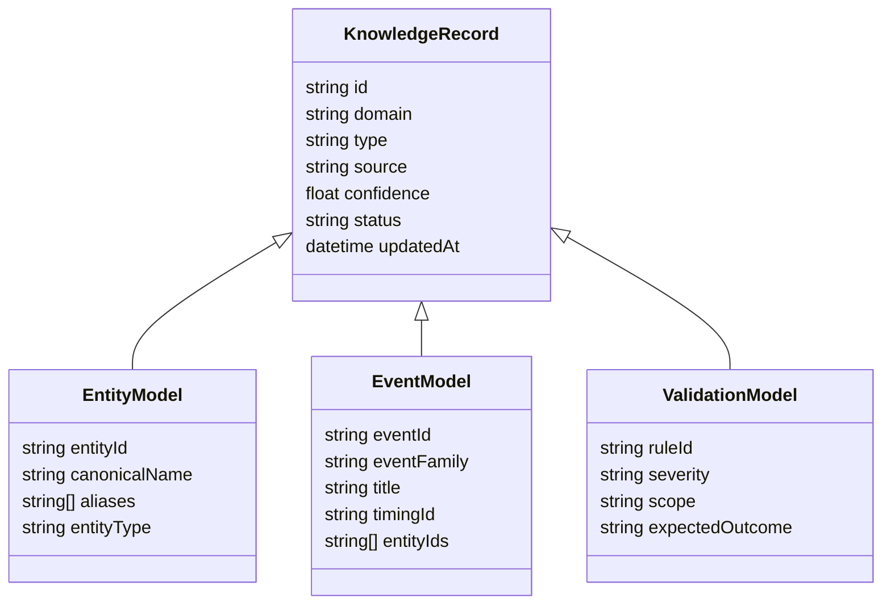

# Knowledge Model

## Purpose

The Knowledge Model is the normalized contract that transforms domain inputs into platform-readable structures. It is the boundary between domain plugins and reusable generation engines.

## Model layers

## Core objects

| Object | Responsibility |
| --- | --- |
| DomainProfile | Defines ontology, terminology, supported assets, rules, and validation policy. |
| KnowledgeRecord | Normalized fact, entity, event, relationship, or rule. |
| EntityModel | Stable identity and attributes for domain entities. |
| EventModel | Time-bound occurrence or content opportunity. |
| ObservabilityModel | Region, condition, availability, measurement, or visibility context. |
| TimingModel | Temporal structure, recurrence, duration, phases, and precision. |
| RegionModel | Geography, market, jurisdiction, culture, or audience boundary. |
| LanguageModel | Locale, terminology, formatting, units, and writing conventions. |
| VisualIntentModel | Required imagery, composition intent, exclusions, style, and accuracy rules. |
| ValidationModel | Rules and expected checks for facts, prompts, localization, and assets. |

## Minimal knowledge record

## Astronomy mapping

| Knowledge model object | Astronomy example |
| --- | --- |
| DomainProfile | Astronomy domain with celestial terminology and event families. |
| EntityModel | Moon, Mars, Perseids, comet, constellation, observer location. |
| EventModel | Lunar eclipse, meteor shower peak, planet conjunction. |
| ObservabilityModel | Visible from North America, best after midnight, low horizon constraints. |
| TimingModel | Peak time, event window, local date conversion. |
| RegionModel | Country, hemisphere, city, time zone, sky visibility region. |
| LanguageModel | English, Hindi, Spanish, localized units and date formats. |
| VisualIntentModel | Realistic Moon eclipse, meteor radiant, planet grouping, no fantasy planet. |
| ValidationModel | Required objects present, forbidden generic terms absent, safe overlays. |

## Domain examples

| Domain | Entity model | Event model | Observability or region model |
| --- | --- | --- | --- |
| Astrology | Sign, house, planet, aspect. | Transit, retrograde, daily reading. | Audience birth chart or locale. |
| Numerology | Number, name token, birth date component. | Personal year, monthly cycle. | Cultural number interpretation. |
| Education | Concept, objective, prerequisite. | Lesson, assessment, curriculum milestone. | Grade level and region curriculum. |
| History | Person, place, institution, artifact. | Battle, treaty, reign, migration. | Map region and period. |
| Travel | Destination, attraction, route, provider. | Trip day, festival, booking window. | Country, city, season, visa boundary. |
| Health | Condition, habit, intervention, evidence. | Program day, symptom timeline. | Jurisdiction and safety policy. |
| Finance | Instrument, company, metric, sector. | Earnings, rate decision, market open. | Market, currency, regulation. |

## Design rules

- Every generated claim should trace back to a knowledge record or declared inference.
- Every visual asset should trace back to visual intent and asset constraints.
- Every localization should preserve entity identity and fact meaning.
- Every domain-specific field should be isolated behind a domain profile or plugin.
- Every validation rule should declare scope, severity, and remediation path.
