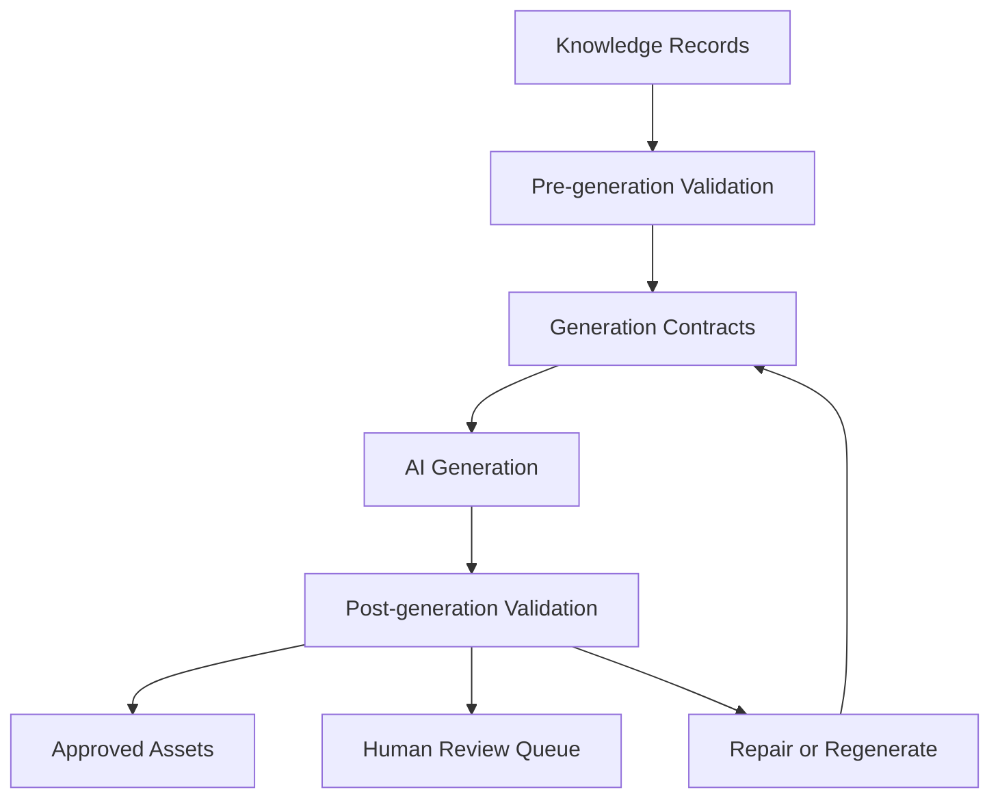
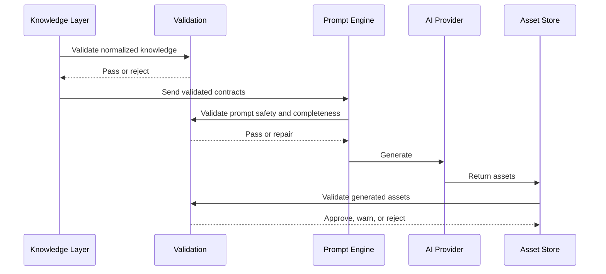

# Knowledge Validation

## Purpose

Knowledge Validation ensures that structured knowledge and generated assets remain accurate, safe, localized, and consistent. It validates both inputs before generation and outputs after generation.

## Validation architecture

## Validation dimensions

### Fact validation

Checks whether generated claims preserve source facts and avoid unsupported assertions.

Examples:

- Astronomy event date matches the source timing.
- Finance metric is not stated without a source.
- Health content avoids unsupported medical claims.
- History chronology is internally consistent.

### Terminology validation

Checks whether domain-specific terms are used consistently and correctly.

Examples:

- Astronomy distinguishes conjunction, occultation, eclipse, and alignment.
- Education uses curriculum-specific vocabulary.
- Travel uses official place names and local spellings.
- Finance uses precise terms such as revenue, earnings, yield, and market cap.

### Prompt safety

Checks that provider prompts avoid unsafe, prohibited, misleading, or policy-sensitive instructions.

Examples:

- No request to fabricate scientific facts.
- No health diagnosis or financial advice framed as certainty.
- No instruction to include unreadable overlay text.
- No forbidden visual depictions for a target audience or channel.

### Localization accuracy

Checks whether localized output preserves meaning, units, dates, names, and cultural appropriateness.

Examples:

- Local sky timing is not confused with UTC.
- Units are converted correctly.
- Entity names are not mistranslated.
- Tone matches local audience expectations.

### Asset consistency

Checks whether generated images, narration, thumbnails, metadata, and guides agree with the same knowledge contract.

Examples:

- A lunar eclipse story should not produce a solar eclipse thumbnail.
- A travel guide cover should match the destination in the itinerary.
- A history timeline should match narration dates.
- A finance explainer chart should match the stated metric and currency.

## Validation severity

| Severity | Meaning | Action |
| --- | --- | --- |
| Blocking | Output must not publish. | Reject, repair, or regenerate. |
| Warning | Output may be usable after review. | Send to review or annotate. |
| Advisory | Improvement opportunity. | Log and feed future optimization. |

## Validation checkpoints

## Domain-specific examples

| Domain | Critical validation risk |
| --- | --- |
| Astronomy | Incorrect event type, visibility, timing, or unrealistic celestial visual. |
| Astrology | Inconsistent interpretive system or incorrect zodiac terminology. |
| Numerology | Incorrect calculation or mismatched interpretation system. |
| Education | Wrong learning level, missing prerequisite, or inaccurate concept explanation. |
| History | Incorrect chronology, unsupported causality, or anachronistic imagery. |
| Travel | Outdated availability, wrong destination, unsafe recommendation, or visa confusion. |
| Health | Medical misinformation, unsafe advice, or missing disclaimer. |
| Finance | Unsupported investment claim, stale data, or missing risk context. |

## Validation outputs

Validation should produce structured results:

- Rule identifier.
- Scope and asset reference.
- Pass, warning, or fail status.
- Evidence or detected mismatch.
- Recommended remediation.
- Whether regeneration is required.
- Whether human review is required.
