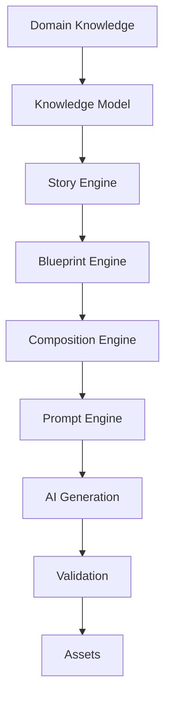
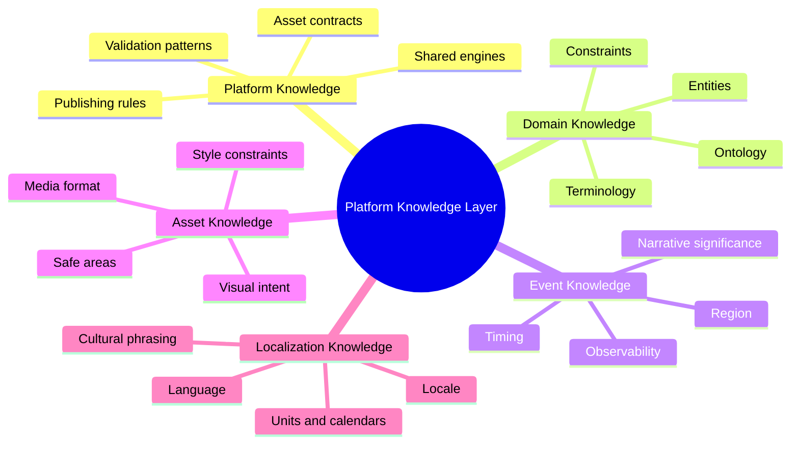

# Knowledge Architecture

The Knowledge Architecture defines the reusable knowledge layer that allows Astronomy V3 to evolve from an astronomy-specific generator into a multi-domain AI Content Generation Platform.

The platform does not start from prompts. It starts from structured domain knowledge that can be validated, localized, enriched, and reused before any AI prompt is assembled.

## Knowledge-first generation stack

## Documents

- [Knowledge Architecture](KnowledgeArchitecture.md)
- [Knowledge Graph](KnowledgeGraph.md)
- [Knowledge Model](KnowledgeModel.md)
- [Knowledge Lifecycle](KnowledgeLifecycle.md)
- [Knowledge Contracts](KnowledgeContracts.md)
- [Knowledge Validation](KnowledgeValidation.md)
- [Knowledge Localization](KnowledgeLocalization.md)
- [Knowledge Evolution](KnowledgeEvolution.md)

## Core principles

1. Knowledge is structured before it is verbalized.
2. Prompts are generated from contracts, not handwritten as the source of truth.
3. Domain facts, event rules, visual intent, localization, and validation requirements remain separate but composable.
4. Future domains reuse the same platform engines by supplying different knowledge plugins and contracts.
5. Validation is part of the knowledge lifecycle, not an afterthought after generation.

## Knowledge types

## Relationship to existing documentation

This section extends the Foundation, Architecture, Event Families, Product Modules, and Platform Architecture documentation by defining the knowledge substrate beneath the story, blueprint, composition, prompt, and validation systems.
