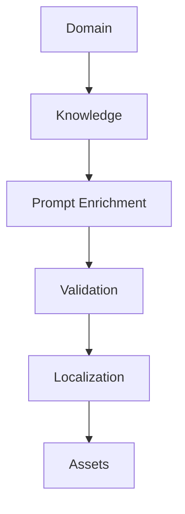
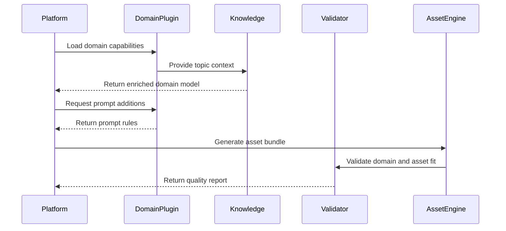

# Domain Architecture

A domain plugs into the platform by contributing knowledge, constraints, enrichment logic, validation rules, localization guidance, and asset preferences.

## Extension model

| Extension point | Domain contribution | Platform responsibility |
| --- | --- | --- |
| Knowledge | Concepts, entities, facts, taxonomies, terminology | Store, retrieve, and inject context |
| Prompt enrichment | Tone, constraints, examples, forbidden patterns | Compose prompts consistently |
| Validation | Accuracy checks, domain warnings, compliance rules | Execute validators and report outcomes |
| Localization | Regional terms, cultural sensitivity, measurement conventions | Apply locale rules across assets |
| Assets | Preferred visuals, guide sections, narrative patterns | Generate assets using shared contracts |

## Plugin sequence

