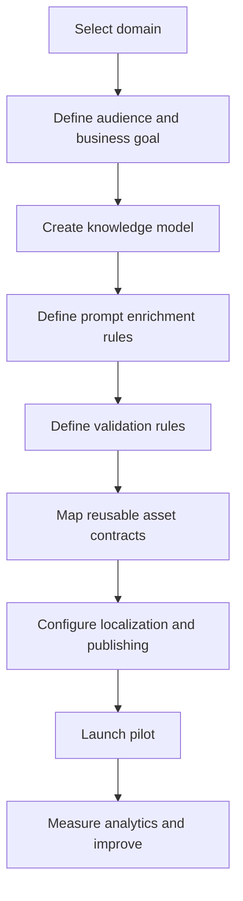

# Domain Expansion

Adding a new domain should change domain knowledge, rules, terminology, product strategy, and asset preferences while keeping the platform engines reusable.

## Expansion process

## Example domains

| Domain | What changes | What stays reusable |
| --- | --- | --- |
| Astronomy | Celestial events, observation timing, sky terminology | Story, prompt, validation, rendering, publishing engines |
| Astrology | Symbolic interpretations, signs, houses, tone | Asset contracts, localization, publishing, diagnostics |
| Numerology | Number meanings, calculation rules, personal reports | Story and blueprint engines, validation framework |
| Education | Curriculum goals, learning level, assessment style | Localization, rendering, publishing, diagnostics |
| History | Periods, timelines, sources, historical context | Story structures, media composer, validation framework |
| Travel | Destinations, itineraries, seasonal context | Prompt framework, publishing, localization |
| Health | Wellness topics, disclaimers, safety boundaries | Workflow, publishing, diagnostics, compliance hooks |
| Finance | Market education, risk language, regulatory caution | Asset contracts, validation framework, localization |
| Science | Concepts, experiments, evidence standards | Story, blueprint, prompt, rendering engines |
| Wildlife | Species, habitats, conservation context | Visual asset workflows, narration, localization |
| Weather | Forecast concepts, safety alerts, regional units | Publishing, localization, validation framework |
| Technology | Products, concepts, comparisons, release cycles | Story, prompt, thumbnail, publishing engines |
| Product Reviews | Product data, pros and cons, buyer intent | Blueprint, validation, publishing, analytics |

## Reuse expectation

Most new domains should reuse orchestration, asset contracts, prompt composition, localization infrastructure, publishing, diagnostics, and analytics. Domain teams should focus on expertise, quality bars, and commercial positioning.
