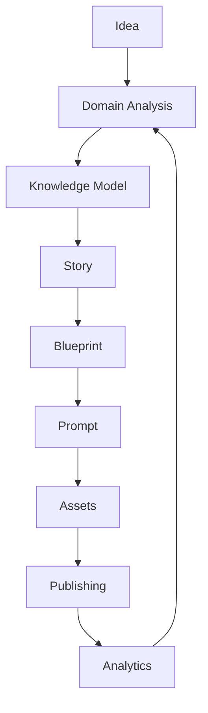
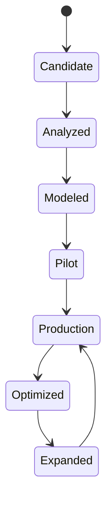

# Domain Lifecycle

The lifecycle describes how a domain idea becomes repeatable, validated, publishable content.

## Lifecycle states

## Stage descriptions

| Stage | Purpose | Outcome |
| --- | --- | --- |
| Idea | Identify a commercially or strategically valuable domain. | Domain hypothesis. |
| Domain Analysis | Define audience, competitors, content patterns, risks, and monetization. | Domain brief. |
| Knowledge Model | Capture entities, terminology, facts, taxonomies, and constraints. | Structured domain context. |
| Story | Define narrative patterns and audience journeys. | Reusable story rules. |
| Blueprint | Convert story into production plans and asset packages. | Asset blueprint. |
| Prompt | Generate AI instructions using domain and asset rules. | Prompt set. |
| Assets | Produce visuals, narration, guides, metadata, and media parts. | Asset bundle. |
| Publishing | Package, localize, schedule, and distribute content. | Published media. |
| Analytics | Measure performance and quality to improve the loop. | Optimization signals. |
