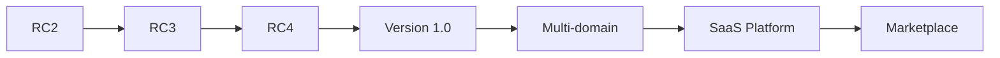
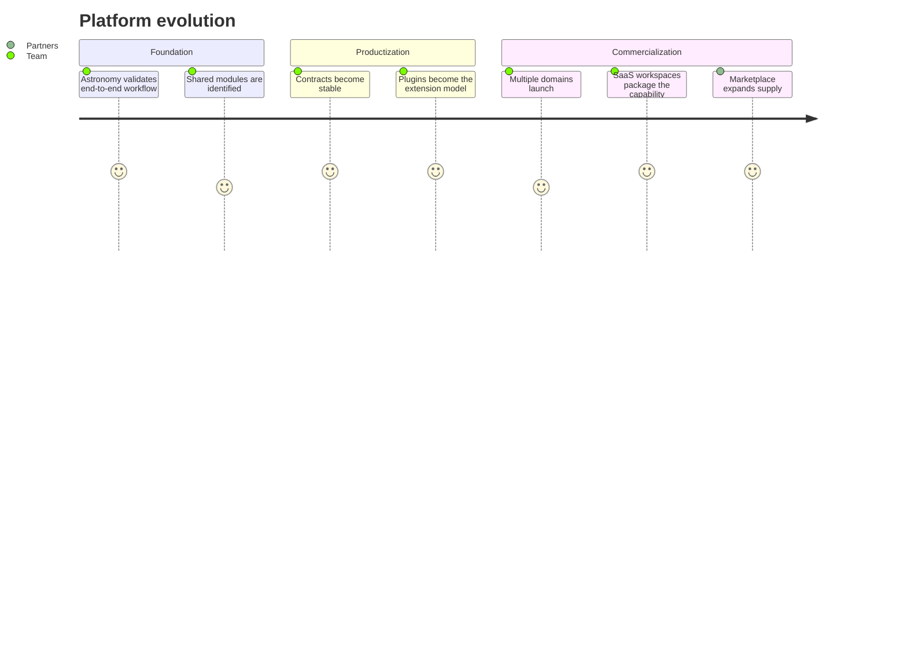
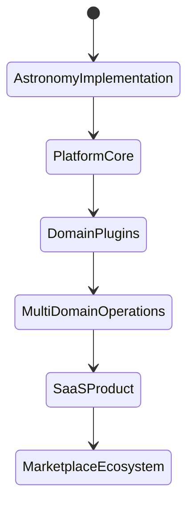

# Platform Roadmap

The roadmap describes the evolution from Astronomy V3 RC2 into a multi-domain SaaS and marketplace platform.

## Roadmap stages

| Stage | Platform focus | Business focus |
| --- | --- | --- |
| RC2 | Prove Astronomy implementation and reusable asset pipeline. | Establish credibility and production quality. |
| RC3 | Formalize platform contracts, plugin boundaries, and diagnostics. | Prepare for repeatable domain launches. |
| RC4 | Add stronger domain lifecycle tooling, validation packs, and analytics loops. | Reduce domain launch cost and time. |
| Version 1.0 | Stabilize core APIs, documentation, operational model, and publishing packages. | Launch as a reliable production platform. |
| Multi-domain | Onboard multiple domains with shared engines and domain plugins. | Expand market coverage and revenue streams. |
| SaaS Platform | Provide user workspaces, domain configuration, review workflows, and usage-based generation. | Convert internal platform into recurring software revenue. |
| Marketplace | Enable third-party domain packs, prompt packs, asset templates, validators, and channel adapters. | Build ecosystem leverage and partner distribution. |

## Evolution journey

## Strategic milestones

