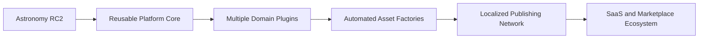
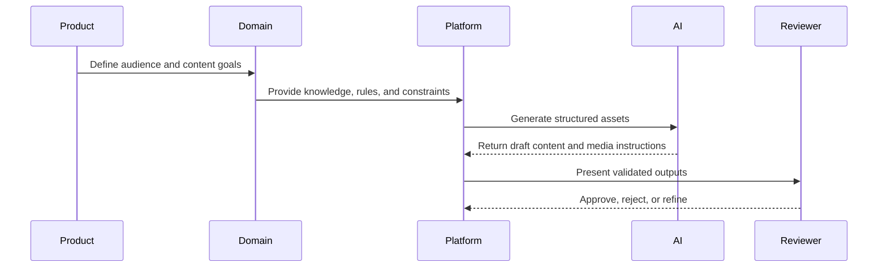

# Platform Vision

## What is the platform?

The platform is a reusable AI-first content generation system that transforms structured domain knowledge into high-quality media assets. Astronomy is the first domain implementation, proving that the same architecture can produce stories, prompts, visuals, narration, observation guides, thumbnails, galleries, and publishable media.

## Why it exists

Modern content operations need speed, consistency, localization, validation, and channel adaptation. A single-purpose generator can solve one niche, but a platform can compound investment across many domains. The platform exists to turn each new domain into a configuration, knowledge, validation, and plugin problem rather than a full rebuild.

## Long-term vision

The long-term vision is a multi-domain content operating system where teams can launch a domain, define its knowledge model, connect its validation rules, and generate consistent media packages across channels.

## Business philosophy

The business philosophy is leverage through reuse. Every reusable engine increases margin and speed for future domains. Every domain improves platform maturity by revealing new asset patterns, validation needs, and commercial use cases.

## AI-first architecture

AI is not an add-on. It is the primary production interface. Human teams define strategy, quality standards, constraints, and review processes; AI performs scalable generation, enrichment, transformation, and adaptation within those boundaries.

## Content generation philosophy

The platform treats content as a system of related assets, not isolated outputs. A story informs prompts. Prompts inform visuals. Visuals inform thumbnails and galleries. Narration and localization adapt the same source truth for different audiences.

## Future commercial direction

Commercial expansion can include managed content services, domain-specific products, API access, SaaS workspaces, partner plugins, asset marketplaces, and analytics-driven optimization packages.
