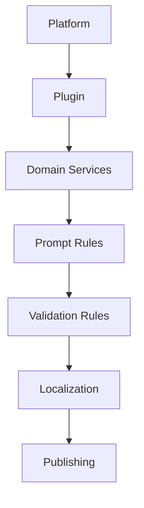
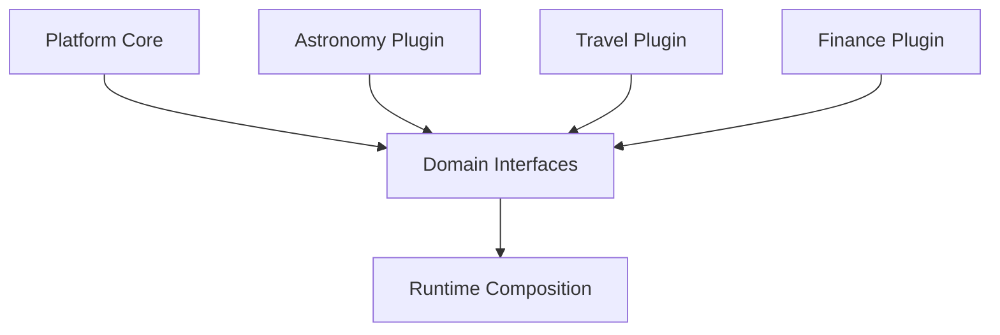
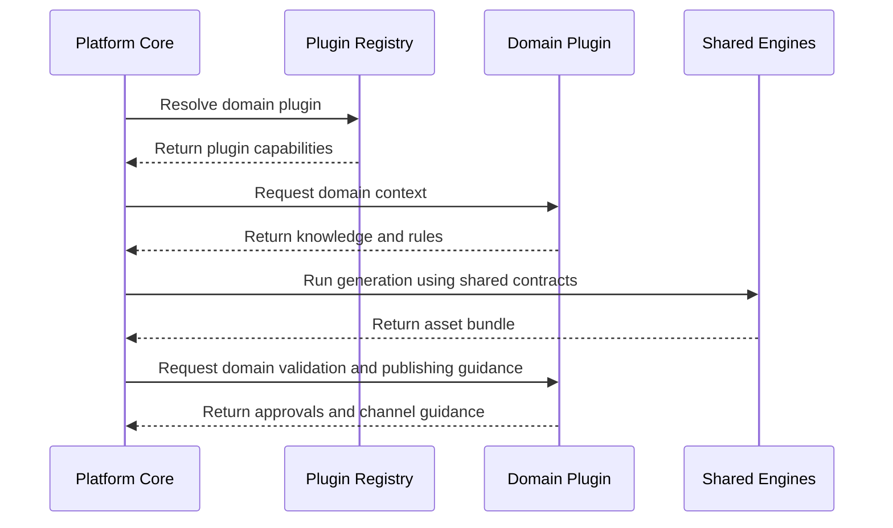

# Plugin Architecture

The plugin model allows domains to extend the platform without forcing the platform core to depend on domain-specific concepts.

## Dependency inversion

The platform defines contracts. Plugins implement domain behavior behind those contracts. This keeps the platform stable while allowing domains to evolve independently.

## Plugin responsibilities

| Plugin capability | Description |
| --- | --- |
| Domain services | Provide knowledge lookup, terminology, content constraints, and enrichment. |
| Prompt rules | Add domain tone, examples, constraints, and prohibited output patterns. |
| Validation rules | Check factual fit, domain safety, completeness, and audience appropriateness. |
| Localization rules | Adapt domain language, measurements, cultural references, and disclaimers. |
| Publishing rules | Shape channel packaging, metadata, cadence, and audience targeting. |

## Runtime composition

