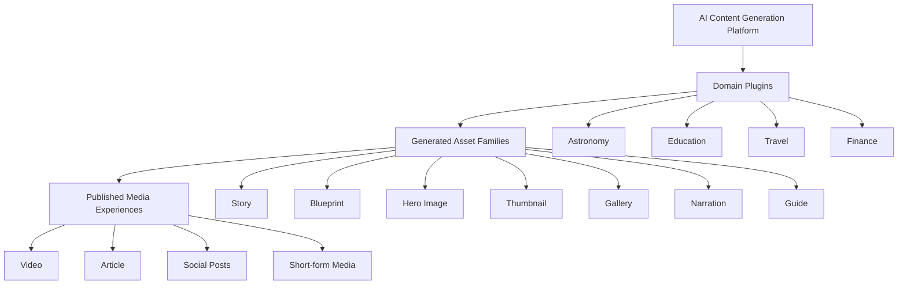
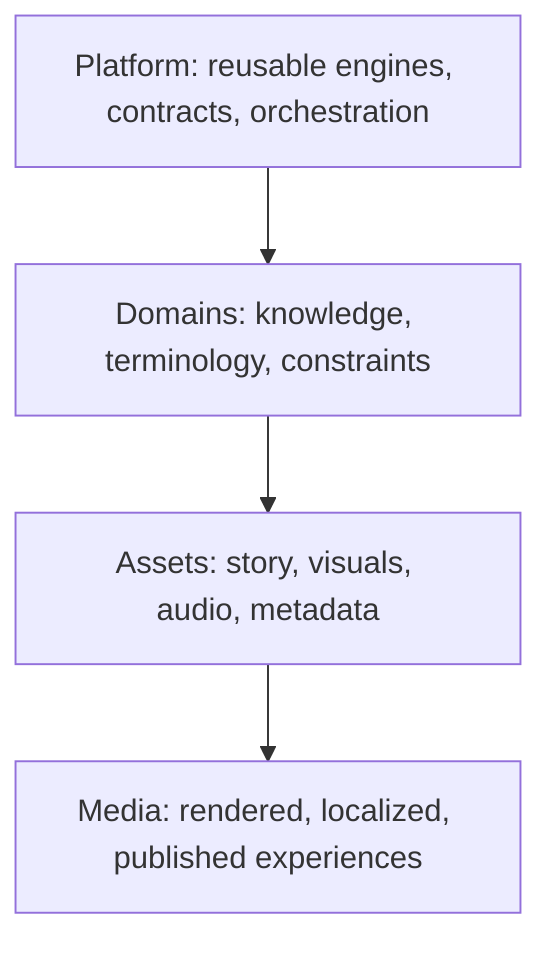
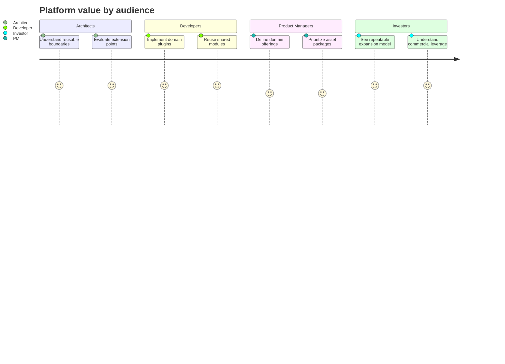

# AI Content Generation Platform

Astronomy V3 RC2 is the first production implementation of a broader AI-powered Content Generation Platform. The platform separates reusable generation capability from domain knowledge so future products can reuse the same engines while changing the subject matter, rules, assets, and publishing strategy.

## Platform hierarchy

## Conceptual stack

## Audience view

## Core idea

The platform owns repeatable content generation mechanics. Domains provide context, rules, and market focus. Assets express content in reusable formats. Media packages those assets for channels, languages, and audiences.
