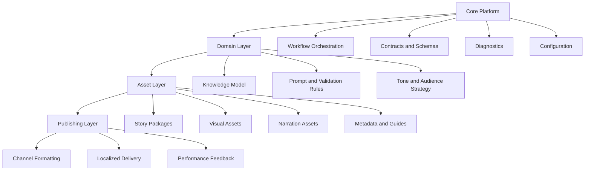
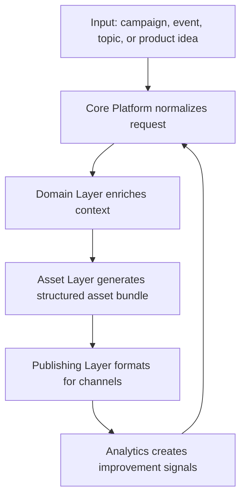

# Reference Architecture

## Layered architecture

## Responsibilities

| Layer | Responsibility | Stable across domains? |
| --- | --- | --- |
| Core Platform | Orchestration, contracts, shared engines, diagnostics, configuration | Yes |
| Domain Layer | Knowledge, terminology, constraints, market positioning | No |
| Asset Layer | Story, prompt, visual, narration, guide, and metadata outputs | Mostly |
| Publishing Layer | Channel packaging, localization, scheduling, analytics feedback | Mostly |

## Architecture flow

