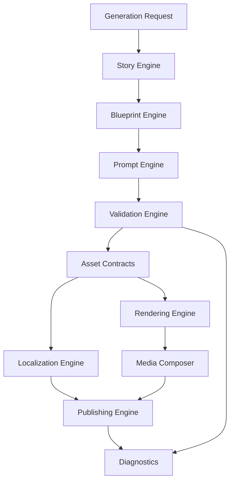

# Reusable Architecture

The platform is designed around reusable modules that can serve many domains with minimal change.

| Module | Responsibility | Reuse pattern |
| --- | --- | --- |
| Story Engine | Converts domain topics into narrative structures, hooks, scenes, and audience journeys. | Reused with domain-specific narrative rules. |
| Blueprint Engine | Creates structured production plans for assets, scenes, media sections, and publishing packages. | Reused with domain-specific templates. |
| Prompt Engine | Builds AI prompts from platform standards, domain context, asset goals, and safety constraints. | Reused with domain prompt extensions. |
| Validation Engine | Checks completeness, consistency, quality, factual alignment, policy fit, and asset readiness. | Reused with pluggable domain validators. |
| Localization Engine | Adapts language, tone, cultural references, units, and regional publishing needs. | Reused with locale and domain packs. |
| Rendering Engine | Converts approved asset specifications into media-ready visual, audio, and layout outputs. | Reused with asset-type renderers. |
| Publishing Engine | Packages content for channels, metadata, scheduling, distribution, and analytics feedback. | Reused with channel adapters. |
| Media Composer | Combines visuals, narration, overlays, pacing, and transitions into cohesive media. | Reused with composition presets. |
| Diagnostics | Captures generation decisions, warnings, quality outcomes, and failure reasons. | Fully reusable. |
| Configuration | Centralizes domain, asset, locale, channel, and workflow settings. | Fully reusable with environment-specific values. |
| Asset Contracts | Defines common interfaces for story, visual, audio, thumbnail, gallery, guide, and publishing outputs. | Fully reusable with extension fields. |

## Module interaction

