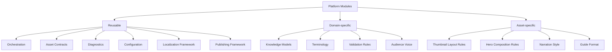

# Shared Modules

## Reuse categories

## Classification table

| Capability | Reusable | Domain-specific | Asset-specific |
| --- | --- | --- | --- |
| Workflow orchestration | Yes | No | No |
| Story framework | Yes | Narrative patterns | Story format variants |
| Blueprint framework | Yes | Domain production sections | Asset package sections |
| Prompt framework | Yes | Knowledge and terminology | Asset prompt goals |
| Validation framework | Yes | Accuracy and safety rules | Asset completeness rules |
| Localization framework | Yes | Cultural assumptions | Asset text length and tone |
| Rendering framework | Yes | Visual vocabulary | Renderer and layout choices |
| Publishing framework | Yes | Channel strategy | Channel asset requirements |
| Diagnostics | Yes | Domain quality dimensions | Asset failure categories |
| Configuration | Yes | Domain configuration | Asset presets |

## Design principle

Shared modules should know how to run a generation workflow. Domain modules should know what is true and appropriate. Asset modules should know what must be produced.
