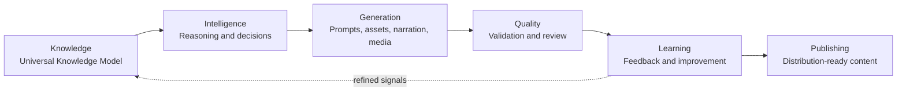
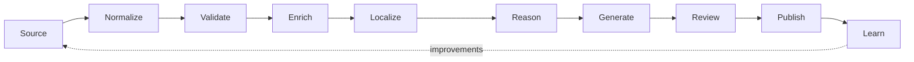
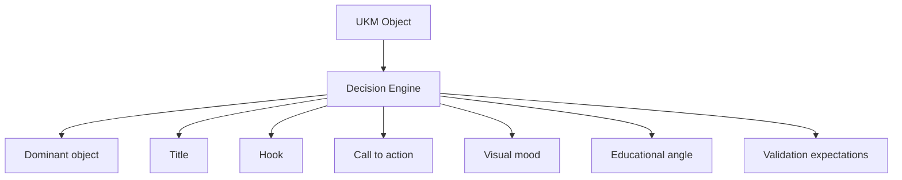
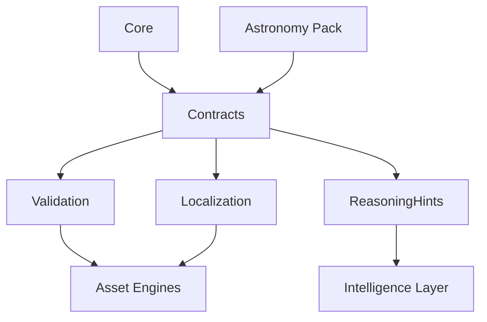

<!-- markdownlint-disable MD013 -->

# Platform Capability #001: Universal Knowledge Model

## 1. Executive Summary

The Universal Knowledge Model (UKM) is the platform-level contract for representing trusted domain knowledge before that knowledge becomes story, prompt, asset, narration, or media. AstronomyV3RC2 proves that high-quality generation depends less on clever prompts and more on structured, validated, reusable knowledge.

The platform starts from knowledge, not prompts, because prompts are an execution detail. Knowledge is the durable source of truth that can be reasoned over, localized, validated, versioned, reused across assets, and migrated across domains. A prompt may ask for a thumbnail, narration, or documentary scene; UKM defines what the platform knows, what must remain factual, what relationships matter, and how downstream capabilities should safely consume that knowledge.

## 2. Platform Context

UKM anchors the Knowledge stage of the reusable Knowledge Intelligence Platform and supplies trusted context to every later capability.



In this flow, Knowledge is not a passive database. It is the stable contract that lets Intelligence decide what matters, Generation create assets with context, Quality verify output against facts, Learning capture improvements, and Publishing distribute content with confidence.

## 3. Core Principle

> Platform owns capabilities. Domains own knowledge. Assets consume knowledge.

The platform owns reusable capabilities such as validation, localization, reasoning, prompt planning, media assembly, and publishing. Each domain owns its facts, terminology, relationships, educational priorities, visual conventions, and validation constraints. Assets do not duplicate domain logic; they consume UKM objects through platform contracts.

## 4. UKM Building Blocks

- **Entity**: A stable domain object, actor, place, concept, organism, person, artifact, body, or system component.
- **Event**: A time-bound or condition-bound occurrence involving one or more entities.
- **Relationship**: A typed connection between entities or events, such as part-of, causes, orbits, influences, located-in, precedes, or contrasts-with.
- **Observation**: A user-relevant way to perceive, measure, experience, or verify an entity or event.
- **Educational Knowledge**: Concepts, misconceptions, difficulty level, learning outcomes, and teaching value.
- **Visual Knowledge**: Canonical appearance, visual emphasis, scale cues, composition guidance, and avoidances.
- **Narrative Knowledge**: Story angles, explanatory framing, emotional tone, audience promise, and sequencing hints.
- **Localization Knowledge**: Locale-specific names, units, cultural context, safety phrasing, and translation-sensitive terminology.
- **Validation Knowledge**: Required facts, forbidden claims, consistency checks, completeness rules, and asset readiness rules.
- **Intelligence Hints**: Decision support metadata that helps the reasoning layer choose emphasis, hooks, calls to action, and quality expectations without embedding final prompt text.

## 5. Astronomy Examples

Astronomy remains the golden reference domain for UKM because it contains concrete entities, observable events, visual constraints, and educational value.

| Example | UKM Interpretation |
| --- | --- |
| Sun | Entity with aliases, physical facts, visual strategy for brightness and scale, validation rules against unsafe viewing guidance. |
| Moon | Entity related to Earth and eclipse events, with phase observations, localization names, and visual guidance for surface detail. |
| Jupiter | Entity with relationships to moons, storms, and planetary groupings, plus scale and color guidance. |
| Solar Eclipse | Event involving Sun, Moon, and Earth relationships, observation rules, safety validation, and localized visibility context. |
| Meteor Shower | Event with parent-body relationships, peak windows, radiant observations, viewing advice, and narrative hooks around anticipation. |
| Planet Grouping | Event expressing apparent sky proximity, dominant objects, observation windows, and composition guidance. |
| Comet | Entity or event depending on context, with orbit relationships, tail visuals, observation constraints, and rarity-driven narrative value. |

## 6. Future Domain Examples

The same UKM shape applies beyond astronomy:

- **Astrology**: Entities are signs, houses, planets, and aspects; relationships describe symbolic associations; validation separates symbolic interpretation from astronomical fact.
- **Education**: Entities are subjects, concepts, standards, and skills; events are lessons, assessments, or milestones; educational knowledge becomes the primary value driver.
- **History**: Entities are people, places, institutions, and artifacts; events are historical episodes; validation emphasizes chronology, sourcing, and contested interpretations.
- **Travel**: Entities are destinations, routes, landmarks, and experiences; observations include seasonal conditions, accessibility, and visitor guidance.
- **Health**: Entities are conditions, symptoms, behaviors, and interventions; validation requires strict safety, medical disclaimers, evidence quality, and escalation rules.

## 7. Knowledge Object Shape

A UKM knowledge object is conceptual first and implementation-neutral. Future schemas and C# contracts should preserve these platform fields:

```yaml
id: stable platform identifier
type: entity | event | relationship | observation | concept | guide
canonicalName: preferred display name
aliases: alternative names, translations, or search labels
domain: owning knowledge domain
facts: trusted factual statements and attributes
relationships: typed links to other knowledge objects
observations: user-visible ways to experience or verify the object
educationalValue: learning outcomes, difficulty, misconceptions, teaching priority
visualStrategy: appearance, emphasis, composition, constraints, avoidances
narrativeStrategy: angle, tone, story arc, audience promise
localization: locale-specific names, units, cultural notes, safety language
validationRules: required facts, forbidden claims, completeness checks
intelligenceHints: reasoning support signals, not final prompts
version: object contract and content version metadata
```

## 8. Knowledge Lifecycle



The lifecycle ensures knowledge enters the platform through trusted sources, becomes normalized into UKM shape, passes validation, gains educational and visual enrichment, is localized, powers reasoning and generation, is reviewed before publishing, and returns learning signals for future improvement.

## 9. Asset Consumption

Assets consume UKM instead of inventing their own domain logic.

- **Hero** uses dominant entity or event, canonical name, visual strategy, narrative promise, and localization.
- **Thumbnail** uses visual emphasis, title candidates, dominant object, contrast rules, and validation constraints.
- **Gallery** uses related entities, observations, visual variants, and educational sequencing.
- **Narration** uses narrative strategy, educational value, facts, relationships, pronunciation, and localized terminology.
- **Observation Guide** uses observation windows, safety rules, user instructions, localization, and required relationships.
- **Documentary** uses entity/event timelines, narrative arcs, educational progression, and validation expectations.
- **Social Posts** use concise facts, hooks, CTA hints, localization, and platform-specific readiness checks.

## 10. Reasoning Integration

The Intelligence Layer uses UKM to make consistent decisions before generation begins.



For example, a solar eclipse object may cause Intelligence to choose the Sun-Moon alignment as the dominant relationship, a safety-aware observation CTA, a high-drama visual mood, and strict validation expectations around eye protection and visibility.

## 11. Validation Rules

UKM validation operates at the knowledge level before asset validation begins:

- **Factual consistency**: Facts must not contradict trusted domain rules or related objects.
- **Required entities**: Events must include the entities necessary to explain them.
- **Required relationships**: Critical relationships must be explicit, typed, and traversable.
- **Localization completeness**: Required locales must include names, units, and safety-sensitive phrasing.
- **Visual strategy completeness**: Assets must have enough appearance, composition, and avoid/require guidance.
- **Asset readiness**: Knowledge objects must declare whether they are ready for hero, thumbnail, narration, guide, documentary, or social generation.

## 12. Versioning

UKM versioning separates platform contracts from domain content.

- **UKM version**: Version of the platform-level object shape, required fields, validation semantics, and compatibility rules.
- **Domain knowledge pack version**: Version of a domain-owned body of objects, facts, localizations, and rules.
- **Backward compatibility**: New fields should be additive where possible; deprecated fields should remain readable until migration completes.
- **Migration strategy**: Each UKM contract change should include mapping rules, validation updates, and compatibility tests for existing domain packs.

## 13. Repository Direction

Future implementation should move toward an explicit platform knowledge area:

```text
Platform/
  Knowledge/
    Core/
    Astronomy/
    Contracts/
    Validation/
    Localization/
    ReasoningHints/
```



## 14. Implementation Roadmap

1. **Phase 1: Documentation** — Establish the whitepaper, terminology, lifecycle, and repository direction.
2. **Phase 2: Conceptual contracts** — Define platform-neutral contracts for entities, events, relationships, and validation.
3. **Phase 3: JSON schema** — Produce schema definitions for portable knowledge objects and packs.
4. **Phase 4: C# contracts** — Add strongly typed platform contracts for application integration.
5. **Phase 5: Astronomy knowledge pack** — Convert astronomy reference knowledge into versioned UKM objects.
6. **Phase 6: Knowledge engine** — Implement loading, validation, querying, localization, and readiness checks.
7. **Phase 7: Reasoning integration** — Connect UKM to decision, prompt, story, visual, and quality reasoning.

## 15. Risks and Guardrails

Avoid these failure modes:

- **Over-engineering**: Start with stable concepts and add schema precision only when it enables platform reuse.
- **Making UKM astronomy-specific**: Astronomy is the reference domain, not the boundary of the model.
- **Putting prompt text directly in knowledge**: Store facts, strategies, constraints, and hints; let prompt generation remain a platform capability.
- **Duplicating domain logic inside assets**: Asset engines should consume UKM and platform reasoning outputs rather than re-implementing domain rules.

## 16. Related Documents

- [Platform docs](./README.md)
- [Knowledge docs](../knowledge/README.md)
- [Reasoning docs](../reasoning/README.md)
- [Product docs](../product/README.md)
- [Event family docs](../event-families/README.md)
