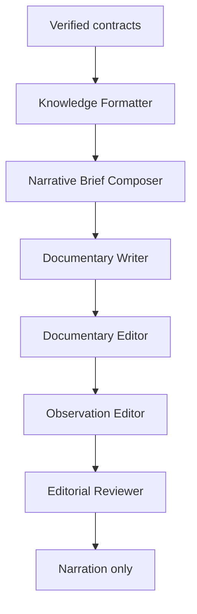

# Chronicle Editorial Engine v1.0

> Product specification. This document defines the domain-independent editorial layer that turns verified knowledge contracts into audience-ready documentary narration. It does not define fact generation, observation calculation, or domain-specific truth rules.

## 1. Mission

Chronicle Editorial Engine transforms verified knowledge into documentaries that people trust, remember, and act upon.

The engine is **not responsible for facts**. It is responsible for **meaning**: shaping verified inputs into clear, memorable, observational storytelling without exposing the production process.

## 2. Domain Boundary

Chronicle is intentionally domain-independent. The same editorial engine must work across astronomy, history, mythology, astrology, nature, medicine, engineering, and future domains.

Only the Knowledge Layer changes by domain. Chronicle receives already-verified knowledge and applies a stable editorial workflow, voice, and review model.

## 3. Inputs

Chronicle accepts the following upstream contracts:

- **Knowledge Contract** — verified domain facts, entities, constraints, and source-safe assertions.
- **Editorial Contract** — voice, audience, tone, length, safety, and product intent.
- **Creative Storyboard** — story arc, sequence, and emotional shape.
- **Story Frames** — scene-level beats and explanatory units.
- **Observation Metadata** — when, where, what, equipment, and viewing or experience conditions when applicable.

## 4. Output

Chronicle outputs **Narration only**.

The final narration must not include diagnostics, warnings, checklists, prompt text, production notes, scoring details, or metadata dumps.

## 5. Editorial Manifesto

- Truth before drama.
- Observation before explanation.
- Curiosity before information.
- Guide; never lecture.
- Never expose production.
- Teach naturally.
- Prepare the viewer to observe.
- Wonder is earned.
- Every sentence has purpose.
- The audience should never notice the editorial process.
- Facts come from Knowledge.
- Storytelling comes from Chronicle.

## 6. Internal Workflow

### 6.1 Knowledge Formatter

Transforms machine facts into human facts so narration can sound natural without weakening accuracy.

Examples:

| Machine fact | Human fact |
| --- | --- |
| `2026-06-09T13:53Z` | On the evening of June 9... |
| `27°` | About halfway above the western horizon. |

The formatter does not invent facts. It converts verified facts into spoken, audience-friendly phrasing.

### 6.2 Narrative Brief Composer

Creates a producer's story briefing containing:

- Story.
- Audience.
- Emotion.
- Observation.
- Transition.

The brief must never contain writing instructions, prompt mechanics, diagnostics, or production leakage.

### 6.3 Documentary Writer

Writes the first narration draft. The writer receives only:

- Narrative Brief.
- Knowledge.
- Editorial Manifesto.

The writer must never receive planning diagnostics, metadata dumps, warnings, prompt text, scene purpose labels, audience promises, or review checklists.

### 6.4 Documentary Editor

Rewrites the first draft for:

- Spoken rhythm.
- Flow.
- Transitions.
- Clarity.
- Removal of repetition.

The editor improves the documentary voice without adding unsupported facts.

### 6.5 Observation Editor

Guarantees that the narration naturally explains, when relevant:

- When.
- Where.
- What.
- Equipment.
- Viewing or experience conditions.

This stage must integrate practical guidance into the story rather than appending a checklist.

### 6.6 Editorial Reviewer

Scores the narration across:

- Documentary Voice.
- Scientific or domain accuracy.
- Observation Guidance.
- Viewer Experience.
- Editorial Flow.
- Chronicle Identity.

Reviewer findings are internal only. Passing narration is emitted without scores or reviewer notes.

## 7. Certification

Narration is **Aurora Certified** only if it:

- Sounds like a documentary.
- Teaches naturally.
- Prepares the audience to observe or act appropriately.
- Has no production leakage.
- Has Chronicle's own editorial identity.

## 8. Implementation Rules

- Chronicle must preserve the separation between verified facts and editorial meaning.
- Chronicle must never use missing knowledge as permission to speculate.
- Chronicle must keep diagnostics and review artifacts out of the final narration.
- Chronicle must remain reusable across domains by depending on generic contracts, not astronomy-specific fields.
- Chronicle may use domain labels only as input context; its workflow and output rules remain unchanged.
