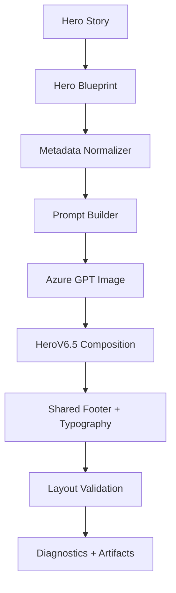
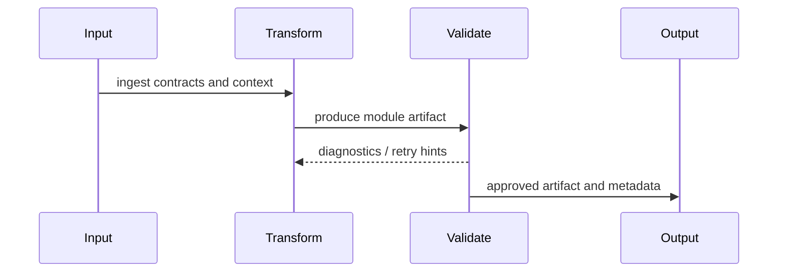
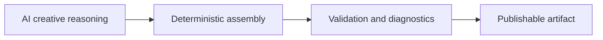
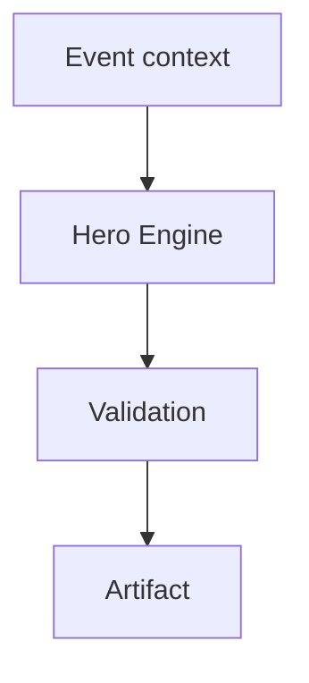

# Hero Engine

> Product specification. This document describes product architecture and observed behavior; it is not API or source-code documentation.

## 1. Purpose

**Business purpose.** Creates the flagship marketing asset for each astronomy event, improving shareability, recognition, and viewer conversion.

**Product purpose.** Transforms event facts into a cinematic hero poster with story, blueprint, composition, localized text, and validation.

**Why it exists.** Hero assets anchor campaigns, thumbnails, galleries, public pages, and publishing metadata.

## 2. Responsibilities

**Responsibilities**

- Generate Hero Story with hook, message, action, visual focus, emotion, platform intent, and quality scores.
- Generate Hero Blueprint with layout style, visual narrative, platform variants, metadata, and readiness score.
- Normalize metadata, build prompts, call Azure GPT Image when enabled, compose HeroV6.5 with shared footer and typography, and emit diagnostics.
- Support English and Hindi hero text and aspect-ratio variants.

**Non-responsibilities and boundaries**

- Does not publish to platforms.
- Does not replace thumbnail-specific CTR rendering.
- Does not invent astronomical facts outside event/observation inputs.

**Interfaces**

Consumes event context, story/blueprint JSON, localization context, renderer options, prompt settings, and Azure image settings; produces image files, manifests, validation JSON, and review diagnostics.

## 3. Inputs

- **JSON contracts:** hero-story.json, hero-blueprint.json, hero-composition-model.json, hero-scene-manifest.json, hero-layout-validation.json
- **Configuration:** RenderingOptions, Azure/OpenAI image settings, hero contract names, language/font options
- **AI outputs:** Hero copy, visual narrative, composition intent, image prompt, optional generated background
- **Scene data:** Event facts, region, observation source fields: what, where, when, why
- **Dependencies:** HeroAssetIntelligenceEngine, HeroCompositionEngine, HeroMetadataNormalizer, HeroAssetSceneSelector, HeroTitleResolver, prompt/image execution services

## 4. Outputs

- Hero images for configured aspect ratios.
- Story and blueprint JSON.
- Composition model and scene manifest.
- Layout validation and diagnostics including duplicate blocks, overlap, visible objects, contract mismatches, and readiness scores.

## 5. Internal Architecture



RC2 separates creative story planning from deterministic composition. Hero Story decides viewer promise. Hero Blueprint decides layout intent. HeroV6.5 renders contract-safe text blocks, footer, object visibility, and aspect-ratio outputs. Future work keeps this layered architecture while adding richer model choice, stronger automatic art-direction scoring, and broader localized typography.

## 6. Processing Flow



1. **Input:** Event, region, language, phase, existing story/blueprint when present.
2. **Transformation:** Story → hook selection → blueprint → metadata normalization → prompt → image/background → deterministic composition.
3. **Validation:** Layout contract, text overlap, duplicate blocks, visible object check, score thresholds, generated file existence.
4. **Output:** Hero images plus story, blueprint, composition, layout validation, and review diagnostics.

## 7. AI Responsibilities



- **AI owns:** Hook alternatives, emotional framing, visual narrative, prompt imagery, and optional generated background.
- **Deterministic code owns:** Phase control, file paths, JSON schema shape, text placement, shared footer, aspect-ratio rendering, fallback behavior.
- **Validation owns:** Contract compatibility, typography safety, object visibility, overlap, duplicate block detection, diagnostics.

## 8. Validation

- **Rules:** Hero contract names must align across hero, validator, and renderer; required blocks must fit; astronomy claims must match source facts.
- **Diagnostics:** hero-layout-validation.json, generated file list, readiness scores, scene manifest.
- **Retry:** Regenerate prompt/background or adjust blueprint when readiness or layout validation fails.
- **Recovery:** Dry-run preview, reuse existing story/blueprint, deterministic placeholder/fallback when image generation is disabled.
- **Failure modes:** Missing fonts/assets, invalid phase, bad JSON, Azure image failure, layout overlap, contract mismatch.

## 9. Localization

- **English:** Primary language path with concise uppercase hook conventions.
- **Hindi:** Uses Hindi text detection/font path and localized metadata while preserving astronomy terms where safer.
- **Future languages:** Add locale packs, fonts, reading-direction rules, and metadata normalization policies.
- **Metadata normalization:** Normalizes title, hook, event name, region, date/time, platform intent, and language.
- **Typography:** Shared footer, safe zones, bold hierarchy, localized fonts, aspect-ratio-specific wrapping.

## 10. Configuration

- **Feature flags:** DryRun, OverwriteExisting, phase selection, image generation enablement.
- **Configuration files/options:** appsettings options for rendering, fonts, Azure, prompts, asset roots.
- **Azure settings:** Azure GPT Image/OpenAI endpoints and credentials govern AI background generation.
- **Prompt settings:** Hero-specific prompt builder uses event facts and blueprint constraints.
- **Renderer settings:** HeroV6.5 renderer, shared footer dimensions, aspect ratios.

## 11. Extension Points

- New hero contracts beside GuideHero.
- Additional aspect ratios and platform variants.
- Alternative image providers.
- Event-family-specific hero strategies.

## 12. Examples

**Example pipeline**



**Example JSON**

```json
{"heroHook":"LOOK WEST TONIGHT","heroMessage":"Venus and Jupiter appear close after sunset.","heroAction":"Look west shortly after sunset.","heroEmotion":"Wonder","platformIntent":"ScrollStoppingHeroAsset"}
```

**Example output**

A localized 16:9/9:16/1:1 hero poster with cinematic background, readable hook, event context, footer, and validation diagnostics.

## 13. Related Documents

- [Product README](./README.md)
- [Architecture Overview](../architecture/ArchitectureOverview.md)
- [Pipeline Architecture](../architecture/PipelineArchitecture.md)
- [Rendering Architecture](../architecture/RenderingArchitecture.md)
- [Prompt Architecture](../architecture/PromptArchitecture.md)
- [Validation Architecture](../architecture/ValidationArchitecture.md)
- [Localization Architecture](../architecture/LocalizationArchitecture.md)
- [RC2 Release Notes](../releases/AstronomyV3RC2.md)
- [Event Families](../event-families/README.md)
