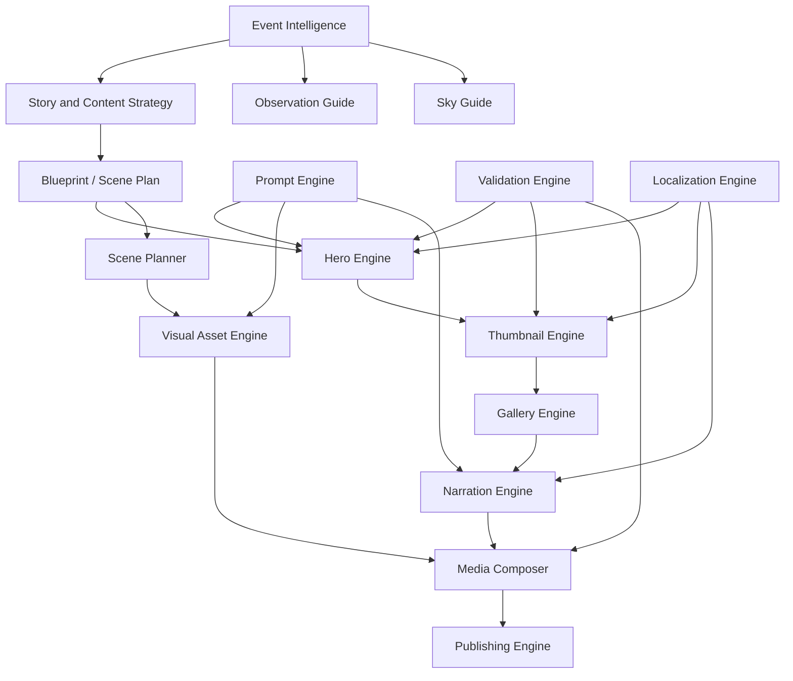

# Product Module Specifications

Astronomy V3 is organized as a product pipeline that turns astronomical events and regional sky context into viewer-ready stories, visuals, narration, video, and publishing assets. These documents describe module responsibilities and product behavior rather than public APIs or line-by-line implementation.

## Module Dependency Graph

## Responsibilities by Module

| Module | Responsibility |
| --- | --- |
| [HeroEngine](./HeroEngine.md) | Produces the primary scroll-stopping event poster through Hero Story, Blueprint, composition, metadata normalization, prompt building, Azure GPT Image, HeroV6.5, shared footer, typography, validation, and diagnostics. |
| [ThumbnailEngine](./ThumbnailEngine.md) | Produces platform thumbnails. Current implementation emphasizes deterministic local collage/text rendering; RC3 target adds AI variants, CTR scoring, and experimentation. |
| [GalleryEngine](./GalleryEngine.md) | Produces supporting image sets and future educational carousels that explain observation context and information hierarchy. |
| [NarrationEngine](./NarrationEngine.md) | Converts scene plans and questions into narration scripts, SSML/TTS packages, subtitles, and future voice-personalized narration. |
| [ObservationGuide](./ObservationGuide.md) | Normalizes direction, time, equipment, visibility, difficulty, and regional guidance into viewer-safe observing instructions. |
| [SkyGuide](./SkyGuide.md) | Plans daily, weekly, monthly, and yearly sky-guide products, including Stellarium-backed observation planning. |
| [ScenePlanner](./ScenePlanner.md) | Converts story/event context into scene sequence, question structure, visual intent, and render requirements. |
| [VisualAssetEngine](./VisualAssetEngine.md) | Selects, generates, packages, and validates visual assets for scenes, heroes, previews, and sky-guide videos. |
| [MediaComposer](./MediaComposer.md) | Assembles validated narration, scenes, assets, subtitles, and thumbnails into long/short media outputs. |
| [PublishingEngine](./PublishingEngine.md) | Publishes and diagnoses media distribution to YouTube, Meta, blob storage, and analytics collectors. |
| [ValidationEngine](./ValidationEngine.md) | Applies quality gates for title truthfulness, visual realism, contract compatibility, TTS packages, shorts requirements, and pre-publish readiness. |
| [LocalizationEngine](./LocalizationEngine.md) | Handles English/Hindi language contexts, metadata normalization, typography/font choices, and future locale expansion. |
| [PromptEngine](./PromptEngine.md) | Centralizes prompt construction, feedback hints, event-family context, and AI/deterministic boundaries. |
| [AIContentGenerationPhilosophy](./AIContentGenerationPhilosophy.md) | Captures why the platform combines AI creativity with deterministic precision, validation, localization, and human review. |

## Product Architecture Principles

1. **Event truth comes first.** Astronomical facts, observation windows, and visibility constraints limit creative generation.
2. **AI proposes; deterministic systems compose.** AI is used for creative phrasing and visual ideation, while code controls contracts, geometry, typography, validation, and publishing.
3. **Every asset is explainable.** Diagnostics, manifests, validation reports, and generated files make each stage auditable.
4. **Localization is product behavior, not translation afterthought.** English and Hindi paths preserve typography, metadata, and viewer comprehension.
5. **Current and future architecture are documented together.** Hero RC2 is the mature reference architecture; Thumbnail/Gallery RC3 directions intentionally evolve different product strategies.
