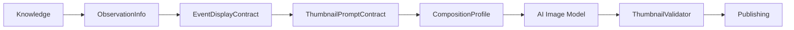
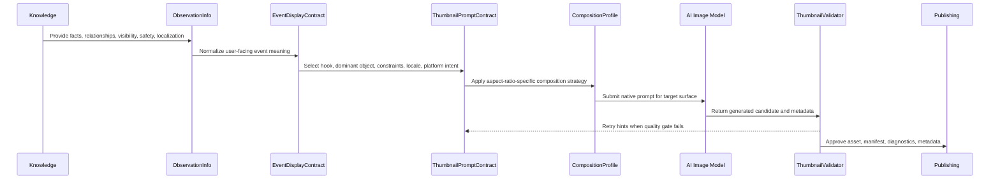
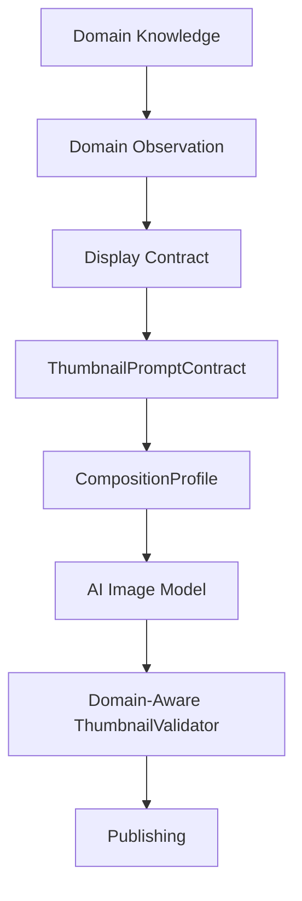

# Thumbnail Architecture

> Official engineering blueprint for Thumbnail implementation under Astronomy V3 RC3.

## 1. Purpose and Philosophy

Thumbnail exists to earn the first click without weakening scientific trust. It is the platform-optimized, CTR-focused entry asset for an astronomy event: the smallest visual surface with the largest responsibility for discovery, comprehension, and conversion.

The Thumbnail capability is:

- **AI-first**: the primary visual is generated from structured intelligence and aspect-ratio-specific prompts, not assembled from deterministic text overlays.
- **Platform-optimized**: every target surface receives a native composition strategy for its aspect ratio, safe zones, density, and preview behavior.
- **CTR-focused**: the asset prioritizes immediate recognition, contrast, emotion, object salience, and curiosity.
- **Scientifically accurate**: all visible claims, bodies, relationships, phases, alignments, colors, and observation cues must trace back to trusted knowledge and event contracts.
- **Multilingual**: prompt intent, localized titles, search context, and publishing metadata must support locale-specific terminology without forcing text-heavy image overlays.
- **Future-family extensible**: new astronomical families extend knowledge, providers, and configuration; they do not add family-specific logic to the Thumbnail renderer.

Thumbnail follows the Engineering Development Workflow: define the business objective, design contracts before implementation, pass the extension test, keep renderers generic, and validate outcomes before publishing.

## 2. Hero vs Gallery vs Thumbnail

| Asset | Primary job | User moment | Visual strategy | Text strategy |
| --- | --- | --- | --- | --- |
| **Hero** | Flagship campaign poster and public-page anchor | User is already in the campaign context | Cinematic, branded, story-rich | Structured title, message, footer, localized hierarchy |
| **Gallery** | Educational sequence and supporting carousel | User is learning or browsing details | Multi-slide explanation, observation steps, variants | Sparse educational overlays and localized facts |
| **Thumbnail** | Stop the scroll and win the click | User is scanning a feed, search result, recommendation rail, or preview card | High-salience AI image tailored to platform/aspect ratio | Minimal or no baked-in text; metadata/title should carry language when possible |

Thumbnail must not be treated as a smaller Hero or a single-slide Gallery. It has its own contract, validation gates, and composition profiles because CTR surfaces punish visual clutter, bad cropping, and text that becomes unreadable at small sizes.

## 3. AI-First Generation Rule

Thumbnail generation must begin from structured knowledge and produce an AI image prompt as the main creative artifact. Deterministic code may orchestrate, validate, store, retry, and publish, but it must not become the creative composer.

The AI-first rule exists because thumbnails require integrated composition: object scale, atmosphere, contrast, depth, negative space, platform preview behavior, and family-specific visual emphasis must be planned together. Those decisions are better expressed as prompt intelligence derived from contracts than as late deterministic overlays.

## 4. Why Deterministic Overlay Is Not the Thumbnail Strategy

Deterministic overlay should not be used as the default Thumbnail implementation because it creates the wrong product shape:

- It makes the renderer responsible for composition decisions that belong to providers and prompt contracts.
- It encourages family-specific branching inside the renderer.
- It produces text-heavy images that degrade in small preview surfaces and multilingual contexts.
- It risks covering scientifically important visual relationships, such as conjunction spacing, eclipse alignment, meteor radiant direction, or lunar phase shape.
- It cannot reliably adapt to 16:9, 9:16, and 1:1 without either cropping, squeezing, or duplicating renderer logic.
- It shifts optimization away from CTR image quality and toward poster-like layout mechanics.

Deterministic rendering may still create debug previews, safe placeholders, masks, manifests, review sheets, or publishing wrappers. It must not own family-specific Thumbnail art direction.

## 5. Architecture Flow

### Responsibility Ownership

- **Knowledge owns facts**: astronomical truth, terminology, relationships, safety constraints, visual knowledge, and localization knowledge.
- **Providers decide**: dominant object, hook angle, visual emphasis, prompt strategy, retry hints, and platform target.
- **Contracts carry intelligence**: the renderer receives complete intent rather than discovering event meaning.
- **Renderers render**: file creation, format conversion, placeholders, manifests, and mechanical output concerns only.
- **Validators verify outcomes**: scientific accuracy, visual quality, localization readiness, brand fit, and platform safety.

## 6. ThumbnailPromptContract

`ThumbnailPromptContract` is the contract between event intelligence and image generation. It should be implementation-neutral and stable enough for multiple image providers.

Required conceptual fields:

| Field | Purpose |
| --- | --- |
| `contractVersion` | Version of the Thumbnail prompt contract shape. |
| `eventId` | Stable event identifier for traceability and diagnostics. |
| `eventFamily` | Family identifier from knowledge/provider configuration, not renderer branching. |
| `language` | Locale/language code for prompt phrasing, metadata, and title candidates. |
| `platformTargets` | Intended surfaces such as YouTube, Shorts, Instagram, public page, or search card. |
| `compositionProfile` | Native profile: `landscape_16x9`, `portrait_9x16`, or `square_1x1`. |
| `dominantSubject` | Primary object, relationship, or phenomenon to make immediately recognizable. |
| `secondarySubjects` | Optional supporting bodies, environment cues, or sky context. |
| `scientificFacts` | Required facts that must remain visible or true in the generated image. |
| `visualStrategy` | Salience, contrast, camera perspective, color guidance, scale cues, atmosphere, negative space. |
| `promptText` | Provider-ready positive prompt generated from knowledge and display contracts. |
| `negativePrompt` | Forbidden visuals, misleading compositions, unsafe depictions, text artifacts, distortions. |
| `titleCandidates` | Localized metadata/title options for publishing surfaces; not instructions to bake text into the image. |
| `brandingHints` | Brand mood, quality bar, watermark policy, and optional non-intrusive identity constraints. |
| `safetyRules` | Observation safety, platform safety, and family-specific avoidances inherited from knowledge. |
| `validationRules` | Expected quality gates and scoring thresholds for validator execution. |
| `retryPolicy` | Retry count, alternate emphasis, and allowed provider fallback behavior. |
| `diagnostics` | Trace IDs, source contract references, provider settings, and review notes. |

## 7. Composition Profiles

Each aspect ratio requires its own prompt strategy. Thumbnail must never crop, squeeze, or mechanically repurpose one generated image into another final aspect ratio.

### 16:9 Landscape

- Primary for YouTube thumbnails, website cards, and wide recommendation surfaces.
- Emphasize a left/right or center-weighted cinematic subject with strong edge-safe composition.
- Preserve negative space for platform UI and optional downstream metadata placement.
- Avoid small central objects that disappear in reduced previews.

### 9:16 Portrait

- Primary for Shorts, Reels, Stories, and vertical discovery feeds.
- Use vertical depth, foreground-to-sky hierarchy, tall phenomena, or stacked subject relationships.
- Keep the dominant subject away from top/bottom UI collision zones.
- Avoid simply cropping the landscape composition; vertical must be planned as vertical.

### 1:1 Square

- Primary for grid previews, social cards, and compact recommendation units.
- Use centered or radial subject salience with clear silhouette and balanced contrast.
- Reduce peripheral dependencies because square crops are often displayed small.
- Avoid dense multi-object layouts unless the event family explicitly requires grouping.

## 8. No Cropping or Squeezing Rule

A generated Thumbnail candidate is valid only for the composition profile it was prompted for. The platform may resize within the same aspect ratio for file constraints, but it must not crop, stretch, squeeze, or pad a different aspect ratio into final publication.

If a campaign needs three ratios, the provider must produce three `ThumbnailPromptContract` instances and three native AI image generations. Validation must run per ratio.

## 9. Event and Family Extensibility

Thumbnail renderer must not contain family-specific business logic. It should not know how a meteor differs from a conjunction, how an eclipse alignment works, or which comet tail direction is scientifically plausible.

New family support must extend:

- Knowledge objects and validation facts.
- Observation providers and event display providers.
- Prompt provider strategies and configuration.
- Composition profile hints.
- Validator rules and thresholds.

New family support must not require changes to:

- Thumbnail renderer.
- File writer.
- Publishing wrapper.
- Generic manifest producer.

### Future Family Support

The architecture must support these families through knowledge/provider/configuration extension:

- Moon
- Meteor
- Planet Pairing
- Planet Grouping
- Conjunction
- Solar Eclipse
- Lunar Eclipse
- Comet
- Constellation
- Nebula
- Galaxy
- Deep Sky Objects
- Special Events

## 10. Validation Strategy

`ThumbnailValidator` verifies generated outcomes, not renderer internals.

| Validation area | Required checks |
| --- | --- |
| Scientific | Required bodies/relationships visible; no impossible phases, false alignments, unsafe observation implication, or contradicted event facts. |
| Visual | Dominant subject salience, contrast, readability at small size, no clutter, no artifacts, no distorted celestial objects, ratio-native composition. |
| Localization | Locale metadata present; generated image avoids unreadable or wrong-language text; title candidates align with terminology and safety phrasing. |
| Branding | Quality bar, tone, optional watermark policy, brand-safe color/mood, no cheap collage appearance. |
| Platform safety | No unsafe solar viewing implication, misleading emergency cues, prohibited symbols, policy-sensitive text, or UI-zone collisions. |

Validator output should include pass/fail, scores, blocking reasons, retry hints, source contract references, approved asset path, and publishing metadata readiness.

## 11. Definition of Done

Thumbnail implementation is complete only when:

- Business objective and success metrics are documented.
- Contracts are designed before renderer implementation.
- The extension test passes: adding a new family changes only knowledge, provider, configuration, or validator rules.
- `ThumbnailPromptContract` carries all prompt intelligence needed by the image provider.
- Composition profiles generate native 16:9, 9:16, and 1:1 assets without cropping or squeezing.
- Renderer contains no family-specific business logic.
- Validator covers scientific, visual, localization, branding, and platform safety gates.
- Diagnostics make failures actionable for retry, review, or provider improvement.
- Publishing receives approved assets, manifests, metadata, and validation evidence.
- Documentation remains aligned with EDW, Hero, Gallery, and the Universal Knowledge Model.

## 12. Future Multi-Domain Readiness

Thumbnail must remain an asset capability of the platform, not an astronomy-only renderer. Astronomy supplies the golden reference because it has strict scientific, visual, and safety constraints, but the same pattern must support future domains.

Future domains should replace domain knowledge and providers while reusing the same architecture:

The invariant remains unchanged: platform owns the capability, domains own knowledge, providers decide, contracts carry intelligence, renderers render, and validators verify.
