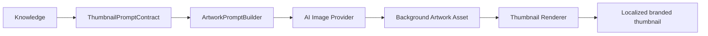
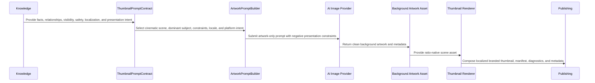
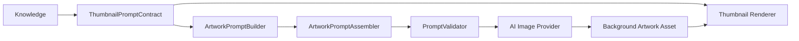
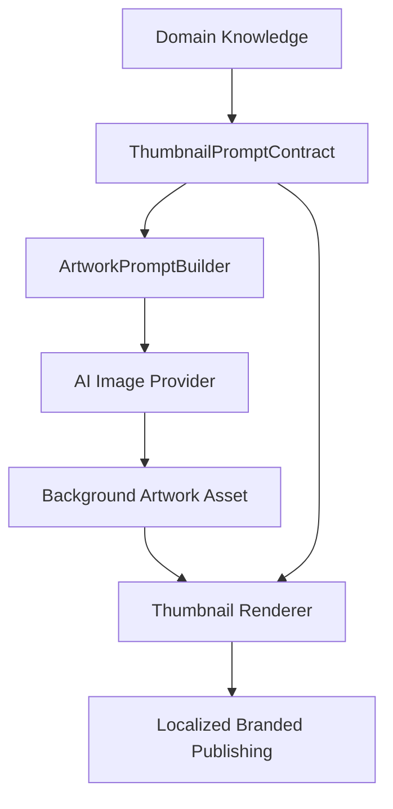

# Thumbnail Architecture

> Official engineering blueprint for Thumbnail implementation under Astronomy V3 RC3.

## 1. Purpose and Philosophy

Thumbnail exists to earn the first click without weakening scientific trust. It is the platform-optimized, CTR-focused entry asset for an astronomy event: the smallest visual surface with the largest responsibility for discovery, comprehension, and conversion.

The Thumbnail capability is:

- **Artwork-first**: AI generates clean cinematic background artwork from structured intelligence; it does not generate the finished thumbnail product.
- **Renderer-owned presentation**: deterministic rendering owns text, icons, cards, branding, localization, safe areas, and platform layout.
- **Platform-optimized**: every target surface receives a native composition strategy for its aspect ratio, safe zones, density, and preview behavior.
- **CTR-focused**: the asset prioritizes immediate recognition, contrast, emotion, object salience, and curiosity.
- **Scientifically accurate**: all visible claims, bodies, relationships, phases, alignments, colors, and observation cues must trace back to trusted knowledge and event contracts.
- **Multilingual**: prompt intent, localized titles, search context, and publishing metadata must support locale-specific terminology through renderer-owned typography, not AI-baked text.
- **Future-family extensible**: new astronomical families extend knowledge, providers, and configuration; they do not add family-specific logic to the Thumbnail renderer.

Thumbnail follows the Engineering Development Workflow: define the business objective, design contracts before implementation, pass the extension test, keep renderers generic, and validate outcomes before publishing.

## 2. Hero vs Gallery vs Thumbnail

| Asset | Primary job | User moment | Visual strategy | Text strategy |
| --- | --- | --- | --- | --- |
| **Hero** | Flagship campaign poster and public-page anchor | User is already in the campaign context | Cinematic, branded, story-rich | Structured title, message, footer, localized hierarchy |
| **Gallery** | Educational sequence and supporting carousel | User is learning or browsing details | Multi-slide explanation, observation steps, variants | Sparse educational overlays and localized facts |
| **Thumbnail** | Stop the scroll and win the click | User is scanning a feed, search result, recommendation rail, or preview card | High-salience AI artwork tailored to platform/aspect ratio | No AI-baked text; renderer adds localized typography when required |

Thumbnail must not be treated as a smaller Hero or a single-slide Gallery. It has its own contract, validation gates, and composition profiles because CTR surfaces punish visual clutter, bad cropping, and text that becomes unreadable at small sizes.

## 3. Artwork-First Generation Rule

Thumbnail generation must begin from structured knowledge and produce a clean cinematic artwork prompt as the main creative artifact. AI creates the scene. The platform creates the product.

The artwork-first rule exists because AI is best used for integrated visual atmosphere: celestial subject scale, lighting, depth, texture, environment, mood, contrast, and negative space. Final product presentation must be deterministic because typography, localization, brand consistency, icons, observation cards, CTA treatment, and platform safe areas must remain correct, repeatable, and reviewable.

## 4. AI and Renderer Boundary

AI output is the background artwork asset, not the final thumbnail. The AI Image Provider must generate clean cinematic artwork only.

AI must not generate:

- Text, titles, subtitles, labels, captions, badges, or numerals.
- Icons, pictograms, glyph systems, or platform UI symbols.
- Logos, wordmarks, watermarks, or brand marks.
- Observation cards, fact panels, tables, callout boxes, or UI cards.
- CTA copy, buttons, arrows, subscribe prompts, or engagement graphics.

The Thumbnail Renderer owns:

- Typography and type hierarchy.
- Localization and locale-specific text fitting.
- Layout, platform composition, density, and safe areas.
- Brand system, colors, logos, marks, and watermark policy.
- Icons, observation cards, CTAs, metadata bands, and product UI elements.
- Deterministic export, manifests, diagnostics, and publishing wrappers.

This boundary keeps creative scene generation flexible while keeping product presentation consistent, localizable, brand-safe, and testable. Renderer-owned elements must remain generic and contract-driven rather than family-specific.

## 5. Architecture Flow

### Responsibility Ownership

- **Knowledge owns facts**: astronomical truth, terminology, relationships, safety constraints, visual knowledge, and localization knowledge.
- **Providers decide**: dominant object, hook angle, visual emphasis, artwork prompt strategy, retry hints, and platform target.
- **Contracts carry intelligence**: the renderer receives complete presentation intent rather than discovering event meaning.
- **AI providers create artwork**: clean cinematic background scene assets without text, icons, logos, cards, or CTA elements.
- **Renderers create the product**: typography, localization, layout, brand, icons, cards, safe areas, file creation, format conversion, manifests, and mechanical output concerns.
- **Validators verify outcomes**: scientific accuracy, visual quality, localization readiness, brand fit, and platform safety.

## 6. ThumbnailPromptContract

`ThumbnailPromptContract` is the contract between event intelligence, artwork generation, and deterministic presentation. It should be implementation-neutral and stable enough for multiple image providers and renderer implementations.

Required conceptual fields:

| Field | Purpose |
| --- | --- |
| `contractVersion` | Version of the Thumbnail prompt contract shape. |
| `eventId` | Stable event identifier for traceability and diagnostics. |
| `eventFamily` | Family identifier from knowledge/provider configuration, not renderer branching. |
| `language` | Locale/language code for prompt phrasing, metadata, and title candidates. |
| `platformTargets` | Intended surfaces such as YouTube, Shorts, Instagram, public page, or search card. |
| `compositionProfile` | Native profile: `landscape_16x9`, `portrait_9x16`, or `square_1x1`. |
| `dominantSubject` | Primary object, relationship, or phenomenon to make immediately recognizable. |
| `secondarySubjects` | Optional supporting bodies, environment cues, or sky context. |
| `scientificFacts` | Required facts that must remain visible or true in the generated image. |
| `visualStrategy` | Salience, contrast, camera perspective, color guidance, scale cues, atmosphere, negative space. |
| `promptSections` | Reusable prioritized `PromptSection` collection emitted by family prompt providers before platform filtering. |
| `promptText` | Provider-ready positive artwork prompt assembled deterministically from validated prompt sections. |
| `negativePrompt` | Forbidden visuals, misleading compositions, unsafe depictions, text artifacts, icons, logos, cards, CTA elements, and distortions. |
| `titleCandidates` | Localized metadata/title options for renderer and publishing surfaces; never instructions to bake text into the AI artwork. |
| `rendererPresentationHints` | Contract-driven presentation inputs for deterministic typography, localization, layout, icons, cards, safe areas, and platform density. |
| `brandingHints` | Brand mood, quality bar, logo/watermark policy, and deterministic renderer identity constraints. |
| `safetyRules` | Observation safety, platform safety, and family-specific avoidances inherited from knowledge. |
| `validationRules` | Expected quality gates and scoring thresholds for validator execution. |
| `retryPolicy` | Retry count, alternate emphasis, and allowed provider fallback behavior. |
| `diagnostics` | Trace IDs, source contract references, provider settings, and review notes. |

## 7. Composition Profiles

Each aspect ratio requires its own prompt strategy. Thumbnail must never crop, squeeze, or mechanically repurpose one generated image into another final aspect ratio.

### 16:9 Landscape

- Primary for YouTube thumbnails, website cards, and wide recommendation surfaces.
- Emphasize a left/right or center-weighted cinematic subject with strong edge-safe composition.
- Preserve negative space for platform UI and optional downstream metadata placement.
- Avoid small central objects that disappear in reduced previews.

### 9:16 Portrait

- Primary for Shorts, Reels, Stories, and vertical discovery feeds.
- Use vertical depth, foreground-to-sky hierarchy, tall phenomena, or stacked subject relationships.
- Keep the dominant subject away from top/bottom UI collision zones.
- Avoid simply cropping the landscape composition; vertical must be planned as vertical.

### 1:1 Square

- Primary for grid previews, social cards, and compact recommendation units.
- Use centered or radial subject salience with clear silhouette and balanced contrast.
- Reduce peripheral dependencies because square crops are often displayed small.
- Avoid dense multi-object layouts unless the event family explicitly requires grouping.

## 8. No Cropping or Squeezing Rule

A generated Thumbnail candidate is valid only for the composition profile it was prompted for. The platform may resize within the same aspect ratio for file constraints, but it must not crop, stretch, squeeze, or pad a different aspect ratio into final publication.

If a campaign needs three ratios, the provider must produce three `ThumbnailPromptContract` instances and three native AI image generations. Validation must run per ratio.

## 9. Event and Family Extensibility

Thumbnail renderer must not contain family-specific business logic. It should not know how a meteor differs from a conjunction, how an eclipse alignment works, or which comet tail direction is scientifically plausible.

New family support must extend:

- Knowledge objects and validation facts.
- Observation providers and event display providers.
- Prompt provider strategies and configuration.
- Composition profile hints.
- Validator rules and thresholds.

New family support must not require changes to:

- Thumbnail renderer.
- File writer.
- Publishing wrapper.
- Generic manifest producer.

### Future Family Support

The architecture must support these families through knowledge/provider/configuration extension:

- Moon
- Meteor
- Planet Pairing
- Planet Grouping
- Conjunction
- Solar Eclipse
- Lunar Eclipse
- Comet
- Constellation
- Nebula
- Galaxy
- Deep Sky Objects
- Special Events

## Artwork Prompt Assembly Pipeline

Thumbnail artwork prompt creation uses a deterministic assembly pipeline instead of one large family-owned string. The pipeline creates provider-ready artwork instructions and renderer-ready presentation hints as separate outputs.

`PlatformStorytellingStrategy` decides which event emphasis and product presentation sections may exist for landscape, portrait, and square outputs. `CompositionProfile` controls artwork framing, negative space, object dominance, and safe regions for later renderer-owned presentation. `ArtworkPromptAssembler` filters unsupported `PromptSection` entries, applies the strategy and profile, removes incompatible sections, and emits `PromptAssemblyReport.json` diagnostics. `PromptValidator` rejects AI-baked text, icons, logos, observation cards, CTA instructions, footer/table leakage, square density overflow, and contradictory instructions before the prompt reaches the AI provider.

## 10. Validation Strategy

`ThumbnailValidator` verifies generated outcomes, not renderer internals.

| Validation area | Required checks |
| --- | --- |
| Scientific | Required bodies/relationships visible; no impossible phases, false alignments, unsafe observation implication, or contradicted event facts. |
| Visual | Dominant subject salience, contrast, readability at small size, no clutter, no artifacts, no distorted celestial objects, ratio-native composition. |
| Localization | Locale metadata present; generated artwork contains no baked text; renderer title candidates align with terminology and safety phrasing. |
| Branding | Quality bar, tone, brand-safe color/mood, no cheap collage appearance; logos and watermarks are renderer-owned. |
| Platform safety | No unsafe solar viewing implication, misleading emergency cues, prohibited symbols, policy-sensitive text, or UI-zone collisions. |

Validator output should include pass/fail, scores, blocking reasons, retry hints, source contract references, approved asset path, and publishing metadata readiness.

## 11. Definition of Done

Thumbnail implementation is complete only when:

- Business objective and success metrics are documented.
- Contracts are designed before renderer implementation.
- The extension test passes: adding a new family changes only knowledge, provider, configuration, or validator rules.
- `ThumbnailPromptContract` carries all artwork intelligence needed by the image provider and all presentation hints needed by the renderer.
- Composition profiles generate native 16:9, 9:16, and 1:1 assets without cropping or squeezing.
- Renderer contains no family-specific business logic.
- Validator covers scientific, visual, localization, branding, and platform safety gates.
- Diagnostics make failures actionable for retry, review, or provider improvement.
- Publishing receives approved assets, manifests, metadata, and validation evidence.
- Documentation remains aligned with EDW, Hero, Gallery, and the Universal Knowledge Model.

## 12. Future Multi-Domain Readiness

Thumbnail must remain an asset capability of the platform, not an astronomy-only renderer. Astronomy supplies the golden reference because it has strict scientific, visual, and safety constraints, but the same pattern must support future domains.

Future domains should replace domain knowledge and providers while reusing the same architecture:

The invariant remains unchanged: platform owns the capability, domains own knowledge, AI providers create clean artwork assets, contracts carry intelligence, renderers create branded localized presentation, and validators verify.
