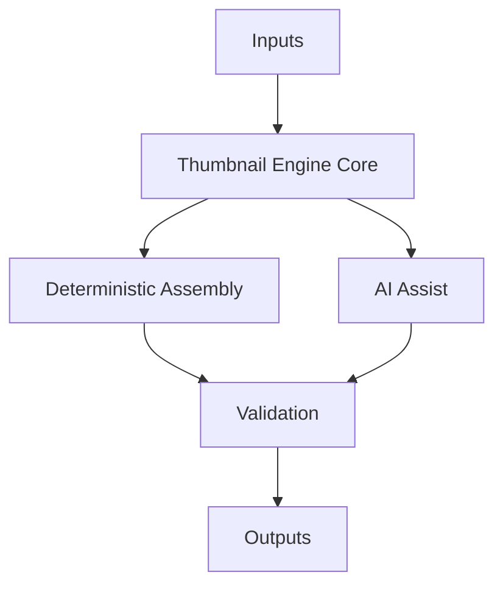
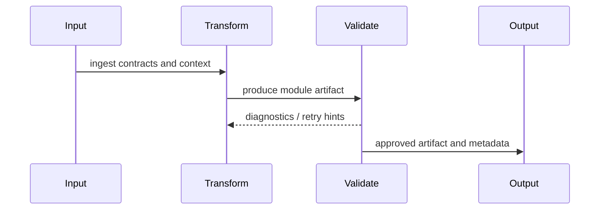
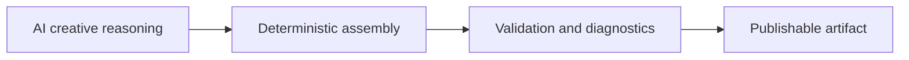
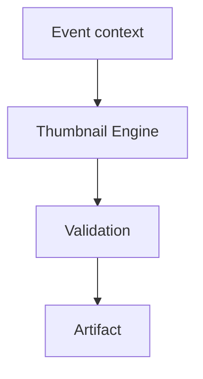
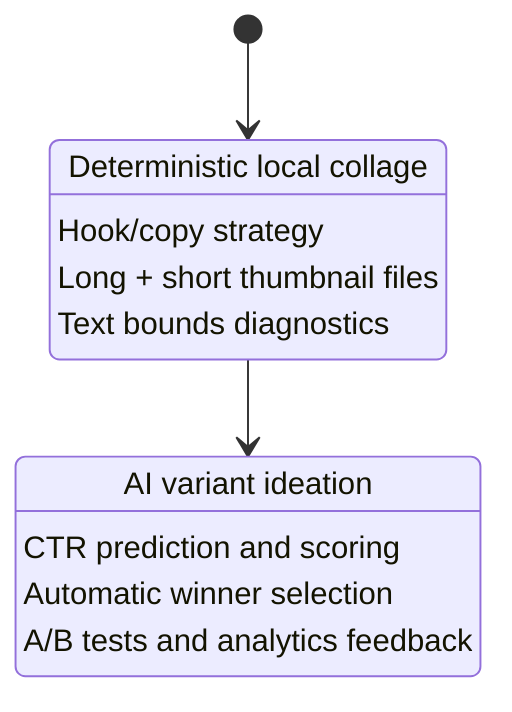

# Thumbnail Engine

> Product specification. This document describes product architecture and observed behavior; it is not API or source-code documentation.

## 1. Purpose

**Business purpose.** Thumbnail Engine increases product quality and operational scale for astronomy media generation.

**Product purpose.** It owns the product-facing behavior implied by its name within the event-to-publishing pipeline. Current implementation uses deterministic local asset collage, text rendering, scoring, hooks, and platform long/short outputs. Target RC3 intentionally diverges from Hero: Hero optimizes brand/story immersion, while Thumbnail optimizes click-through clarity under tiny-display constraints. RC3 adds CTR optimization, multiple AI variants, automatic thumbnail scoring, and A/B testing.

**Why it exists.** The module isolates a coherent product responsibility so teams can evolve it without destabilizing adjacent modules.

## 2. Responsibilities

**Responsibilities**

- Ingest upstream event/story/scene context relevant to Thumbnail Engine.
- Transform that context into product artifacts with explicit diagnostics.
- Respect localization, validation, and configuration boundaries.
- Expose stable artifacts for downstream modules.

**Non-responsibilities and boundaries**

- Does not own upstream astronomical truth generation unless explicitly noted.
- Does not bypass validation gates.
- Does not publish unless it is the Publishing Engine.

**Interfaces**

File/JSON contracts, service-layer DTOs, configuration options, diagnostics reports, and downstream artifact references.

## 3. Inputs

- **JSON contracts:** Module-specific request/plan/result JSON and manifests
- **Configuration:** Options classes, appsettings, feature flags, paths, language/font settings
- **AI outputs:** Creative text, summaries, visual prompts, rankings, or narration drafts when enabled
- **Scene data:** Scene plans, observation contexts, visual requirements, timing, and region metadata
- **Dependencies:** Core, Infrastructure, Rendering, Publishing, and AstroData services as appropriate

## 4. Outputs

- JSON plans/manifests.
- Rendered or selected assets where relevant.
- Diagnostics and validation reports.
- Downstream-ready references.

## 5. Internal Architecture



Thumbnail Engine follows the platform pattern of contract-first inputs, optional AI assistance, deterministic assembly, and explicit validation. Current behavior is inferred from existing pipeline services, rendering services, tests, and architecture docs. Future behavior should preserve contracts while adding new strategies behind feature flags.

## 6. Processing Flow



1. **Input:** Receive event, scene, language, configuration, and upstream artifacts.
2. **Transformation:** Apply product rules, AI assistance where valuable, deterministic assembly, and metadata normalization.
3. **Validation:** Run module-specific checks and emit diagnostics.
4. **Output:** Persist downstream-ready artifacts and reports.

## 7. AI Responsibilities



- **AI owns:** Creative ideation, wording alternatives, intent extraction, ranking hints, and prompt drafts.
- **Deterministic code owns:** Contracts, ordering, file outputs, renderer calls, fallbacks, metadata normalization, and reproducibility.
- **Validation owns:** Quality gates, factual consistency checks, artifact existence, renderer compatibility, and recovery hints.

## 8. Validation

- **Rules:** Must preserve event facts, localization context, safe typography, configured output paths, and downstream contract compatibility.
- **Diagnostics:** Structured JSON reports, logs, scores, warnings, and generated file lists.
- **Retry:** Retry AI generation, rerender deterministic assets, or fall back to existing/source assets depending on failure type.
- **Recovery:** Use dry runs, placeholders, cached artifacts, source visuals, or manual review flags.
- **Failure modes:** Missing configuration, invalid input JSON, model refusal/bad output, renderer failure, validation failure, or publish-blocking diagnostics.

## 9. Localization

- **English:** Default production language and metadata path.
- **Hindi:** Supported localized path with Hindi text/font handling and normalized metadata.
- **Future languages:** Add new language contexts, font packs, metadata rules, voice support, and typography tests.
- **Metadata normalization:** Normalize event names, titles, regions, dates, platform fields, and language codes.
- **Typography:** Use readable hierarchy, safe zones, locale-specific fonts, and platform constraints.

## 10. Configuration

- **Feature flags:** Dry run, overwrite, AI enablement, phase/stage routing, experimental renderers.
- **Configuration files/options:** appsettings, options classes, asset registries, prompt feedback data, renderer options.
- **Azure settings:** Used where AI image, TTS, storage, or OpenAI/Azure settings are enabled by module.
- **Prompt settings:** Prompt templates, feedback hints, event family strategies, and output schemas.
- **Renderer settings:** FFmpeg, image processors, local collage renderers, Stellarium capture, or platform upload constraints.

## 11. Extension Points

- New event-family strategies.
- Alternative AI models/providers.
- Plugin renderers and validators.
- Additional platform outputs and analytics feedback loops.

## 12. Examples

**Example pipeline**



**Example JSON**

```json
{"eventId":"evt-001","regionId":"udaipur","language":"en","inputs":["event","story","scenePlan"],"diagnostics":true}
```

**Example output**

A validated Thumbnail Engine artifact with JSON manifest, localized metadata, and downstream references.

## 13. Related Documents

- [Product README](./README.md)
- [Architecture Overview](../architecture/ArchitectureOverview.md)
- [Pipeline Architecture](../architecture/PipelineArchitecture.md)
- [Rendering Architecture](../architecture/RenderingArchitecture.md)
- [Prompt Architecture](../architecture/PromptArchitecture.md)
- [Validation Architecture](../architecture/ValidationArchitecture.md)
- [Localization Architecture](../architecture/LocalizationArchitecture.md)
- [RC2 Release Notes](../releases/AstronomyV3RC2.md)
- [Event Families](../event-families/README.md)

## Current → Future Product Architecture



### Current implementation

The current thumbnail product is intentionally deterministic. It selects usable visual inputs, composes local collage-style imagery, renders concise text, writes long-form and short-form thumbnail variants, validates visible text bounds, and falls back to source visuals when composition cannot safely complete. It uses hook and scoring services to prefer product-specific messaging such as daily-sky, special-event, meteor, Moon, and planet-pairing hooks.

### Target RC3 architecture

RC3 should keep deterministic safety for final rendering while introducing a competitive experimentation layer: multiple AI-assisted copy/layout variants, automatic CTR scoring, visual hierarchy scoring, mood grading, audience/platform segmentation, and A/B publication feedback. The expected output is no longer a single “good” thumbnail; it is a ranked set of measurable candidates.

### Why Hero and Thumbnail use different rendering strategies

Hero assets are brand and story artifacts. They can carry more atmosphere, educational context, footer metadata, and cinematic composition. Thumbnails are acquisition artifacts. They must survive small-device scanning, platform cropping, and fast viewer decisions. Therefore Hero uses a richer story/blueprint/image architecture, while Thumbnail emphasizes legibility, contrast, short hooks, CTR feedback, and deterministic reproducibility.
