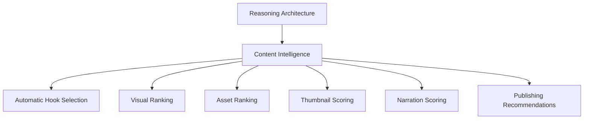

# Content Intelligence

## Purpose

Content Intelligence defines the future AI roadmap for astronomy media decision-making. It describes how the platform can evolve from documented reasoning principles into automated selection, ranking, scoring, and publishing recommendations.

## Overview

Content Intelligence is the future operational form of the reasoning architecture. It should help the platform choose better hooks, visuals, assets, thumbnails, narration, and publishing strategies at scale.

## Architecture

Content Intelligence should combine rule-based constraints, knowledge contracts, AI ranking, validation signals, and performance feedback. It should not be a single model decision. It should be a coordinated intelligence loop.

## Responsibilities

- Automatically select content hooks from event knowledge.
- Rank visual concepts and generated assets.
- Score thumbnails for clarity and click potential.
- Score narration for pacing, comprehension, accuracy, and retention.
- Recommend publication timing, format, and platform positioning.
- Learn from validation results and publishing performance.
- Preserve explainability for editors and operators.

## Decision Logic

### Automatic hook selection

Hook selection should rank candidate promises by timeliness, specificity, curiosity, accuracy, and audience value.

### Visual ranking

Visual ranking should compare generated concepts and assets by event recognizability, hierarchy, composition, realism, format fit, and scientific plausibility.

### Asset ranking

Asset ranking should consider how each asset contributes to the full content package. A technically beautiful image may rank lower if it conflicts with the title, narration, or educational goal.

### Thumbnail scoring

Thumbnail scoring should estimate:

- Subject recognition at small size.
- Contrast and readability.
- Emotional pull without deception.
- Alignment with title and event family.
- Cropping resilience across platforms.

### Narration scoring

Narration scoring should estimate:

- Opening strength.
- Scientific accuracy.
- Pacing and sentence clarity.
- Educational progression.
- Localization naturalness.
- Match to visual sequence.

### Publishing recommendations

Publishing recommendations should use event timing, audience location, platform format, language, content readiness, and historical performance. Recommendations should explain why a publishing window or format is preferred.

## Examples

- A meteor shower event may receive a high publishing score for a short vertical video near the peak viewing window and a lower score for a long explainer after the peak.
- A thumbnail with one clear red Moon may score higher than a detailed eclipse collage because it is more recognizable on mobile.
- A narration script that explains observation timing before orbital mechanics may score higher for beginner audiences.

## Future Improvements

- Build a unified content score across story, visual, education, localization, and publishing.
- Add model-assisted editorial review summaries.
- Use real performance data to calibrate ranking weights.
- Create feedback loops from comments, retention, CTR, and manual review outcomes.
- Extend intelligence patterns to future domains beyond astronomy.

## Related Documents

- [Reasoning Architecture](./ReasoningArchitecture.md)
- [Decision Engine](./DecisionEngine.md)
- [Story Reasoning](./StoryReasoning.md)
- [Visual Reasoning](./VisualReasoning.md)
- [Quality Reasoning](./QualityReasoning.md)
