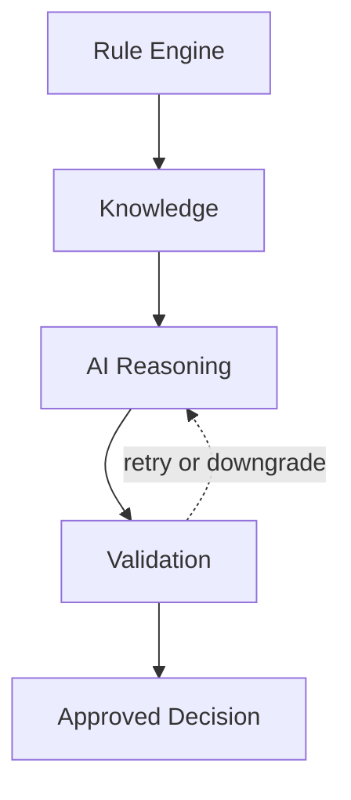

# Decision Engine

## Purpose

Decision Engine documents the future AI Director: the system that will coordinate rules, knowledge, AI reasoning, and validation to make content decisions. This document describes the desired intelligence hierarchy, not an implementation plan.

## Overview

The future AI Director should combine deterministic reliability with AI creativity. Rules prevent known mistakes, knowledge provides truth, AI proposes and ranks creative options, and validation protects output quality.

## Architecture

The decision hierarchy is:

1. **Rule Engine:** non-negotiable platform, safety, event-family, and publishing constraints.
2. **Knowledge:** validated facts, entities, relationships, timing, visibility, localization, and visual requirements.
3. **AI:** creative reasoning, ranking, alternative generation, and explanation of tradeoffs.
4. **Validation:** factual, visual, educational, localization, and quality checks.

## Responsibilities

- Make cross-module content decisions from shared context.
- Generate and rank multiple story, visual, prompt, and publishing candidates.
- Explain why a decision was selected.
- Assign confidence scores to decision areas.
- Request fallback, retry, or human review when confidence is low.
- Preserve rule and knowledge authority over AI creativity.

## Decision Logic

### Rule Engine

Rules define hard boundaries:

- Do not promote unsafe solar viewing.
- Do not claim visibility where the event is not visible.
- Do not show physically impossible scenes as realistic observation.
- Do not publish without required metadata and validation.

### Knowledge

Knowledge supplies the decision material:

- What event is occurring.
- Which objects are involved.
- Where and when it is visible.
- What event-family constraints apply.
- What terminology and localization rules apply.

### AI

AI should operate inside the rule and knowledge envelope. It can propose hooks, visual variants, prompt directions, narration angles, and publication recommendations, but it should not override validated facts.

### Validation

Validation confirms that decisions are acceptable. It should check factual consistency, educational value, safety, localization fit, visual plausibility, and platform readiness.

### Confidence scoring

Confidence scoring should express how strongly the platform trusts a decision.

| Score area | Inputs |
| --- | --- |
| Factual confidence | Knowledge completeness, source reliability, event-family fit. |
| Story confidence | Hook clarity, narrative relevance, audience fit. |
| Visual confidence | Object hierarchy, composition clarity, event accuracy. |
| Educational confidence | Correctness, safety, learning progression. |
| Localization confidence | Naturalness, terminology, cultural fit, regional visibility. |
| Publishing confidence | Platform format, CTR, metadata, timing. |

Low confidence should trigger a clear action: retry with different reasoning, fall back to safer templates, request human review, or block publishing.

## Examples

- If AI proposes a dramatic solar eclipse image without visible viewing safety context, validation should downgrade or reject it.
- If two story hooks are both accurate, the Decision Engine may prefer the one with clearer audience value and stronger visual alignment.
- If localized terminology is uncertain, confidence should drop and human review may be requested before publishing.

## Future Improvements

- Persist decision traces for audit and learning.
- Use performance feedback to calibrate confidence scores.
- Add human-in-the-loop review queues for low-confidence decisions.
- Build explainable AI Director dashboards for editors and operators.

## Related Documents

- [Reasoning Architecture](./ReasoningArchitecture.md)
- [Content Intelligence](./ContentIntelligence.md)
- [Quality Reasoning](./QualityReasoning.md)
- [Knowledge Architecture](../knowledge/KnowledgeArchitecture.md)
