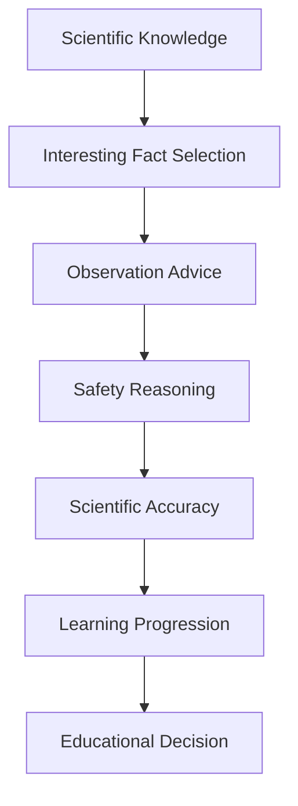

# Educational Reasoning

## Purpose

Educational Reasoning explains how the platform maximizes learning value in astronomy content. It decides which facts are worth teaching, how observation advice is presented, where safety matters, and how scientific accuracy is preserved while keeping content accessible.

## Overview

Educational value is not the number of facts included. It is the usefulness, correctness, timing, and clarity of the facts chosen.

## Architecture

Educational reasoning connects domain knowledge to audience understanding. It should favor concepts that help viewers interpret the sky, observe safely, and remember the event.

## Responsibilities

- Select interesting facts that support the story.
- Provide practical observation advice when relevant.
- Identify safety constraints, especially for solar events.
- Maintain scientific accuracy in wording and visuals.
- Sequence concepts from basic recognition to deeper explanation.
- Avoid overloading short-form content with too many details.

## Decision Logic

### Interesting facts

A fact is educationally valuable when it is:

- Relevant to the selected event.
- Surprising without being sensationalized.
- Easy to connect to what the viewer can see.
- Correct at the level of precision required by the format.
- Useful for remembering or observing the event.

### Observation advice

Observation advice should answer practical viewer questions:

| Question | Reasoning response |
| --- | --- |
| When should I look? | Use event timing, peak windows, and local visibility. |
| Where should I look? | Use sky direction, altitude, constellation, or horizon context when known. |
| What equipment do I need? | Distinguish naked-eye, binocular, telescope, camera, or solar-filter needs. |
| What can prevent viewing? | Include clouds, city lights, horizon blockage, daylight, or moonlight when relevant. |

### Safety

Safety reasoning is mandatory when events involve the Sun, optical equipment, or harmful observation conditions. It should not be treated as optional disclaimer text. Solar viewing must emphasize proper filters and safe methods; unsafe direct viewing should never be implied by visuals, narration, or prompts.

### Scientific accuracy

Accuracy is preserved by:

- Keeping apparent sky position separate from physical distance.
- Avoiding exaggerated size changes for supermoons.
- Explaining meteor showers as Earth crossing debris streams.
- Treating eclipse visibility as location-dependent.
- Preventing visuals that imply impossible orbital arrangements unless clearly diagrammatic.

### Learning progression

A recommended progression is:

1. Name the phenomenon.
2. Explain what the viewer will see.
3. Explain why it happens.
4. Give the observation action.
5. Add one memorable insight.

## Examples

- A solar eclipse explanation should lead with safe viewing before encouraging observation.
- A planetary alignment should explain that planets align visually from Earth's viewpoint, not in a perfect physical line.
- A comet story should explain tail direction relative to the Sun if that fact helps interpret the image.

## Future Improvements

- Audience-level profiles for beginner, student, enthusiast, and expert modes.
- Educational scoring based on clarity, correctness, actionability, and retention value.
- Automated detection of unsafe or misleading phrasing.
- Quiz, recap, and learning-objective generation for educational products.

## Related Documents

- [Reasoning Architecture](./ReasoningArchitecture.md)
- [Story Reasoning](./StoryReasoning.md)
- [Quality Reasoning](./QualityReasoning.md)
- [Knowledge Validation](../knowledge/KnowledgeValidation.md)
